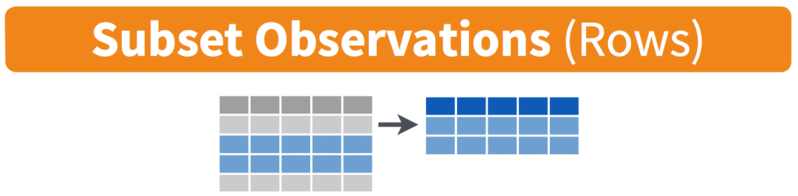
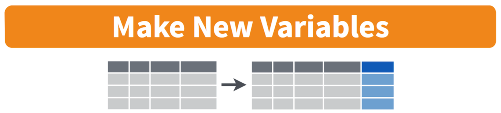

```{r setup, include=FALSE}
knitr::opts_chunk$set(echo = TRUE)
```

<br>

# Introduction

Lab 1 introduces you to the core functions of R/RStudio and covers essential data cleaning techniques. Data cleaning is a critical skill to have in carrying out public health research. It entails the preparation of raw — and often messy and unstructured — data for analysis. While the specific steps can vary by project, many common tasks — such as modifying variable types, filtering data, and creating new variables — are foundational to ensuring reliable and reproducible analyses. 

Before you begin Lab 1, I recommend reading Chapter 2 ("The Very Basics") of [Hands-On Programming with R](https://rstudio-education.github.io/hopr/basics.html). This chapter provides an overview of the R language and its use within RStudio. Some of this information has already been covered on the Assignment Guidelines page; however, this optional reading will provide more detail if you need additional context. 

<br>

# Objectives

After completing Lab 1, you will be able to:

1. Install and load R packages.
2. Set your working directory.
3. Import a dataset into RStudio.
4. Understand and use data documentation.
5. Filter a dataset.
6. Identify and modify variable types.
7. Rename a variable.
8. Create a new variable.
9. Export a dataset from RStudio.

<br>

# Tasks

When you are ready to start Lab 1:

1. First create a new R Markdown file using the instructions on the Assignment Guidelines page. Save this `.Rmd` file in a folder dedicated to Lab 1 materials. 
2. Next, download the dataset "frmgham2.csv" from Canvas and save it in the same folder as your Lab 1 R Markdown file.
3. Finally, proceed to read through and carry out each of the tasks detailed below. You will need to complete each task *sequentially* to successfully complete this assignment. In other words, you won't be able to complete task #3 without first completing task #2, etc.

<br>

## 1. Install and load R packages

On the Assignment Guidelines page, you read through an example in which R was used to add 1+1. R can be used in this way as a simple calculator; however, most often we will use R functions (or "commands") to perform more complex analyses that would otherwise be extremely burdensome to perform by hand. R functions allow you to perform tasks such as data visualization, statistical modeling, or data cleaning, without having to write all the code from scratch. For example, suppose you want to know the mean (or average) of a set of numbers. Rather than manually adding all of the values together and then dividing by the number of values, we can simply use the `mean()` command in R. These types of R functions do not exist in a vacuum but rather within R "packages", which are collections of pre-written functions, data, and documentation that extend R’s capabilities far beyond a simple calculator.   

To use the functions contained within a particular package, that package must be installed in R. You can install a package using the `install.packages()` command. Once you have done this, the package is saved on your computer, and you won’t need to install it again unless you update or reinstall R. 

In RStudio, we will work with many different packages over the course of the semester. For now, start by installing the packages **knitr**, **rmarkdown**, and **tidyverse** by typing the following in your **R Console** window (bottom-left) after `>`:

```
install.packages("knitr")
install.packages("rmarkdown")
install.packages("tidyverse")
```

Remember that when we type code directly into the Console window, that code is *not* saved for future use. This is exactly what we want to do when installing packages for the first time. This is because, as mentioned above, we only need to install a package once — we don't want to repeat this step every time we return to our project. However, to use the functions from a package in a *new R session*, you must load the package using the `library()` function. Loading a package makes its functions available for use in your *current* R session.

For example, to load the packages you installed a moment ago, create a chunk in your R Markdown document as follows:

```{r, results = FALSE, message = FALSE, warning = FALSE}
# load packages
library(knitr)
library(rmarkdown)
library(tidyverse)
```

After running this chunk, you will see a lot of "stuff" appear in the Console window. For our purposes we can ignore all of this when loading packages — that is, unless you see an error message, which would indicate the package did not load properly.

After loading an R package, you can explore its functions by accessing the package documentation. One way to do this is to use the `help(package = "package_name")` command. For example:

```{r}
# access "tidyverse" package documentation
help(package = "tidyverse")
```

You should see some information about "tidyverse" appear in the Help window (bottom-right), including links to a description file, user guide, and other documentation.

<br>

## 2. Set your working directory

In RStudio, the **working directory** is the default folder where R reads and saves files during your session. Think of it as the "home base" for your current project. When you import a dataset or save a file, R will look in this directory unless you specify otherwise. When starting an assignment, you will always need to specify your working directory. For example, for the current assignment (Lab 1), you will want to set your working directory as the folder where you have saved your Lab 1 R Markdown file and "frmgham2.csv" dataset.

You can set the working directory in a couple of ways:

1. *Manually in RStudio:* Go to the "Session" menu at the top of your screen, hover over "Set Working Directory", and then click "Choose Directory..." to navigate to your desired folder.

2. *Using Code (Recommended):* Use the setwd() function to specify the path to your directory. For example:

```
setwd("YOUR FILE PATH HERE")
```

```{r, echo=FALSE}
# set working directory
setwd("~/Google Drive/My Drive/1_CSUS/2024-2025/Spring 2025/PUBH 207B/Website/PUBH-207B-S25")
```

You, of course, will need to insert your own file path between the quotation marks. Not sure how to copy your file path? Try Googling "how to copy file path on mac" (or on whatever operating system you are using).

I strongly recommend using code to set your working directory so that the specific folder you specified for an assignment is clearly documented in your R Markdown file. This will be helpful when restarting R or reopening an assignment because rather than searching through your files to set the working directory manually, you will just need to rerun the chunk that already contains the necessary file path.

<br>

## 3. Import a dataset into RStudio

To analyze data in RStudio, the first step is often to import a dataset into your working environment. R supports various file types, including CSV, Excel, and text files. The most common data file type you will encounter is a CSV (Comma-Separated Values) file. 

For Lab 1, you should have already downloaded the dataset called "frmgham2.csv" and saved it in the same folder as your Lab 1 R Markdown file. You should have also already set this folder as your working directory.

To import a CSV file, use the `read.csv()` function, specifying the name of your dataset within quotation marks as follows:

```{r}
# load dataset
data <- read.csv("frmgham2.csv")
```

Notice the line of code we used to bring in the dataset starts with `data <-`. This is telling R that we want to save the "frmgham2.csv" dataset as an "object" in our Environment and call it "data". An R object is a named data structure in R that stores information, such as data, functions, or results, allowing you to reuse and manipulate it throughout your analysis. In this case, we want to be able to access and manipulate the data contained within the "frmgham2.csv" data file. This is why, after running this chunk, you should see an R object called "data" in your Environment window (top-right). When performing your own analyses, you can call R objects whatever makes the most sense to you (though for the purposes of the Labs, I would stick with the names I've already specified). A couple of quick observations about the "data" object now in our Environment:

* The spreadsheet icon on the far right indicates that this object is a "data frame" (i.e., a spreadsheet with rows and columns). For now, know that there are different types of R objects we can store in the Environment. Data frames are the most common type (but not the only type) of R object we will work with.
* The object is shown to contain "11627 obs. of 39 variables" — this means that the dataset contains 11,627 observations (rows) and 39 variables (columns). 

In the Environment window, click on the "data" object you have created. You can also type `View(data)` into the Console for the same result. You should see the dataset open in a new tab within RStudio. It should essentially look like a spreadsheet, with variable names across the top and each observation in a row. 

*Note:* If at any point you want to import an Excel file, you’ll need to install and load the "readxl" package and use the `read_excel()` function instead of `read.csv()`.

<br>

## 4. Understand and use data documentation

We've loaded our dataset into RStudio and now we're ready to analyze it, right? Not quite! Before you begin any kind of analysis (and really before you even start downloading any data), it is important to have a clear understanding of the dataset's contents. This includes knowing what each variable represents, how the data were collected, and whether there are any limitations or nuances you need to be aware of. Without this understanding, you risk misinterpreting results or making errors in your analysis.

Data documentation, often called a **codebook** or **data dictionary**, is a resource that explains:

* The structure of the data (e.g., rows as individuals, columns as variables).
* The variables in your dataset, including names, definitions, and units of measurement.
* The values each variable can take, and what they mean (e.g., "1 = Male, 2 = Female", etc.).
* The methods by which the data were collected (e.g., participant survey, biomarkers, etc.).

You will use data documentation at various stages of a project:

* *Before analysis* — Familiarize yourself with the dataset by reviewing the documentation to understand its structure and variables.
* *During analysis* — Refer back to the documentation when you encounter unfamiliar variables or need clarification.
* *After analysis* — Use the documentation to make sure you are accurately describing your methods and findings.

For several assignments in this course, we will be using the "frmgham2.csv" dataset (or a modified version of it) you've loaded into your current R session. This dataset is from the **Framingham Heart Study**, which is a prospective cohort study carried out over several decades to study risk factors for cardiovascular disease. **Before moving forward, read over the first 7 pages of the data documentation**, linked on the Lab 1 assignment page on Canvas.

Beginning on page 2 of the data documentation, you will see a table that defines each of the variables included in the dataset, including the variable name, a brief description, the units of the variable, and the range of values (or, instead, the count of observations, labeled with "n"). Take a moment to examine the dataset in RStudio in the context of this codebook. You should see that each column in the dataset has a corresponding row in the codebook that defines that variable.

<br>

## 5. Filter a dataset

```{r, echo=FALSE, out.width = '100%'}

```

One key benefit of working with a dataset in RStudio is that any data manipulation you perform — such as filtering rows, creating new variables, or transforming data — occurs within R and does **not** alter the original data file. This ensures the raw data remain unchanged, allowing you to experiment freely while maintaining the integrity of your original dataset. 

For example, using the dataset you've loaded from the Framingham Heart Study, suppose we want to restrict the data to the *baseline* sample for some exploratory analysis. As you may have already observed, the original dataset contains multiple observations (up to three) for each participant, where each of these observations corresponds to a different period of time (specified by the "PERIOD" variable). The baseline observation (where PERIOD = 1) is the initial data collected when a participant entered the study. We can restrict the data to the baseline sample using the `filter()` command as follows:

```{r}
# filter data to include only baseline sample
data_period1 <- data %>% filter(PERIOD == 1)
```

First, understand that "filtering" data basically means that we are selecting certain rows *based on condition*. In this case, the condition is that PERIOD = 1. There are a few things happening in the above code chunk, so let's break them down (moving from right to left):

* `filter(PERIOD == 1)`: Applies the `filter()` function to select rows where the variable PERIOD is equal to 1. Only rows meeting this condition are included in the resulting dataset.
* `data %>%`: The `%>%` is called a "pipe operator" and comes from the "tidyverse" package. There are always multiple ways the same task can be accomplished in R, and this operator is essentially used to help us write our code in a logical and efficient way. Here, the pipe operator is used to pass the dataset we called "data" as *input* to the next function. In other words, the pipe operator (`%>%`) is like saying "and then." It takes whatever is on the left side — in this case, the dataset we called "data" — and hands it over to the next step. So, you start with your data, *and then* you tell R to filter it to only include rows where the PERIOD variable is equal to 1. It’s like giving R a to-do list: 'Start with this data *and then* filter it to contain only the observations I want.' We will use the pipe operator a lot throughout the course.
* `data_period1 <-`: Creates a new object called "data_period1" to store the filtered dataset. The `<-` operator is like an arrow — it assigns the result of the operation (everything on the right of the arrow) to this new object. In other words, we are taking our original dataset (called "data"), filtering it to only include observations where PERIOD is equal to 1, and then saving this filtered dataset as a new data object called "data_period1". Giving a new name to the resulting dataset is important because it allows us to keep the original data unchanged while working with a modified version. This way, the original data remains intact for reference or other analyses, and the new name makes it clear what the filtered or modified dataset represents. For example, naming the filtered dataset "data_period1" helps us quickly identify that it contains only the rows where PERIOD is equal to 1, making our work easier to understand later.

Once you run the code chunk above, you should see the new R object called "data_period1" in your Environment (top-right window). Notice that this object contains 4,434 observations and 39 variables. Click on the "data_period1" object to view it in a new tab. You should see that all 39 variables in our original dataset have been retained. But, when you scroll over to the PERIOD variable, all of the observations show a value of 1, meaning our modified dataset contains only the baseline sample like we wanted. Yay! 

We will continue to work with this modified dataset for the remainder of the assignment.

<br>

## 6. Identify and modify variable types

Identifying and modifying variable types in R is crucial because the type of a variable (e.g., numeric, character, factor) determines how R processes and analyzes the data. A variable may be most appropriately assigned one type — such as categorical — but R may initially interpret it differently, such as numeric, depending on how the data is formatted or imported. For example, a variable representing survey responses like 1 = "Yes" and 2 = "No" might initially be read as numeric, but treating it as a categorical (factor) variable is more appropriate for analysis. By explicitly modifying variable types when needed, you can make sure R treats your data correctly for your analysis.

For example purposes, let's identify the variable type for a few of the variables in our dataset — specifically, sex assigned at birth, age, BMI (body mass index), and attained education. We will do this using the "class" function as follows:

```{r}
# identify variable types
class(data_period1$SEX) # sex assigned at birth
class(data_period1$AGE) # age
class(data_period1$BMI) # BMI
class(data_period1$educ) # attained education
```

When we run the above code chunk, the results will appear in the Console (bottom-left window). You should see that `SEX` is an "integer" variable, `AGE` is an "integer" variable, `BMI` is "numeric", and `educ` (attained education) is an "integer" variable. Integer and numeric variables both represent numbers — the difference is that integer variables are discrete (the values must be whole numbers) whereas numeric variables can take on any value (including decimals). R interprets variables as integer or numeric by default when importing data because it relies on the format of the raw data and doesn’t automatically assign "context" or "meaning" to the values. For example, R doesn't know that for "SEX", 1 means "male" and 2 means "female" (referring back to the data documentation). It only sees the values "1" and "2". Using what we have learned in class, let's consider the most appropriate variable type for each of these four variables:

* **SEX:** Represents categorical information about sex assigned at birth, coded numerically (e.g., 1 = Male, 2 = Female). Although represented as integers, the numbers are codes for categories rather than quantities. This means that this variable would most appropriately be coded as a "factor" variable. Treating it as a factor ensures R correctly interprets and analyzes it as categorical data.
* **AGE:** Represents a person's age, measured in whole years. Age is a continuous, quantitative variable. Since age is being measured in whole years, this variable is correctly coded as an "integer" variable. Treating this variable as "numeric" would also be appropriate.
* **BMI:** Represents body mass index, a continuous measure derived from a person's height and weight. BMI is inherently a continuous, quantitative variable that can take decimal values, so the default "numeric" type is appropriate for any analyses we may wish to conduct using this variable.
* **educ:** Represents a person's level of attained education, coded numerically (1=0-11 years; 2=High School Diploma, GED; 3=Some College, Vocational School; 4=College (BS, BA) degree or more). Similar to sex, the numbers represent categories rather than quantities. As such, this variable would most appropriately be coded as a "factor" variable. 

Given the above explanations, we've can conclude that the `AGE` and `BMI` variables are already appropriately coded as "integer" and "numeric", respectively. `SEX` and `educ`, on the other hand, would be more appropriately coded as factor (or "categorical") variables given the values represent categories, not quantities. As we learned in class, these factor variables can be further categorized into two types — ordered and unordered. For example, sex assigned at birth represents categories with no inherent order or ranking. In our dataset, sex can take on two values: 1 (male) or 2 (female). There is no logical sequence between these categories — they are distinct but equal. As such, `SEX` should be treated as an *unordered* factor variable in any analyses. Conversely, the values associated with attained education represent categories with a natural hierarchy or ranking (e.g., high school < some college < college). The levels have a logical progression, with one level ranked above or below another. As such, "educ" may be best treated as an *ordered* factor variable. Ordered factors are treated as ordinal variables in analyses, allowing you to consider their ranking in models or visualizations. 

> Later in the course, you will see that some categorical variables have a natural order (for example, levels of educational attainment), but that does not necessarily mean they must always be treated as ordered in an analysis. The decision to treat a variable as ordered or unordered depends on the research question and what types of comparisons we want to make.

For now, let's take a look at how we can convert the variables to their most appropriate types, starting with `SEX`. We can do this using the `factor()` command as follows:

```{r}
# convert sex assigned at birth to unordered factor variable
data_period1$SEX <- factor(data_period1$SEX, 
                           levels=c("1", "2"), 
                           ordered=FALSE)
```

This code converts the `SEX` column of the `data_period1` dataset into a categorical variable (factor), specifying that it has two levels ("1" and "2") and that these levels are unordered. This ensures that R treats the variable as distinct categories. Let's break down the code one piece at a time (starting on the right of the `<-`):

* `factor(...)`: The factor() function is used to convert the specified variable into a factor. 
  * `data_period1$SEX`: Refers to the `SEX` column in the `data_period1` dataset. This is the variable being transformed into a factor. The `$` operator here is used to access a specific column within a dataset. The part before the `$` identifies the dataset to use (in this case, `data_period1`), and the part after the `$` specifies the column being modified (in this case, `SEX`). 
  * `levels=c("1", "2")`: Specifies the possible values (or levels) for the factor. In this case, the levels are "1" and "2", which correspond to the categories "Male" and "Female". Defining levels ensures R knows all valid categories for the factor.
  * `ordered=FALSE`: Indicates that the factor is *not* ordered — the levels do not have a natural hierarchy or ranking. For example, "Male" and "Female" are categories with no logical order, so ordered=FALSE is appropriate here.
* `data_period1$SEX <-`: This part assigns the result of the `factor()` function to the `SEX` column of the `data_period1` dataset. The `<-` symbol means "assign this value to," so we are essentially overwriting the `SEX` column with a new version where it is converted into a factor. 

<br>

Next, let's convert attained education (`educ`) to an ordered factor variable:

```{r}
# convert attained education to ordered factor variable
data_period1$educ <- factor(data_period1$educ, 
                            levels=c("1", "2", "3", "4"), 
                            ordered = TRUE)
```

This code converts the `educ` column in the `data_period1` dataset into an ordered factor with four levels ("1", "2", "3", "4"). The `ordered=TRUE` argument tells R to interpret the variable as ordinal. Let's break down the code one piece at a time:

* `factor(... )`: As we saw above, the `factor()` function is used to convert the specified variable (in this case, `educ`) into a factor. 
* `data_period1$educ`: Refers to the educ column within the data_period1 dataset. This is the variable being transformed into an ordered factor. Refer to the previous example for an explanation of the `$` operator.
* `levels=c("1", "2", "3", "4")`: Specifies the possible values (or levels) for the factor. In this case, the levels are "1", "2", "3", and "4". These correspond to the categories shown in the data documentation. Defining levels explicitly ensures R knows the valid categories and their sequence.
* `ordered=TRUE`: Indicates that the factor is ordered, meaning the levels have a natural hierarchy or ranking. For example, "1" (e.g., "0-11 years") is considered lower than "4" (e.g., "College (BS, BA) degree or more"), and R will treat this as an ordinal variable in subsequent analyses.
* `data_period1$educ <-`: This assigns the result of the `factor()` function to the `educ` column of the `data_period1` dataset. The `<-` symbol means "assign this value to," so we are updating the `educ` column with a new version where it is converted into an ordered factor.

When we assign the modified variable back to the *same name as the original* (e.g., `data_period1$educ <-`), R overwrites the original variable with the new version. In both of our examples here, the `SEX` and `educ` columns - originally integer variables - are replaced with factor versions of the same data.

This means the `SEX` and `educ` variables in the `data_period1` dataset will no longer be treated as integers. Instead, they will now be treated as factors, with its levels and order defined by the `factor()` function. Overwriting these variables ensures that R uses the updated type in future analyses, eliminating the need to create a separate variable or keep track of multiple versions. However, if you want to preserve the original version, you can assign the modified variable a new name instead. 

Now that we have modified the variable types for sex assigned at birth and attained education, let's check them using the `class()` function once again:

```{r}
# recheck variable types for modified variables
class(data_period1$SEX) # sex assigned at birth
class(data_period1$educ) # attained education
```

You should see that both `SEX` and `educ` are now coded as "factor" variables. Hooray!

<br>

## 7. Rename a variable

Renaming a variable during an analysis can make your work clearer, more organized, and easier to understand. Here are a few reasons why you might want to rename a variable:

* Original variable names may be unclear or cryptic (e.g., "var1"), and renaming them to something descriptive (e.g., "age") makes the dataset easier to interpret.
* Renaming variables can help you maintain uniform naming conventions, which is especially helpful when combining datasets or working collaboratively.
* Descriptive variable names are more intuitive for presentations, reports, or sharing results with others who may not know the dataset as well as you do.
*Clear variable names reduce the risk of confusion or mistakes in your analysis, especially when working with many variables.

In general, the variables included in the Framingham Heart Study dataset are already named in fairly intuitive ways. One minor inconsistency is the `educ` variable is all lowercase, whereas all other variables are uppercase. As long as we specify the variable name correctly in our analyses, we wouldn't necessarily *need* to correct this inconsistency. But, for example purposes, let's look at how we could rename this variable using the `rename()` function:

```{r}
# rename "educ" to "EDUC"
data_period1 <- data_period1 %>% rename(EDUC = educ)
```

Let's break down this line of code:

* `rename(EDUC = educ)`: The `rename()` function is used to change the name of a variable. Note that the sequence here is "new name" = "current name". `EDUC` is the new name for the variable; `educ` is the current name of the variable that is being renamed.
* `data_period1 %>%`: As we saw previously, this uses the "pipe operator" (`%>%`) to pass the `data_period1` dataset as *input* to the `rename()` function. Remember, this basically tells R, 'use the data in `data_period1` *and then* rename `educ` to `EDUC`.'
* `data_period1 <-`: Assigns the result of the operation back to the `data_period1` dataset. This means the updated dataset with the renamed variable will overwrite the previous version.

To check if the variable was renamed successfully, click the `data_period1` object in your Environment window. You should see the column is now called `EDUC` rather than `educ`. Nice!

<br>

## 8. Create a new variable

```{r, echo=FALSE, out.width = '100%'}

```

Creating new variables is a common step in data cleaning to prepare for analysis. Here are some situations where you might want to create a new variable:

* When you need to transform or combine existing variables to make the dataset ready for analysis (e.g., converting "height" and "weight" into "BMI").
* To make analysis easier by recoding complex variables into simpler categories (e.g., grouping age into age ranges).
* When you need new values derived from existing ones (e.g., calculating the difference between two dates to get "time elapsed").
* Some analyses require variables to be recoded or reformatted to meet specific requirements (e.g., creating binary variables for logistic regression — more on this later in the course).

Let's consider an example using the Framingham Heart Study dataset. Suppose we want to create a new variable that is a binary indicator of "obese" status, defined as body mass index (BMI) greater than 30. We can create a new variable, which we will call `OBESE`, using the `mutate()` and `ifelse()` functions as follows:

```{r}
# create a new variable for obese status
data_period1 <- data_period1 %>% mutate(OBESE = ifelse(BMI>30, 1, 0))
```

This code creates a new variable called `OBESE` in the `data_period1` dataset. The variable is binary: it assigns a value of 1 if the BMI is greater than 30 (indicating obesity) and 0 otherwise. The updated dataset, with the new variable, is reassigned to `data_period1`. Let's break down each piece of this code:

* `mutate(OBESE = ... )`: The `mutate()` function is used to create or modify variables in a dataset. `OBESE =`: Defines the name of the new variable being created. In this case, the new variable is called OBESE.
* `ifelse(BMI > 30, 1, 0)`: The `ifelse()` function evaluates a condition and assigns a value based on whether the condition is true or false. In this case, BMI>30 is the condition being checked. For each row, it evaluates whether the BMI value is greater than 30. If BMI>30 (i.e., the condition is true), the value assigned to the new variable is 1. If BMI <= 30 (i.e., the condition is false), the value assigned to the new variable is 0.
* `data_period1 %>%`: Uses the pipe operator (`%>%`) to pass the `data_period1` object into the `mutate()` function. This allows you to modify the dataset by adding or changing variables.
* `data_period1 <-`: Assigns the result of the operation back to the `data_period1` dataset. This overwrites the original dataset with the updated version that includes the new variable OBESE.

After running the code chunk above, the `data_period1` object should now contain 40 variables (it previously had 39). This is because we added a new variable, OBESE, to the dataset. If you click on the `data_period1` object in the Environment tab to view the dataset, you’ll see the new `OBESE` variable in the far-right column. Each row will have a value of either 1 (indicating BMI>30) or 0 (indicating BMI≤30), based on the calculation you just performed. This confirms that the new variable was successfully created and added to the dataset.

<br>

## 9. Export a dataset from RStudio

After completing data cleaning tasks, exporting the modified dataset as a new CSV file can be very useful. This step allows you to save your cleaned and prepared data for later use so that you don’t need to repeat the data cleaning process every time you want to analyze the data.

Saving the cleaned dataset as a new file is particularly helpful because:

* It keeps your cleaned data separate from the original raw data, preserving the original dataset for reference or auditing as needed.
* You can directly load the cleaned dataset in future R sessions.
* Your cleaned dataset can be easily shared with collaborators.
* Exporting the cleaned dataset documents the result of your data cleaning process, which is important for transparency and reproducibility.

To review, we have made the following modifications up to this point: (1) filtered the data to retain only the baseline sample (period 1); (2) converted the sex and attained education variables to factors; (3) renamed the attained education variable for consistency with the format of the other variables; and (4) created a new binary variable for obese status. Suppose you want to export this modified dataset you have created. We can use the `write.csv()` function as follows:

```{r}
# exports modified dataset as CSV
write.csv(data_period1, "frmgham2_p1.csv")
```

The `write.csv()` function in R is used to export a dataset into a CSV (Comma-Separated Values) file format. In this code, the dataset `data_period1` (which contains the data modifications we have made) is being saved as a file named `frmgham2_p1.csv`. The filename is specified in quotes and includes the `.csv` extension, and the file will be saved in your **current working directory** unless a specific file path is provided. This allows you to save your cleaned and modified dataset for future use so that you don’t need to repeat the data cleaning process (or at least, not all of it). Exporting data in this way is also useful for sharing your dataset with collaborators or using it in other software tools.

<br>

# Summary

In Lab 1, you’ve gained hands-on experience with essential data cleaning and preparation tasks in R. You’ve learned how to install and load R packages, set your working directory, and import a dataset into RStudio. Using data documentation, you explored the dataset’s structure and variables, then applied key cleaning techniques: filtering the dataset, identifying and modifying variable types, renaming a variable, and creating a new variable. Finally, you exported the cleaned dataset as a CSV file to ensure it is ready for future use or sharing. These foundational skills are critical for preparing real-world public health datasets for analysis.

You will continue to apply these skills in assignments throughout the course as we build on this foundation. Lab 1 has provided a brief introduction to important data cleaning techniques and coding practices, which you will refine and expand upon as we progress through the course.

When you are ready, please submit the following to the Lab 1 assignment page on Canvas:

1. An R Markdown document, which has a `.Rmd` extension
2. A knitted `.html` file

Please reach out to me at jenny.wagner@csus.edu if you have any questions. See you in class!

<br>

---

**Jenny Wagner, PhD, MPH**  
Assistant Professor<br>
Department of Public Health<br>
California State University, Sacramento<br>
jenny.wagner@csus.edu
