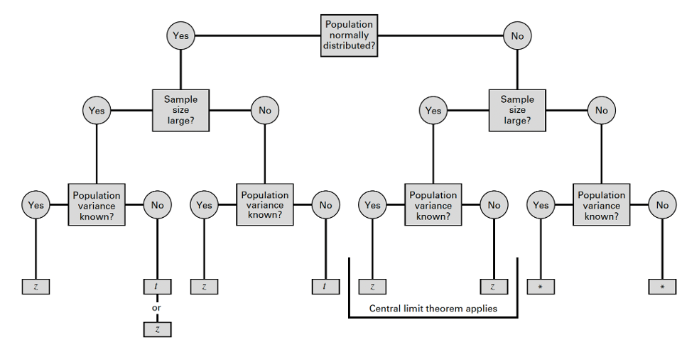
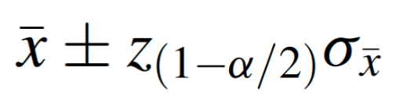
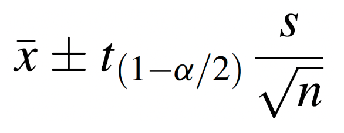
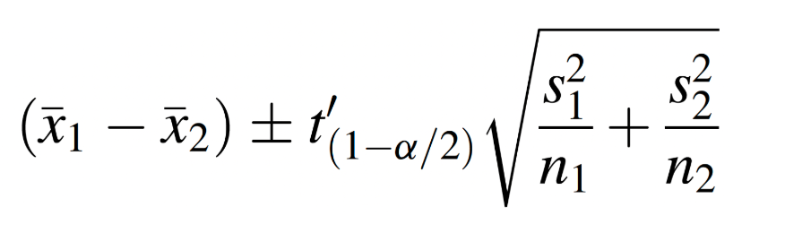
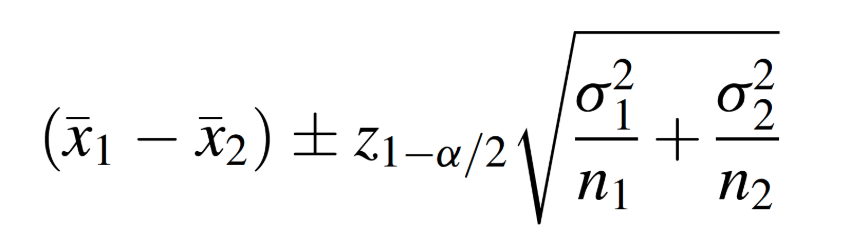
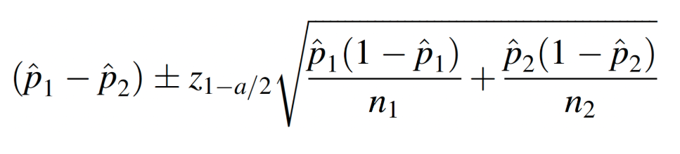

```{r setup, include=FALSE}
knitr::opts_chunk$set(echo = TRUE)
```

<br>

**Jenny Wagner, PhD, MPH**
<br>
Department of Public Health
<br>
California State University, Sacramento
<br>
<br>


# Introduction

Statistical inference is the process of using data from a sample to draw conclusions about a larger population. Since it’s often impractical to collect data from an entire population, statistical inference allows researchers to make informed decisions based on limited information. This is particularly important in public health, where decisions and policies need to be grounded in evidence. Robust data and careful analysis are essential for guiding interventions, allocating resources effectively, and addressing the health needs of populations.

Estimation is one of the two main types of statistical inference - the other being hypothesis testing, which we will cover in the coming weeks. Estimation focuses on determining the value of a population parameter — such as a mean or proportion — using sample data. For example, we might estimate the average cholesterol level in a population, the difference in smoking prevalence between two groups, or the prevalence of diabetes in a community. These estimates provide the evidence needed to understand population health, identify disparities, and inform public health interventions.

Estimation involves two types of estimates - point estimates and interval estimates. A point estimate provides a single value as the best guess for a population parameter, such as the sample mean being used to estimate the population mean. While point estimates are simple and easy to calculate, they do not convey the uncertainty inherent in using sample data.

In contrast, an interval estimate, such as a confidence interval, provides a range of values within which the population parameter is likely to fall. Interval estimates account for variability in the data and provide a measure of uncertainty, offering more information than a point estimate alone. For example, instead of estimating the average cholesterol level as exactly 200 mg/dL (point estimate), a confidence interval might suggest the true population mean lies between 195 and 205 mg/dL with a specified level of confidence.

In Lab 4, we will apply estimation techniques for four population parameters: a single population mean, the difference between two population means, a single population proportion, and the difference between two population proportions. 

<br>

# Objectives

After completing Lab 4, you will be able to:

1. Apply statistical estimation to draw inferences about population parameters.
2. Interpret confidence intervals and understand their role in quantifying uncertainty in public health research.
3. Use R/RStudio to compute and interpret estimates for population means, proportions, and their differences.

<br>

# Tasks

In Lab 4, we will continue working with the Framingham Heart Study teaching dataset. A key assumption we will make is that the baseline sample is *representative* of the adult population of the city of Framingham, MA.  

When you are ready to start Lab 4:

1. First create a new R Markdown file using the instructions on the Assignment Guidelines page. Save this `.Rmd` file in a folder dedicated to Lab 4 materials. 
2. Next, save the **modified dataset** you created in Lab 2 - called "frmgham2_p1_impute.csv" - in the same folder as your Lab 4 R Markdown file.
3. Finally, proceed to read through and carry out each of the tasks detailed below. As usual, you will begin by loading R packages, setting your working directory, and importing the dataset.

<br>

## 1. Install and load R packages

In Lab 4, we will use functions from a few new packages, so these will need to be installed before you proceed. Copy and paste the following into your Console (bottom-left window) to install the packages: 

install.packages("ggplot2")
install.packages("BSDA")
install.packages("car")

After these packages have been installed, they will need to be loaded with the `library()` function each time you start a new R session:

```{r, results = FALSE, message = FALSE, warning = FALSE}
# load packages
library(tidyverse)
library(ggplot2)
library(BSDA)
library(car)
```

<br>

## 2. Set your working directory

Set your working directory using the `setwd()` function - but remember to paste your own file path between the parentheses (see Assignment Guidelines for detailed instructions). 

```{r}
# set working directory
setwd("/Volumes/GoogleDrive/My Drive/1_CSUS/2024-2025/Spring 2025/PUBH 207B/Website/PUBH-207B-S25")
```

<br>

## 3. Import the dataset into RStudio

Use the `read.csv()` function to bring in the modified dataset you created in Lab 2. For this to work, the "frmgham2_p1_impute.csv" file will need to be saved in the working directory you specified in the above step.

```{r}
# import dataset
data <- read.csv("frmgham2_p1_impute.csv")
```

<br>

## 4. Identify and modify variable types

In both Labs 1 and 2, we discussed the importance of identifying and modifying variable types as needed. This is to ensure variables are treated appropriately in our analyses and our final results are interpreted correctly. Variables that represent quantifiable characteristics (e.g., BMI) should be treated as numerical, while variables that represent categories should be treated as such (i.e., as categorical or factor variables). So, let's start by checking variables types in our dataset:

```{r}
# check variable types
class(data$SEX) # sex
class(data$AGE) # age
class(data$BMI) # body mass index
class(data$TOTCHOL) # total cholesterol level
class(data$EDUC) # attained education
class(data$OBESE) # obesity status
```

Just as we did in Lab 2, we'll need to modify the variable types for sex, attained education, and obesity status. While these variables take on numerical values in our dataset, these values do not represent actual quantities - rather, they represent categories with no inherent quantity. Remember that we also need to specify whether a categorical or factor variable is ordered or unordered.

```{r}
# convert sex to unordered factor variable
data$SEX <- factor(data$SEX, 
                       levels=c("1", "2"), 
                       ordered=FALSE)
```

```{r}
# convert attained education to ordered factor variable
data$EDUC <- factor(data$EDUC, 
                        levels=c("1", "2", "3", "4"), 
                        ordered = TRUE)
```

```{r}
# convert obesity status to unordered factor variable
data$OBESE <- factor(data$OBESE, 
                         levels=c("0", "1"), 
                         ordered=FALSE)
```

<br>

## 5. Estimate a population mean

Now that we have prepared our dataset for analysis, suppose we want to use the Framingham Heart Study baseline sample to estimate the mean body mass index (BMI) of the adult population of the city of Framingham. In this case, the population parameter of interest is the population mean of BMI. Before we jump into estimation techniques, let's quickly summarize our dataset using the `summary()` function and also visualize the distribution of BMI with a histogram.

```{r}
# summarize dataset
summary(data)
```

```{r}
# Let's start by visualizing the distribution of BMI in the sample
hist(data$BMI, breaks = 30)
```

From the summary of our dataset, we can see the mean BMI in the sample is 25.85. This aligns with our view of the histogram for BMI, which shows the bulk of the distribution centered around this value. While we have this *point estimate* of the population parameter, an interval estimate will better capture the uncertainty in this measure.

Recall from lecture that the method we use to generate an *interval estimate* of the population mean depends on three conditions: (1) whether the population is normally distributed; (2) whether the sample is small or large (>30); and (3) whether the population variance is *known* or *unknown*. These conditions determine the appropriate *reference distribution*, which is the theoretical probability distribution used as a benchmark to calculate estimates and assess uncertainty in statistical inference. It represents how a sample statistic, such as the sample mean or sample proportion, would behave if we repeatedly sampled from the same population. In the context of estimation, the reference distribution allows us to construct confidence intervals and make inferences about population parameters. 

The reference distribution is often derived from the sampling distribution of the statistic being estimated. For example, the *sampling distribution of the sample mean* is typically normal (or approximately normal due to the Central Limit Theorem), whereas the *sampling distribution of a sample proportion* follows a binomial distribution but can be approximated as normal under certain conditions. Ultimately the specific reference distribution depends on what is being estimated and the assumptions made:

* **Normal distribution (Z)** is used when the population standard deviation is known or for large samples.
* **t-distribution** is used when the population standard deviation is unknown, especially with small sample sizes.
* **Binomial or normal approximation** is used for proportions, depending on sample size and conditions (discussed in greater detail below).

We can use the flowchart below to identify the most appropriate reference distribution (z or t) when estimating a population mean:

```{r, echo=FALSE, out.width = '100%'}

```

In most cases, if the population variance is known, we can directly account for variability in the population and use a "reliability coefficient" (Z) from the standard normal distribution, where the formula for the interval estimate of the population mean is as follows: 

```{r fig.align="center", echo=FALSE, out.width = '20%'}

```

In practice, however, the population variance is rarely known, so we will focus here on the alternative scenario. When the population variance is unknown, we estimate variability using the sample variance and use the t-distribution (rather than the standard normal distribution) in determining the appropriate reliability coefficient. Under these conditions, the formula for the interval estimate of the population mean is as follows: 

```{r fig.align="center", echo=FALSE, out.width = '20%'}

```

The great thing about using R is that - while we need to make the appropriate analytic decisions and specify a desired level of confidence with which to estimate the population parameter - R handles the calculations for the sample mean, variance, and reliability coefficient, making the process of estimation much more efficient.

Back to Framingham... Let's make the following assumptions:

* BMI is normally distributed in the population.
* We have a large sample.
* Population variance is unknown. 

Under these conditions, we can estimate the population mean using *either* the standard normal distribution *or* the t-distribution. Most often in practice, the t-distribution will be used (but the results will be similar, as the t-distribution approximates the standard normal distribution with a large sample). Let's take a look at how we can carry out this task in R using the `t.test()` function:

```{r}
# one sample t-test for population mean
t.test(data$BMI, conf.level = 0.95)
```

First a breakdown of this relatively simple line of code:

* `t.test()`: This function conducts a t-test. By default, it performs a one-sample t-test unless additional arguments are specified.
* `data$BMI`: Specifies the variable being tested (in this case, BMI from the dataset we called `data`).
* `conf.level = 0.95`: Sets the confidence level for the interval estimate to 95%.

The output of this function provides several pieces of information:

* Test Statistic (t): The t-value calculated for the one-sample test.
* Degrees of Freedom (df): The number of observations minus one (n−1).
* P-Value: Tests the null hypothesis that the mean of BMI is equal to 0. Since this is unlikely to be meaningful in practice, this part of the test is often ignored when using t.test() primarily for confidence intervals. More on hypothesis testing next week...
* Confidence Interval: The range of values within which the population mean of BMI is likely to fall with 95% confidence.
* Sample Mean: The calculated mean of BMI in the sample.

From the output, we find that the mean BMI of the sample is approximately 25.85 (in alignment with the summary statistics we generated previously). The 95% confidence interval for the population mean is (25.72565, 25.96667). *This means that we are 95% confident that the true population mean lies within this interval.* Notice that the point estimate of the population mean (i.e., the sample mean) falls exactly in the middle of the interval estimate.

<br>

## 6. Estimate the difference between two population means

Next, suppose we want to know whether mean BMI differs by sex - in other words, we want to estimate the difference in population mean BMI between males and females. First, let's visualize the distribution of BMI by sex in our sample: 

```{r}
# create side-by-side histograms to show the distribution of BMI by sex
data %>%
  ggplot(aes(x = BMI, fill = SEX)) +
    geom_histogram(color="#e9ecef", alpha=0.5, position = 'identity') +
    scale_fill_discrete(labels = c('Males', 'Females')) +
  theme_minimal()
```

A quick breakdown of this code chunk:

* `data %>%`: The pipe operator (%>%) passes the data object (your dataset) as input to the ggplot() function. It allows for clean, readable code by chaining operations.
* `ggplot(aes(x = BMI, fill = SEX))`:  Initializes the plot using the ggplot() function.
  * `aes(x = BMI)`: Maps the BMI variable to the x-axis.
  * `fill = SEX`: Groups the data by the SEX variable, using different fill colors for each group in the histogram.
* `geom_histogram(color = "#e9ecef", alpha = 0.5, position = 'identity')`
  * `geom_histogram()`: Creates the histogram for the BMI variable.
  * `color = "#e9ecef"`: Adds a light gray border to each bar for better visual distinction.
  * `alpha = 0.5`: Sets the transparency level, making the bars semi-transparent so that overlapping sections can be seen.
  * `position = 'identity'`: Ensures the bars for each group are plotted on top of each other, rather than being stacked.
* `scale_fill_discrete(labels = c('Males', 'Females'))`: Modifies the legend for the fill colors.
  * `labels = c('Males', 'Females')`: Replaces the default labels for the SEX variable with "Males" and "Females."
* `theme_minimal()`: Applies the `theme_minimal()` styling, which removes gridlines and clutter for a clean, modern appearance.

From the histogram we can see that the distributions of BMI among males and females overlap substantially. However, the center of the distribution appears to be slightly higher (meaning further to the right) among males than females. Interval estimation of the difference in means will tell us whether this difference is *statistically significant*, meaning there is a real difference between groups unlikely to have occurred by chance. 

Recall from lecture that the specific approach we use to estimate the difference in population means depends on: (1) whether or not the populations are normally distributed; (2) whether or not the sample size is large; (3) whether or not the population variances are known; and finally, (4) whether or not the population variances are equal. 

We can use the flowchart below to identify the most appropriate reference distribution (z, t, or t') when estimating the difference in population means:

```{r, echo=FALSE, out.width = '100%'}
knitr::include_graphics("flowchart_diff_means.png")
```

To estimate the difference in mean BMI between males and females in Framingham, let's first make the following assumptions:

* BMI is normally distributed in both populations.
* We have large samples.
* Population variances are unknown. 

The fourth condition - whether the population variances are equal or not - requires further investigation. There are several approaches for determining whether the population variances are equal or not. We will focus on two statistical tests:

* **F-test for equality of variances**: Compares the variances of two groups by calculating the ratio of their sample variances. It assumes that the data in each group are normally distributed and tests whether the variances are significantly different. This approach is sensitive to departures from normality, which can affect the validity of the test.
* **Levene's test**: Compares the variances of two or more groups by assessing the absolute deviations of individual values from their group means or medians. It is less sensitive to departures from normality and is a more robust alternative to the F-test for equality of variances. It is best for most cases where the data are not perfectly normal but not heavily skewed.

Based on the histograms we generated above, we can see BMI by sex is approximately normally distributed but slightly right-skewed. In the future, we will use a statistical test to determine normality, but for now, let's demonstrate both approaches (F-test and Levene's test) to determine whether the population variances are equal or not.

<br>

#### F-test for equality of variances

In order to carry out the F-test (using the `var.test()` function), we need to first save BMI values for males and females in separate vectors (basically, a list of values) as follows:

```{r}
# create separate objects containing BMI values for males and females
bmi_male <- data$BMI[data$SEX == "1"]
bmi_female <- data$BMI[data$SEX == "2"]
```

After running the above code chunk, you should see two new objects in your Environment, `bmi_male` and `bmi_female`, under "Values". We can now use these objects in the `var.test()` function as follows:

```{r}
# Apply F-test for equality of variances to vectors containing male and female BMI values
var.test(bmi_male, bmi_female)
```

When running the F-test, we really only need to pay attention to one component of the output - the p-value. When the p-value is small (let's consider "small" to be less than 0.05), we can conclude that the population variances are **not equal**, as is the case here for BMI values among males and females.

<br>

#### Levene's test for equality of variances

Let's next use Levene's test for equality of variances. Given our data are slightly skewed, Levene's Test is the more appropriate option in this case. For this test we will use the `leveneTest()` function from the `car` package as follows:

```{r}
# Levene's Test
leveneTest(BMI ~ SEX, data = data)
```

A quick breakdown of the code:

* `leveneTest()`: Levene’s test checks whether the variances of a continuous variable (e.g., BMI) are the same across two or more groups (e.g., SEX).
* `BMI ~ SEX`: The formula specifies the relationship being tested.
  * `BMI` is the dependent variable whose variances are being compared.
  * `SEX` is the grouping variable (independent variable), dividing the data into groups (e.g., males and females).
* `data = data`: Specifies the dataset (data) containing the variables BMI and SEX.

Like the output from the F-test, we are most concerned with the p-value. A small p-value (less than 0.05), as we see in this case, indicates the difference in variances is statistically significant. 

We now have two statistical tests - the F-test and Levene's test - that indicate the variances in BMI for males and females are not equal. Given this information, we will proceed with estimating the difference in population means using **Welch's t-test**, which uses the following formula:

```{r fig.align="center", echo=FALSE, out.width = '35%'}

```

To do this in R, we will carry out a two-sample t-test with unequal variances using the `t.test()` function as follows:

```{r}
# calculate 95% confidence interval for difference in mean BMI by sex
t.test(BMI ~ SEX, data = data, var.equal = FALSE, conf.level = 0.95)
```

Let's break down this code:

* `t.test()`: The function in R that conducts a t-test. In this case, it performs a two-sample t-test because the response variable (BMI) is compared across two groups defined by the explanatory variable (SEX).
* `BMI ~ SEX`: The formula specifies the dependent variable (BMI) and the grouping variable (SEX). This indicates that the means of BMI will be compared between the two levels of SEX (e.g., "Male" and "Female").
* `data = data`: Specifies the dataset (`data`) containing the variables `BMI` and `SEX`.
* `var.equal = FALSE`: Indicates that the two groups are assumed to have *unequal* variances (Welch’s t-test). Welch’s t-test is more robust when the variances of the two groups are unequal. If `var.equal = TRUE`, variances are assumed to be equal across groups and a *pooled variance* approach is used instead.
* `conf.level = 0.95`: Sets the confidence level for the confidence interval to 95%.

From the output, we see the mean BMI among males and females in the sample were 26.16875 and 25.59431, respectively. The 95% confidence interval for the difference in means was (0.3404038, 0.8084815). When estimating a difference in means, the first thing to look for is whether zero is contained within the interval estimate. If zero is within the interval (i.e., the lower bound is a negative value and the upper bound is a positive value), this means we do not have enough evidence to conclude there is a statistically significant difference in population means. For our scenario here, the output shows a confidence interval with positive lower and upper bounds, indicating the population means are different, with 95% confidence, by an amount within the interval estimate. 

From the flowchart above, we can see that either the *z* or *t'* reference distribution would be appropriate for our specific scenario. Just for practice, suppose we wanted to try this problem using the a z-test, which would use the following formula: 

```{r fig.align="center", echo=FALSE, out.width = '35%'}

```

To do this in R, we need to use the objects we created previously which contained BMI values for males and females separately. We would additionally need to create objects for the values of the sample standard deviations using the `sd()` function as follows:

```{r}
# obtain sample standard deviations for BMI among males and females
sd_m <- sd(bmi_male, na.rm = TRUE)
sd_f <- sd(bmi_female, na.rm = TRUE)
```

Now that we have separate R objects containing the list of BMI values for males and females, and objects for the standard deviation of each group, we can apply the `z.test()` function from the `BSDA` package as follows:

```{r}
# Run z.test to obtain 95% confidence interval for difference in means
    # Note: 'mu' is the hypothesized difference between population means
z.test(bmi_male, bmi_female, mu = 0, sigma.x = sd_m, sigma.y = sd_f, conf.level = 0.95)
```

First a breakdown of this code: 

* `z.test()`: This function performs a z-test to compare population means.
* `bmi_male` and `bmi_female`: These are the two vectors containing BMI values for males and females, respectively. The z-test will compare the means of these two samples.
* `mu = 0`: The hypothesized difference in population means is equal to 0. This is the default assumption unless otherwise specified. More on hypothesis testing in the coming weeks...
* `sigma.x = sd_m` and `sigma.y = sd_f`:
  * `sigma.x = sd_m`: The standard deviation of BMI among males in the sample.
  * `sigma.y = sd_f`: The standard deviation of BMI among females in the sample.
* `conf.level = 0.95`: Sets the confidence level for the confidence interval of the mean difference. A 95% confidence level means that the true difference in population means is expected to fall within the interval 95% of the time.

Using this procedure, we find that the mean BMI values among males and females in the sample are 26.16875 and 25.59431, respectively (the same result as before). And we find that the 95% confidence interval for the difference in means is (0.3404678, 0.8084175). This result is almost exactly the same as our original estimate using Welch's t-test. In alignment with our previous findings, this result provides evidence that, with 95% confidence, the population means are different by an amount within the interval estimate.

Again, while both the Welch's t-test and z-test procedures may have been appropriate here under the given conditions, you will most often see the t-test approach used in practice. 

<br>

## 7. Estimate a population proportion

Suppose we want to use the Framingham Heart Study baseline sample to estimate obesity prevalence among the adult population of the city of Framingham. In other words, we want to estimate the proportion of the adult population who are obese. The formula to estimate a population proportion is as follows:

```{r fig.align="center", echo=FALSE, out.width = '35%'}
knitr::include_graphics("prop.png")
```

To do this in R, we first need to know how many people in the sample are obese as well as the total sample size:

```{r}
# generate a table to count number of obese individuals in the sample
table(data$OBESE)
```
From the output, we see there are 574 individuals who are obese (BMI>30) in the sample, out of a total sample of 4434.

We can calculate the 95% confidence interval for the population proportion using the `binom.test()` function as follows:

```{r}
# Calculate 95% confidence interval for proportion obese in Framingham
binom.test(574, 4434, conf.level = 0.95)
```

A breakdown of this line of code:

* `binom.test()`: This function tests hypotheses about proportions and provides an exact confidence interval for a binomial proportion.
* `574` (x): The number of "successes" or events of interest in the sample. In this context, it represents the number of individuals classified as obese.
* `4434` (n): The total number of trials or observations in the sample. Here, it represents the total sample size.
* `conf.level = 0.95`: The confidence level for the confidence interval around the estimated proportion. A 95% confidence level means the true population proportion is expected to lie within the interval 95% of the time.

From the output, we see a point estimate of obesity prevalence (i.e., the sample proportion) is 0.1294542, and the 95% confidence interval for obesity prevalence is (0.1197068, 0.1396925). This means that we are 95% confidence that the true prevalence (i.e., population proportion) falls within this interval.

<br>

## 8. Estimate the difference between two population proportions

Finally, suppose we want to know whether there is a difference in obesity prevalence by sex. Recall from Lab 2 that we visualized the relative frequencies of obesity among males and females using a side-by-side bar chart as follows:

```{r}
# Create the contingency table
contingency_table <- table(data$SEX, data$OBESE)

# Calculate relative frequencies using the `prop.table()` command
relative_frequencies <- prop.table(contingency_table, margin = 1)

# Print relative frequencies
print(relative_frequencies)

# Bar chart for relative frequencies
barplot(relative_frequencies, 
        beside = TRUE, 
        main = "Relative Frequencies of Sex by Obesity Status", 
        xlab = "Obesity Status", 
        ylab = "Proportion", 
        col = c("lightblue", "lightgreen"), 
        legend = c("Male", "Female"), 
        names.arg = c("Not Obese", "Obese"))
```

From the bar chart, it appears obesity prevalence is slightly higher among females than males. But is the difference statistically significant? In other words, based on our sample data, do we have enough evidence to conclude that obesity is more prevalent among females in the population than among males? The formula to estimate the difference in population proportion is as follows: 

```{r fig.align="center", echo=FALSE, out.width = '50%'}

```

To do this in R, we first need to know the number of obese individuals by sex in the sample. We also need the total number of males and females in the sample. We can obtain these values using the 'table' command as follows:

```{r}
# generate counts of obesity by sex and totals by sex
table(data$SEX, data$OBESE) # counts of obesity by sex
table(data$SEX) # total by sex
```

The code chunk above generates two tables in the Console window. The first provides a count of obese individuals by sex, and the second provides the totals by sex. From the first table, we see there are 232 males in the sample who are obese, and there are 342 females in the sample who are obese. From the second table, we see there are a total of 1944 males in the sample and 2490 females. Next, we will use these values to estimate the difference in population proportions using the `prop.test()` function as follows:

```{r}
# obtain 95% confidence interval for difference in obesity prevalence by sex
prop.test(c(232, 342), c(1944, 2490), conf.level = 0.95, correct = FALSE)
```

First a breakdown of this line of code:

* `prop.test()`: Used to compare proportions between two or more groups using large-sample approximation (Chi-square test).
* `c(232, 342)` (x): A vector containing the counts of "successes" (e.g., individuals classified as obese) in each group:
  * `232`: Number of obese males.
  * `342`: Number of obese females.
* `c(1944, 2490)` (n): A vector containing the total number of observations (sample size) in each group:
  * `1944`: Total number of males in the sample.
  * `2490`: Total number of females in the sample.
* `conf.level = 0.95`: Specifies the confidence level for the confidence interval around the difference in proportions. Here, it is set to 95%.
* `correct = FALSE`: Disables the Yates’ continuity correction for the Chi-square test, which is often applied to adjust for small sample sizes or prevent overestimation of significance. Without the correction, the test uses the standard Chi-square approximation (more on this later in the course).

The output here contains several pieces of information:

* Chi-Square test statistic ("X-squared"): A test statistic that evaluates whether the difference in proportions is statistically significant. (More on this later in the course...)
* Degrees of Freedom (df): The degrees of freedom for the test (usually 1 for a two-sample test).
* P-value: Indicates whether the observed difference in proportions is statistically significant. A small p-value (<0.05) suggests a significant difference between the proportions.
* Confidence interval (95% by default): Provides a range of values within which the true difference in population proportions is likely to fall.
* Sample estimates: Displays the sample proportions for each group (e.g., the proportion of obese individuals in males and females).

From the output, we are most interested (for now, anyway) in the confidence interval for the difference in proportions. We can use the confidence interval to determine whether there is a statistically significant difference between groups - and if so, how much that difference is estimated to be. When estimating a difference in population proportions - just as when estimating a difference in population means - the first thing to look for is whether zero (0) is contained within the interval. If zero is within the confidence interval (in other words, if the lower bound is a negative value and the upper bound is a positive value), this means we do not have enough evidence to conclude there is a difference between groups. 

For the current scenario, we see the difference in population proportions is estimated to be (-0.037768267, 0.001752599). As zero is within this interval, we do not have enough evidence to conclude there is a difference in obesity prevalence between males and females. 

<br>

# Summary

In Lab 4, we’ve taken the next step in building your statistical inference skills by focusing on estimation. You’ve learned how to calculate and interpret point estimates and confidence intervals for a population mean, the difference between two means, a population proportion, and the difference between two proportions. These estimation procedures rely on important assumptions: the “target population” (the population we want to study) and the “sampled population” (the population from which our sample is drawn) must be the same. If these populations differ in any way, this needs to be accounted for when interpreting results. Additionally, we assume that samples are drawn using probability sampling techniques, such as random sampling, to ensure that the results are representative and unbiased. With these tools and assumptions in mind, we’re ready to move forward into topics like hypothesis testing and regression analysis, where we’ll expand our ability to make evidence-based conclusions about populations and their relationships.

When you are ready, please submit the following to the Lab 4 assignment page on Canvas:

1. An R Markdown document, which has a `.Rmd` extension
2. A knitted `.html` file

Please reach out to me at jenny.wagner@csus.edu if you have any questions. See you in class!