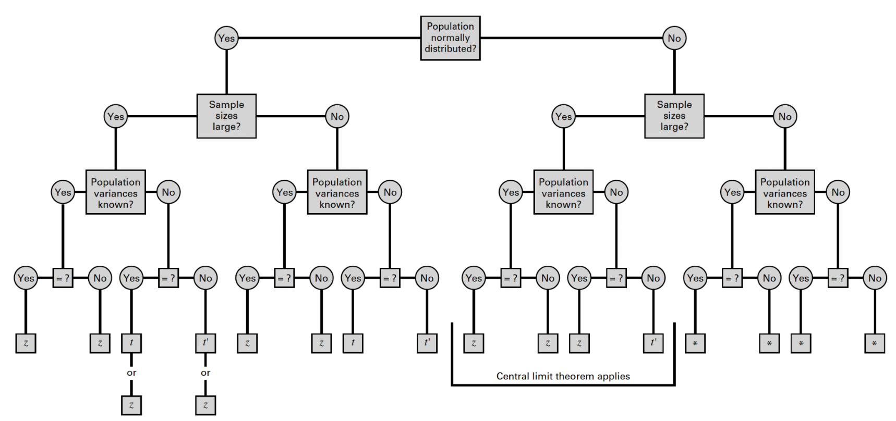

```{r setup, include=FALSE}
knitr::opts_chunk$set(echo = TRUE)
```


<br>
**Jenny Wagner, PhD, MPH**
<br>
Department of Public Health
<br>
California State University, Sacramento
<br>
<br>


# Introduction

In Lab 4 last week, we explored estimation - the first major area of statistical inference - including how to calculate confidence intervals for population parameters often of interest in public health, such as the mean, difference between two means, population proportion, and difference between two proportions. Confidence intervals provide a range of plausible values for a parameter, allowing us quantify uncertainty in our estimates.

In Lab 5, we will build upon estimation techniques for statistical inference with **hypothesis testing**, a formal method for making decisions about population parameters based on sample data. While confidence intervals allow us to estimate parameters within a margin of error, hypothesis testing helps us determine whether a population parameter differs significantly from a hypothesized value.

In Lab 5, you will learn how to conduct both one-sided and two-sided hypothesis tests for various population parameters, including:

* A single population mean
* The difference between two population means
* A single population proportion
* The difference between two population proportions

You will also see how hypothesis tests and confidence intervals are closely linked — where confidence intervals can provide insight into the conclusions we might draw from hypothesis tests. Lab 5 is intentionally designed to closely follow the structure of Lab 4 so that you can see the direct relationship between these techniques for statistical inference. 

<br>

# Objectives

After completing Lab 5, you will be able to:

1. Formulate null and alternative hypotheses for different types of tests
2. Conduct hypothesis tests using R functions
3. Interpret p-values and make conclusions in context
4. Relate confidence intervals to hypothesis testing outcomes

<br>

# Tasks

In Lab 5, we will continue working with the Framingham Heart Study teaching dataset. A key assumption we will make is that the baseline sample is *representative* of the adult population of the city of Framingham, MA.  

When you are ready to start Lab 5:

1. First create a new R Markdown file using the instructions on the Assignment Guidelines page. Save this `.Rmd` file in a folder dedicated to Lab 5 materials. 
2. Next, save the **modified dataset** you created in Lab 2 - called "frmgham2_p1_impute.csv" - in the same folder as your Lab 5 R Markdown file. This is the same file we used last week in Lab 4.
3. Finally, proceed to read through and carry out each of the tasks detailed below. As usual, you will begin by loading R packages, setting your working directory, and importing the dataset.

<br>

## 1. Install and load R packages

In Lab 5, we will use many of the same functions we used in Lab 4, so you should not need to install any new packages. As usual, however, we need to start by loading packages with the `library()` function, as follows:

```{r, results = FALSE, message = FALSE, warning = FALSE}
# load packages
library(tidyverse)
library(ggplot2)
library(BSDA)
library(car)
```

<br>

## 2. Set your working directory

Set your working directory using the `setwd()` function (see Assignment Guidelines for detailed instructions). 

```
setwd("YOUR FILE PATH HERE")
```

```{r, echo=FALSE}
# set working directory
setwd("/Volumes/GoogleDrive/My Drive/1_CSUS/2024-2025/Spring 2025/PUBH 207B/Website/PUBH-207B-S25")
```

<br>

## 3. Import the dataset into RStudio

Use the `read.csv()` function to bring in the modified dataset you created in Lab 2. For this to work, the "frmgham2_p1_impute.csv" file will need to be saved in the working directory you specified in the above step.

```{r}
# import dataset
data <- read.csv("frmgham2_p1_impute.csv") %>% select(-X)
```

<br>

## 4. Identify and modify variable types

Before we jump into hypothesis testing, we need to ensure that the variables we plan to use are in the correct format so they are treated appropriately in our analyses. This is an important step that you have practiced several times in previous Labs, and while it may feel repetitive, it is necessary for avoiding errors and ensuring accurate interpretation of our results.

As you know very well by now, variables that represent quantifiable characteristics (e.g., BMI) should be treated as numerical, while variables that represent categories should be treated as such (i.e., as categorical or factor variables). So, let's start by checking variables types in our dataset:

```{r}
# check variable types
class(data$SEX) # sex
class(data$AGE) # age
class(data$BMI) # body mass index
class(data$TOTCHOL) # total cholesterol level
class(data$EDUC) # attained education
class(data$OBESE) # obesity status
```

Just as we did in Labs 2 and 4, we'll need to modify the variable types for sex, attained education, and obesity status. While these variables take on numerical values in our dataset, these values do not represent actual quantities - rather, they represent categories with no inherent quantity. Remember that we also need to specify whether a categorical or factor variable is ordered or unordered (i.e., ordinal or nominal). Notice in the code chunks below that, for *unordered* (i.e., nominal) categorical variables like sex and obesity status, we specify `ordered = FALSE`, whereas, for *ordered* (i.e., ordinal) categorical variables like attained education, we specify `ordered = TRUE`.

```{r}
# convert sex to unordered factor variable
data$SEX <- factor(data$SEX, 
                       levels=c("1", "2"), 
                       ordered=FALSE)
```

```{r}
# convert attained education to ordered factor variable
data$EDUC <- factor(data$EDUC, 
                        levels=c("1", "2", "3", "4"), 
                        ordered = TRUE)
```

```{r}
# convert obesity status to unordered factor variable
data$OBESE <- factor(data$OBESE, 
                         levels=c("0", "1"), 
                         ordered=FALSE)
```

<br>

## 5. Hypothesis test for a population mean

As in Lab 4, suppose you are interested in studying body mass index (BMI) and want to start by estimating mean BMI of the adult population of the city of Framingham. In this case, the *population parameter* of interest is the population mean of BMI. Before we jump into hypothesis testing, let's quickly summarize our dataset using the `summary()` function and also visualize the distribution of BMI with a histogram.

```{r}
# summarize dataset
summary(data)
```

```{r}
# create a historgram of BMI in the sample
hist(data$BMI, breaks = 30)
```

From the summary of our dataset, we can see the mean BMI in the sample is 25.85. This aligns with our view of the histogram for BMI, which shows the bulk of the distribution centered around this value. Suppose you want to know whether the population of Framingham has an average BMI that is *different* from the national average (at the time of data collection), 25. Using our sample data, we can conduct a hypothesis test for the value of the population mean to determine - with a specified level of confidence - whether the population mean of BMI in Framingham is different from the national average. 

In statistical hypothesis testing, we start with two competing hypotheses: the **null hypothesis** (𝐻~0~) and the **alternative hypothesis** (𝐻~𝑎~). These hypotheses represent different claims about a population parameter, and our goal is to use sample data to determine which is more likely to be true. The null hypothesis is the *default assumption* that there is no effect or difference. It represents a baseline or "status quo" scenario and assumes there is no relationship, difference, or effect. The alternative hypothesis, on the other hand, is the hypothesis you're testing to see if there is evidence of an effect, relationship, or difference. It states the opposite of the null hypothesis and often reflects what you suspect or want to confirm using sample data.

For our scenario, the null and alternative hypotheses are as follows:

<center>

**𝐻~0~:** μ = 25  
**𝐻~𝑎~:** μ $\neq$ 25

</center>

Or, in words:

<center>

**𝐻~0~:** The mean BMI in Framingham is equal to the national average.  
**𝐻~𝑎~:** The mean BMI in Framingham is different from the national average.

</center>

The phrasing of our alternative hypothesis —"different from" — is key because it does not specify a direction (higher or lower), only that the mean may not be 25. This makes it a **two-sided** test, because we are considering both possibilities:

* The population mean BMI in Framingham could be greater than 25.
* The population mean BMI in Framingham could be less than 25.

Recall from lecture that, after specifying the null and alternative hypotheses, our next step is to identify the appropriate **reference distribution** — i.e., the probability distribution that describes how our test statistic behaves under the assumption that the null hypothesis is true. When conducting a hypothesis test for the population mean, we will use either the *Z* or *t*-distribution. Just like when we constructed confidence intervals in Lab 4, the appropriate reference distribution depends on the following conditions:

1. Whether the population is normally distributed; 
2. Whether the sample is small or large (>30); and 
3. Whether the population variance is *known* or *unknown*. 

We can again use the flowchart below to identify the most appropriate reference distribution (*Z* or *t*) when estimating a population mean:

<br>

```{r, echo=FALSE, out.width = '100%'}
knitr::include_graphics("flowchart_mean2.png")
```

<br>

As in Lab 4, we will assume BMI in the population is approximately normally distributed with an unknown variance. Following the flowchart above, under these conditions we can estimate the population mean using *either* the standard normal distribution (*Z*) **or** the *t*-distribution. Most often in practice, the *t*-distribution will be used (but the results will be very similar, as the *t*-distribution approximates the standard normal distribution with large samples). Let's take a look at how we can carry out this task in R using the `t.test()` function:

```{r}
# one sample t-test for population mean
t.test(data$BMI, mu = 25, alternative = "two.sided", conf.level = 0.95)
```

First, notice that the code we are using here for this hypothesis test is very similar to the code we used in Lab 4 to generate a confidence interval for the population mean BMI. In both cases, we use the `t.test()` function and specify the variable of interest using `data$BMI`. However, we've added a couple of new arguments, as follows:

* `mu = 25`: The hypothesized population mean BMI (from the null hypothesis).
* `alternative = "two.sided"`: Indicates that we are conducting a two-sided test, since the alternative hypothesis does not specify a direction.
* `conf.level = 0.95`: Just as we did when constructing confidence intervals, we must specify a desired **confidence level** for our hypothesis test. The confidence level is important in hypothesis testing because it determines the *threshold for statistical significance* — in other words, how much uncertainty we are willing to accept when making a decision about the null hypothesis. Here, we have specified a desired confidence level of 0.95, or 95%, which means there is a 5% chance of making a Type I error. This probability is called "alpha" (α) and is referred to as the significance level of a test. In this case, since we are specifying a confidence level of 95%, this means we have a significance level, α, of 0.05.

Let's break down the most important parts of the output for our hypothesis test:

* **Alternative hypothesis**: Specifies the hypothesis being tested, in this case, that the true (population) mean is not equal to 25.
* **Test statistic (*t*):** Tells us how many standard errors the sample mean is away from the hypothesized mean (25). A large *t*-value (in this case, 13.766) suggests that the sample mean is significantly different from 25.
* **p-value**: The p-value represents the probability of obtaining a test statistic as extreme as (or more extreme than) the one observed, assuming that the null hypothesis (𝐻~0~) is true. In other words, the p-value tells us how likely our sample results would be if there were actually no effect or difference in the population (if 𝐻~0~ were correct). In this case, the p-value is essentially 0 (very, very small), indicating an extremely low probability that we would observe a sample mean this far from 25 if the null hypothesis were true. 

We will use the p-value to make a decision about our null hypothesis. In general, when the p-value is very small, this means we have enough evidence to reject the null hypothesis in favor of the alternative hypothesis. How small is small? To make a decision about our null hypothesis (reject or fail to reject) we will compare the p-value to α, our specified level of significance. Again, this is something we, as the researcher, will choose in advance of conducting the hypothesis test. Common choices for α are:

* 0.05 (5%) → Most common in public health and social sciences.
* 0.01 (1%) → Used when stronger evidence is needed (e.g., medical studies).
* 0.10 (10%) → Sometimes used for exploratory research.

The general rules for drawing conclusions about a hypothesis test are as follows:

* If 𝑝≤𝛼→ Reject 𝐻~0~. 
  ** The data provide strong evidence against 𝐻~0~ , suggesting that 𝐻~𝑎~ is likely true.
  ** Example: If 𝑝=0.02 and 𝛼=0.05, we reject 𝐻~0~. 
* If 𝑝>𝛼→ Fail to reject 𝐻~0~.
  ** The data do not provide enough evidence to reject 𝐻~0~. This does not mean that 𝐻~0~ is true — just that we lack strong enough evidence to reject it.
  ** Example: If 𝑝=0.12 and 𝛼=0.05, we fail to reject 𝐻~0~.

In our scenario, we have a p-value of < 2.2e-16 (remember, this is scientific notation for an extremely small value, close to 0), and we set 𝛼=0.05. Since 𝑝≤𝛼, we can reject the null hypothesis. We can state our conclusion as follows: 

*At a significance level of 0.05, we reject the null hypothesis (𝐻~0~) and conclude that there is strong statistical evidence that the true mean BMI in Framingham is different from the national average of 25.*

<br>

Now, suppose we want to test whether the mean BMI in Framingham is *greater than* the national average of 25, rather than just different from it. This requires a **one-sided** hypothesis test, where we specifically test if the population mean BMI in Framingham is significantly higher than 25. In this next example, we will walk through how to set up and conduct a one-sided t-test for this scenario.

First, we can state our null and alternative hypotheses as follows:

<center>

**𝐻~0~:** μ ≤ 25  
**𝐻~𝑎~:** μ > 25

</center>

Or, in words:

<center>

**𝐻~0~:** The mean BMI in Framingham is less than or equal to the national average.  
**𝐻~𝑎~:** The mean BMI in Framingham is greater than the national average.

</center>

Remember, rhe null hypothesis (𝐻~0~) always represents the status quo or no effect. In this case, the status quo is that the mean BMI in Framingham is not greater than 25 — meaning it could be equal to or less than 25. The alternative hypothesis (𝐻~𝑎~) represents the claim we want to test. Since we are specifically interested in whether the mean BMI is greater than 25, we use a greater than (>) sign in 𝐻~𝑎~.

The code we will use to carry out this hypothesis test is almost exactly the same as before - the only difference is that we will specify the alternative hypothesis as "greater" rather than "two.sided" as we did for our two-sided test above. 

```{r}
# one sample t-test for population mean
t.test(data$BMI, mu = 25, alternative = "greater", conf.level = 0.95)
```

A few things to note about our output:

* We now see, expectedly, that the alternative hypothesis is that the "true mean is greater than 25."
* Just as in our previous example, we have a test statistic (*t) and p-value - and, from the tiny p-value, you probably suspect (correctly) that we will reject the null hypothesis.
* Finally, we see that, where we had a two-sided confidence interval before, we now have what is sometimes referred to as a "one-sided" confidence interval, where either the lower or upper bound is set to negative infinity or positive infinity, respectively. In this case, since our alternative hypothesis is that the true mean is greater than 25, the upper bound of the one-sided confidence interval is set to positive infinity (Inf). With a lower bound of 25.74503, we can report with 95% confidence that the true mean is *at least* this value.

For this one-sided test, we can state our conclusion as follows: 

*At a significance level of 0.05, we reject the null hypothesis (𝐻~0~) and conclude that there is strong statistical evidence that the true mean BMI in Framingham is greater than the national average of 25.*

<br>

## 5. Hypothesis test for the difference between two population means

Again building from Lab 4, suppose we next want to know whether mean BMI differs by sex - in other words, we want to know whether there is a statistically significant difference in population mean BMI between males and females. 

First, let's visualize the distribution of BMI by sex in our sample: 

```{r}
# create side-by-side histograms to show the distribution of BMI by sex
data %>%
  ggplot(aes(x = BMI, fill = SEX)) +
    geom_histogram(color="#e9ecef", alpha=0.5, position = 'identity') +
    scale_fill_discrete(labels = c('Males', 'Females')) +
  theme_minimal()
```

*See Lab 4 for a detailed breakdown of this code chunk.*

From the histogram we can see that the distributions of BMI among males and females overlap substantially. However, the center of the distribution appears to be slightly higher (further to the right) among males than females. We can use a hypothesis test to determine whether or not there is a statistically significant difference between the two population means. 

Let's start by stating the null and alternative hypotheses:

<center>

**𝐻~0~:** μ~male~ = μ~female~ or equivalently, μ~male~ − μ~female~ = 0
**𝐻~𝑎~:** μ~male~ $\neq$ μ~female~ or equivalently, μ~male~ − μ~female~ $\neq$ 0

</center>

Or, in words:

<center>

**𝐻~0~:** There is no difference in the mean BMI between males and females.
**𝐻~𝑎~:** The true mean BMI differs between males and females in the population.

</center>

This is a two-sided test because we are testing for any difference, rather than specifically whether BMI is higher in one group compared to the other.

Next, recall from lecture that the appropriate reference distribution (for a difference in means) depends on four conditions: 

1. Whether or not the populations are normally distributed;
2. Whether or not the sample sizes are large;
3. Whether or not the population variances are known; and finally,
4. Whether or not the population variances are equal. 

As in Lab 4, we can use the flowchart below to identify the most appropriate reference distribution (*Z*, *t*, or *t'*) when estimating the difference in population means:

```{r, echo=FALSE, out.width = '100%'}

```

<br>

To estimate the difference in mean BMI between males and females in Framingham, let's first make the following assumptions:

1. BMI is normally distributed in both populations.
2. We have large samples.
3. Population variances are unknown. 

The fourth condition - whether the population variances are equal or not - requires further investigation. In Lab 4, you learned two approaches: the **F-test** for equality of variances (appropriate for normally distributed or approximately normally distributed data); and **Levene's test** (appropriate for slightly skewed data).

Since we have already gone through the steps of determining equality of variances in Lab 4, we won't repeat those steps here. Just be sure to return to Lab 4 for guidance on this step when working on future assignments. 

We know from our work in Lab 4 that the variances for BMI among males and females are *not* equal. Following our flowchart above, we can see that either the *Z* or *t'* reference distribution would be appropriate for our specific scenario.

We will opt to carry out a two-sample *t-test* with unequal variances (i.e., Welch's t-test) using the `t.test()` function as follows:

```{r}
# two-sample t-test for difference in mean BMI by sex
t.test(BMI ~ SEX, data = data, var.equal = FALSE, alternative = "two.sided", mu = 0, conf.level = 0.95)
```

As in our previous example, the code we are using should feel familiar from Lab 4. Here, however, we have specified a couple of additional arguments: 

* `alternative = "two.sided"`: Specifies a two-tailed test to check for any difference (not just greater or less).
* `mu = 0`: Tests whether the difference in means is equal to 0 (i.e., no difference).
* `conf.level = 0.95`: Specifies a confidence level of 0.95 or 95%, meaning 𝛼=0.05.


