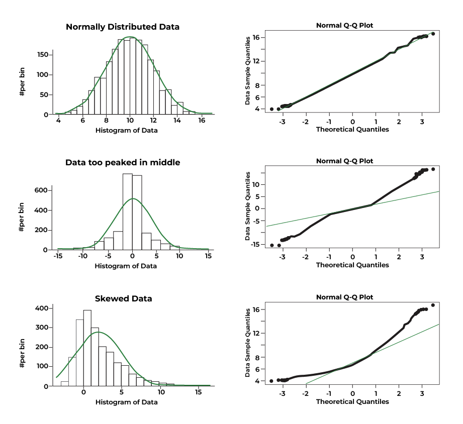

```{r setup, include=FALSE}
knitr::opts_chunk$set(echo = TRUE)
```


<br>
**Jenny Wagner, PhD, MPH**
<br>
Department of Public Health
<br>
California State University, Sacramento
<br>
<br>

# Introduction

In Lab 5 last week, we discussed hypothesis testing as a framework for making statistical inferences about population parameters using sample data. We focused on hypothesis tests for comparing two groups, such as the independent two-sample t-test. In Lab 6, we will extend our hypothesis testing approach to situations where we need to compare more than two groups. This is where Analysis of Variance (ANOVA) comes in.

ANOVA, or Analysis of Variance, is a statistical method used to determine whether there are statistically significant differences between the means of three or more independent groups. Instead of performing multiple t-tests (which would increase the risk of Type I errors), ANOVA allows us to test for differences in means across several groups with a single hypothesis test. ANOVA essentially allows us to investigate whether there is a significant relationship between a categorical independent variable (i.e., the "exposure") and a continuous dependent variable (i.e., "outcome" of interest).

ANOVA is commonly used in public health and medical research to compare means across different groups, for example:

* Comparing average blood pressure levels among individuals with different physical activity levels.
* Examining differences in cholesterol levels across different smoking status categories (e.g., non-smokers, former smokers, current smokers).
* Investigating whether BMI differs among participants with different levels of educational attainment.

Before we begin, there are a few key points to know about the ANOVA procedure:

1. Like other hypothesis tests, ANOVA begins with setting up null and alternative hypotheses. In the case of ANOVA, these hypotheses are always as follows:

  * **Null Hypothesis (𝐻~0~)**: The population means are equal across all groups (i.e., there is no difference in means).
  * **Alternative Hypothesis (𝐻~𝑎~)**: At least one group mean is different from the others.

2. If the ANOVA test returns a statistically significant result (i.e., a p-value smaller than the specified level of significance), we conclude that *at least one* group mean is different from the others. However, ANOVA does not tell us which groups differ — for that, we need post-hoc tests, which we'll get into later in this Lab.

3. For ANOVA to provide valid results, the following assumptions must be met:

  * **Independence** – The observations must be independent within and across groups.
  * **Normality** – The dependent variable (i.e., the outcome of interest) should be approximately normally distributed within each group.
  * **Homogeneity of variance (or homoscedasticity)** – The variance of the dependent variable (i.e., the outcome of interest) should be similar across all groups (this can be checked using Levene’s test for equality of variances).

Because ANOVA requires these assumptions to be met, we will begin by checking assumptions (after, of course, we prepare our dataset for analysis).

<br>

# Objectives

After completing Lab 6, you will be able to:

1. State the null and alternative hypotheses for the ANOVA test
2. Check the assumptions of ANOVA
3. Conduct an ANOVA test to compare means across multiple groups
4. Interpret results of the ANOVA test
5. Conduct post-hoc pairwise comparisons when needed

<br>

# Tasks

In Lab 6, we will continue working with the Framingham Heart Study baseline sample to investigate cardiovascular risk factors. Specifically, we will examine whether and to what extent baseline BMI varies across levels of educational attainment.

When you are ready to start Lab 6:

1. First create a new R Markdown file using the instructions on the Assignment Guidelines page. Save this `.Rmd` file in a folder dedicated to Lab 6 materials. 
2. Next, save the **modified dataset** you created in Lab 2 - called "frmgham2_p1_impute.csv" - in the same folder as your Lab 6 R Markdown file. This is the same file we used Labs 4-5.
3. Finally, proceed to read through and carry out each of the tasks detailed below. As usual, you will begin by loading R packages, setting your working directory, and importing the dataset.

<br>

## 1. Install and load R packages

In Lab 6, we will use functions from a few new packages. Copy and paste the following into your Console (bottom-left window), then click Return/Enter, to install the new packages: 

```
install.packages(c("rstatix", "ggpubr", "ggplot2"))
```

After these packages have been installed, they will need to be loaded with the `library()` function each time you start a new R session:

```{r, results = FALSE, message = FALSE, warning = FALSE}
# load packages
library(tidyverse)
library(stats)
library(rstatix)
library(ggplot2)
library(ggpubr)
```

<br>

## 2. Set your working directory

Set your working directory using the `setwd()` function (see Assignment Guidelines for detailed instructions). 

```
setwd("YOUR FILE PATH HERE")
```

```{r, echo=FALSE}
# set working directory
setwd("/Volumes/GoogleDrive/My Drive/1_CSUS/2024-2025/Spring 2025/PUBH 207B/Website/PUBH-207B-S25")
```

<br>

## 3. Import the dataset into RStudio

Use the `read.csv()` function to bring in the modified dataset you created in Lab 2. For this to work, the "frmgham2_p1_impute.csv" file will need to be saved in the working directory you specified in the above step. Again, this is the same data file you started with in Labs 4-5.

```{r}
# import dataset
data <- read.csv("frmgham2_p1_impute.csv") %>% select(-X)
```

<br>

## 4. Prepare the dataset for analysis

As usual, to prepare the dataset for analysis, we'll need to modify the variable types for sex, attained education, and obesity status. While these variables take on numerical values in our dataset, these values do not represent actual quantities - rather, they represent categories with no inherent quantity. Remember that we also need to specify whether a categorical or factor variable is ordered or unordered (i.e., ordinal or nominal). Notice in the code chunks below that, for *unordered* (i.e., nominal) categorical variables like sex and obesity status, we specify `ordered = FALSE`, whereas, for *ordered* (i.e., ordinal) categorical variables like attained education, we specify `ordered = TRUE`.

```{r}
# convert sex to unordered factor variable
data$SEX <- factor(data$SEX, 
                       levels=c("1", "2"), 
                       ordered=FALSE)
```

```{r}
# convert attained education to ordered factor variable
data$EDUC <- factor(data$EDUC, 
                        levels=c("1", "2", "3", "4"), 
                        ordered = TRUE)
```

```{r}
# convert obesity status to unordered factor variable
data$OBESE <- factor(data$OBESE, 
                         levels=c("0", "1"), 
                         ordered=FALSE)
```

<br>

## 5. Exploratory data analysis

In this Lab, we'll investigate whether BMI differs across levels of educational attainment, defined as:

* 1: 0-11 years
* 2: High School Diploma, GED
* 3: Some College, Vocational School
* 4: College (BS, BA) degree or more

Before carrying out more in-depth analyses using ANOVA, it’s important to first explore the data to understand how BMI values vary across education levels. As we learned in Lab 2, Exploratory Data Analysis (EDA) helps us understand the distribution of variables of interest, identify potential relationships, and detect potential outliers (which could affect the assumptions of the ANOVA procedure).

To start, we will:

* Calculate summary statistics (mean and standard deviation) for BMI within each education level.
* Visualize the data using boxplots to compare distributions of BMI across education levels.
* Check for outliers that may impact normality and variance assumptions (more on assumptions in the next task).

These initial steps will give us a clearer picture of the data before performing any statistical tests.

<br>

### a. Compute summary statistics

We've computed summary statistics in previous Labs, for example, using the `summary()` function. This approach was useful for quickly summarizing an entire dataset - but when we want to break down summary statistics by group (in this case, by education level), we need to use another approach. We can compute summary statistics (specifically, mean and standard deviation) for BMI, stratified by education level, using the following: 

```{r}
# Compute summary statistics for BMI
bmi_summary <- data %>%
  group_by(EDUC) %>%
  summarise(
    BMI_mean = mean(BMI, na.rm = TRUE),
    BMI_sd = sd(BMI, na.rm = TRUE),
    count = n()
  )
```

Let's break down this code chunk:

* `bmi_summary <-`: Stores the result as an object called `bmi_summary`.
* `data %>%`: Uses the pipe operator to pass the dataset `data` to the next function.
* `group_by(EDUC)`: Groups the dataset by the categorical variable `EDUC` (education levels). This means that all calculations carried out in the subsequent `summarise()` function will be performed separately for each education group.
* `summarise()`: This function computes summary statistics for each education group.
  * `BMI_mean = mean(BMI, na.rm = TRUE)`: Calculates the mean BMI for each group. Remember that the argument `na.rm = TRUE` ensures that missing values (NA) are ignored in the calculation (although we don't actually have any missing values since we addressed missingness in Lab 2).
  * `BMI_sd = sd(BMI, na.rm = TRUE)`: Computes the standard deviation of BMI for each group. The standard deviation measures how much BMI values vary within each education level.
  * `count = n()`: Counts the number of observations (sample size) in each education level.

After running the above code chunk, you won't actually see any output in the Console. Rather, since we stored the result in an object called `bmi_summary`, we will instead see this object appear in the Environment window. To view the results, you can either manually click on the object or use the `print()` function as follows:

```{r}
# Print summary statistics for BMI
print(bmi_summary)
```

Examine the output. You should see a table showing the mean (BMI_mean), standard deviation (BMI_sd), and sample size (count) stratified by education level (where each row corresponds to a different education level. We can see there are some modest differences across groups; for example, among those in education level 1 (0-11 years), mean BMI appears to be higher than the other groups, with larger spread indicated by the larger standard deviation. Conversely, education levels 2-4 appear to have similar means for BMI. Our ultimate question in this Lab is whether or not the differences in means across groups are statistically significant.

<br>

### b. Visualize group differences

As we saw in Lab 2, it is also useful to visualize distributions and potential relationships using descriptive plots. Boxplots are particularly useful when comparing the distribution of a continuous random variable across levels of a categorical variable. We can visualize the distribution of BMI across education levels as follows:

```{r}
# Boxplot of BMI across attained education levels
boxplot(data$BMI ~ data$EDUC, 
        main = "Boxplot of BMI by Education Level", 
        xlab = "Education Level", 
        ylab = "BMI", 
        col = "purple", 
        names = c("0-11 years", "High School", "Some College", "College degree or more"))
```

For a detailed breakdown of this code chunk and its output, please revisit Lab 2.

<br>

### c. Check for extreme outliers

Before conducting statistical analyses, it’s important to identify outliers — values that are unusually high or low compared to the rest of the data. Outliers can impact assumptions for hypothesis testing, such as normality and homogeneity of variance in ANOVA.

We will use the `identify_outliers()` function from the `rstatix` package to detect outliers in BMI across education levels. This function flags observations as outliers based on the interquartile range (IQR) method we learned in Lab 2, which classifies an observation as an outlier if it falls more than 1.5 times the IQR below the first quartile (Q1) or above the third quartile (Q3).

Additionally, we will look for *extreme outliers*, which are values that fall more than 3 times the IQR beyond Q1 or Q3. Extreme outliers are particularly important because they may indicate data entry errors, measurement issues, or unusual cases that could disproportionately influence ANOVA results. At this stage, we are only identifying outliers. We will determine whether or not they need to be addressed later when checking ANOVA assumptions.

In this step, we are storing the identified outliers for `BMI` in a new object called `bmi_outliers`, again, using the `identify_outliers()` function. Because we are saving the output to an object, you won’t see any immediate results in the Console after running the code:

```{r}
# check for extreme outliers in BMI
bmi_outliers <- data %>% group_by(EDUC) %>% identify_outliers(BMI)
```

To view the identified outliers, locate the `bmi_outliers` object in the Environment window. When you click on the object, you should see the dataset open in a new tab. We can also use the `head()` function to view the top few rows in the Console as follows:

```{r}
# view top few rows of `bmi_outliers` object
head(bmi_outliers)
```

If you opt to click the `bmi_outliers` object (thereby opening it in a new tab), you can sort the columns by clicking on the column names. For example, if you want to see all of the extreme outliers, click on the "is.extreme" column to sort by TRUE or FALSE. This makes it easier to review the most influential outliers before proceeding to check ANOVA assumptions in the next task.

<br>

## 6. Check ANOVA assumptions

### a. Independence

The assumption of independence cannot be tested using statistical methods in R. Instead, it is a study design issue, meaning that whether this assumption holds depends on how the data were collected. The independence assumption means that observations must not be systematically related to one another. In other words, each participant’s data should not be influenced by or dependent on another participant’s data. If this assumption is violated, ANOVA results may be misleading because dependencies between observations can artificially reduce variability within groups and lead to incorrect conclusions. In our case, if the Framingham Heart Study collected its data from independent individuals (we will assume this is the case), the assumption of independence is likely met by design, and we do not need to check for it using statistical tests.

<br>

### b. Normality 

The normality assumption in ANOVA requires that the dependent variable (in this case, BMI) is approximately normally distributed within each group (in this case, education level). While ANOVA is somewhat robust to violations of normality, especially when sample sizes are large, it is still good practice to check for normality before proceeding.

There are two main approaches for assessing normality: (1) statistical tests such as the **Shapiro-Wilk Test for Normality**; and (2) **visual methods** such as grouped histograms or Q-Q plots (Quantile-Quantile plots).

<br>

#### Shapiro-Wilk Test for Normality

The Shapiro-Wilk test is one of the most commonly used statistical tests for normality. It formally tests whether the data significantly deviate from a normal distribution. The null hypothesis of the Shapiro-Wilk test is that the data follow a normal distribution. We can interpret the results of the Shapiro-Wilk test as follows:

  * If the p-value > 0.05, we fail to reject the null hypothesis, meaning the data do not significantly deviate from normality (i.e., they are approximately normal).
  * If the p-value < 0.05, this suggests that the data deviate from normality.

We can apply the Shapiro-Wilk Test for our outcome of interest using the `shapiro_test()` function as follows:

```{r}
# Check normality of BMI within each education level
data %>% group_by(EDUC) %>% shapiro_test(BMI)
```

From the output, we can see our data violate the normality assumption based on the Shaprio-Wilk Test (as the p-value for each group is very small). 

Importantly, the Shapiro-Wilk test is very sensitive to sample size, where, for large samples (> 100 per group), the test often detects small, meaningless deviations from normality, even when these deviations are not strong enough to affect ANOVA results. Thus, for large samples (like ours), we often rely more on visual methods to assess normality rather than strictly interpreting the p-value from the Shapiro-Wilk test.

<br>

#### Visual methods to check normality

Once again, since statistical tests like the Shapiro-Wilk test can be overly sensitive in large samples, visual methods provide a practical alternative. We'll focus on two visual approaches, grouped histograms and Q-Q plots. We need to know whether the data are normally distributed within each group, so we'll have separate plots for each education level.

<br>

##### Histograms

Histograms are a useful way to visually assess whether deviations from normality are meaningful or minor. If the histograms show severe skewness or extreme outliers, we may need to consider transformations or alternative statistical methods. When examining histograms, we'll look for the following:

* **Bell-shaped distribution** – A roughly symmetric, unimodal shape suggests that the data are approximately normally distributed.
* **Skewness** – If the histogram is right-skewed (long tail on the right) or left-skewed (long tail on the left), the normality assumption may be violated.
* **Peakedness (Kurtosis)** – If the histogram is too peaked (leptokurtic) or too flat (platykurtic) compared to a normal distribution, this could indicate deviations from normality.
* **Outliers or gaps** – Large gaps, extreme values, or multiple peaks (bimodal/multimodal distributions) suggest that the data may not follow a normal distribution.

We can generate a series of histograms for BMI - one for each education level - using `ggplot` as follows:

```{r}
# Histogram of BMI for each education level
ggplot(data, aes(x = BMI, fill = EDUC)) +
  geom_histogram(alpha = 0.6, bins = 30, position = "identity") +
  facet_wrap(~EDUC, scales = "free") +  # Create separate histograms for each education level
  labs(title = "Distribution of BMI by Education Level", x = "BMI", y = "Frequency") +
  theme_minimal()
```

A breakdown of this code chunk:

* `ggplot(data, aes(x = BMI, fill = EDUC))`: Initializes the plot using `ggplot()` and specifies `data` as the dataset.
  * `aes(x = BMI, fill = EDUC)`: Defines the aesthetic mappings as follows:
    * `x = BMI`: BMI values are plotted on the x-axis.
    * `fill = EDUC`: Each education level is colored differently.
* `geom_histogram(alpha = 0.6, bins = 30, position = "identity")`:
  * `geom_histogram()`: Creates a histogram to visualize the distribution of BMI.
  * `bins = 30`: Specifies 30 bins (bars) for the histogram. Adjusting this number changes the granularity of the distribution.
  * `alpha = 0.6`: Sets the transparency level (opacity) of the bars. A value of 0.6 makes overlapping bars slightly transparent.
  * `position = "identity"`: Stacks bars separately rather than grouped together.
* `facet_wrap(~EDUC, scales = "free")`: Facets the plot by `EDUC`, meaning a separate histogram is created for each education level.
  * `scales = "free"` allows each facet to have its own y-axis scale, particularly useful if group sizes differ, as in our situation here.
* `labs(title = "Distribution of BMI by Education Level", x = "BMI", y = "Frequency")`: Adds labels to the plot as follows:
  * `title = "Distribution of BMI by Education Level"`: Sets the main title.
  * `x = "BMI"`: X-axis label.
  * `y = "Frequency"`: Y-axis label.
* `theme_minimal()`: Applies a minimalistic theme to improve readability.

<br>

###### Interpretation

The histograms show the distribution of BMI across education levels, where each panel represents a different education category. Overall, the distributions appear approximately normal but with some right-skewness. Additionally, the spread of BMI is fairly consistent across groups, but education level 4 appears to have a slightly wider range of values, suggesting greater variability at higher levels of education. There are potential outliers on the higher end of the BMI distribution in each group, which may require further investigation. 

<br>

##### Q-Q Plots

While the histograms do not show severe deviations from normality, we should confirm this by checking Q-Q plots (Quantile-Quantile plots), another of the widely used visual methods to check the normality assumption. 

Q-Q plots essentially show how well the data in each group align with a theoretical normal distribution. Ideally, if the data were perfectly normal, the points would closely follow a diagonal reference line in each panel. For example:

```{r, echo=FALSE, out.width = '100%'}

```

To generate the Q-Q plots for BMI across education level, we will again use `ggplot()` but specify some different options than those used to generate the histograms above:

```{r}
# Q-Q Plot for BMI by Education Level
ggplot(data, aes(sample = BMI)) +
  stat_qq() + 
  stat_qq_line() +
  facet_wrap(~EDUC) + 
  labs(title = "Q-Q Plots for BMI by Education Level") +
  theme_minimal()
```

Let's break down this code chunk:

* `ggplot(data, aes(sample = BMI))`: Initializes the plot using the object called `data`.
  * `aes(sample = BMI)`: Specifies that BMI values will be plotted against a theoretical normal distribution.
* `stat_qq()`: Adds a Q-Q plot layer, which plots the quantiles of BMI data against the quantiles of a theoretical normal distribution. If BMI is normally distributed, points should fall along a straight line.
* `stat_qq_line()`: Adds a reference line representing a perfectly normal distribution. If points closely follow this line, the data are approximately normal. Deviations, especially at the tails, indicate skewness (i.e., potential normality violations).
* `facet_wrap(~EDUC)`: Creates separate Q-Q plots for each education level, allowing us to visually assess normality within each group.
* `labs(title = "Q-Q Plots for BMI by Education Level")`: Adds a title to the plot.
* `theme_minimal()`: Applies a minimalistic theme to the plot.

<br>

###### Interpretation

Overall, the Q-Q plots for BMI by education level suggest mild to moderate deviations from normality, particularly at the upper ends of the distributions. For all education levels (1 through 4), the points generally follow the line in the middle range of the data but deviate at the tails, indicating right-skewness. This is evident from the way the upper quantiles curve upward away from the line, showing that there are more high BMI values (or more extreme high values) than would be expected under normality.

Since ANOVA assumes normality within groups, these mild to moderate deviations might affect the validity of ANOVA results (particularly if you are working with small sample sizes). The normality assumption is less critical for large sample sizes, as ANOVA is relatively robust to normality violations if group sizes are similar and reasonably large (e.g., n>30 per group). 

There are several options for dealing with mild or moderate deviations from normality. For example, we can consider **variable transformations**. Variable transformations involve applying a mathematical function to a variable in order to change its distribution. Transformations are commonly used in statistical analysis when data violate assumptions. The goal is to make the data more suitable for analysis while preserving its variability and interpretability. A few common variable transformations are as follows:

* **Log transformation**: Useful when data are moderately right-skewed.
* **Square root transformation**: Also an option when data are moderately right-skewed.
* **Cube root transformation**: Can be useful for either right- or left-skewed data.

Since BMI is moderately right-skewed, we will apply a square root transformation to see if this improves the normality of the data. To carry out a square root transformation, we simply create a new variable for the square root of BMI, which we will call `BMI_sqrt`, using the `mutate()` and `sqrt()` functions, as follows:

```{r}
# create a new variable for square root of BMI
data <- data %>% mutate(BMI_sqrt = sqrt(BMI))
```

Let's take a look at a few rows of our data using the `head()` function to ensure the square root-transformed BMI variable was added to our dataset correctly, as follows:

```{r}
# view the top rows of dataset
head(data)
```

From the output, we can see the variable `BMI_sqrt` has been added to the dataset. Now that we have carried out this transformation, let's recreate the histograms and Q-Q plots to see whether the normality assumption is met with this new variable.

```{r}
# Histogram of square root-transformed BMI for each education level
ggplot(data, aes(x = BMI_sqrt, fill = EDUC)) +
  geom_histogram(alpha = 0.6, bins = 30, position = "identity") +
  facet_wrap(~EDUC, scales = "free") +  # Create separate histograms for each education level
  labs(title = "Distribution of square root BMI by Education Level", x = "Square root of BMI", y = "Frequency") +
  theme_minimal()
```

The new histograms in the Plots window suggest that the square root-transformed BMI variable (called `BMI_sqrt`) values follow an approximately normal distribution across all education levels. While some potential outliers remain, particularly in education level 4, they appear more symmetrically distributed around the central bulk of the data. Overall, the square root transformation has improved normality, making the new variable better suited for subsequent analyses. 

Note that our ultimate goal has not changed - we are still investigating differences in BMI by education level. The square root transformation does not change the fundamental relationships between groups; it just makes the data more suitable for statistical analysis. When we interpret results, we can still describe differences in terms of BMI, and if needed, we can back-transform values to the original scale for clearer interpretation.

Next, let's recreate the Q-Q plots using the square root-transformed BMI variable, as follows: 

```{r}
# Q-Q Plot for square root-transformed BMI by Education Level
ggplot(data, aes(sample = BMI_sqrt)) +
  stat_qq() + 
  stat_qq_line() +
  facet_wrap(~EDUC) + 
  labs(title = "Q-Q Plots for square root-transformed BMI by Education Level") +
  theme_minimal()
```

As with the histograms, the Q-Q plots for square root-transformed BMI by education level show a general improvement in normality compared to the original Q-Q plots. While there are still some minor deviations from the reference line in all four education levels, the points generally follow the diagonal reference line. This suggests that while some potential outliers remain, their influence has been reduced compared to the original (untransformed) BMI data. Given these improvements, we should proceed with the square root- transformed BMI variable in our subsequent steps.

<br>

### c. Homogeneity of Variance

The homogeneity of variance assumption (also called homoscedasticity) is important for ANOVA because it ensures that the variability of the dependent variable (now `BMI_sqrt`) is similar across all education levels. If variance differs significantly between groups, it can affect the accuracy of the ANOVA results, potentially leading to incorrect conclusions. To assess this assumption, we will use **Levene’s test**, which checks whether the variances are equal across groups. If the test is not significant (p>0.05), we can assume that the variances are roughly equal and proceed with ANOVA. However, if the test is significant (p<0.05), we may need to adjust our approach by using **Welch’s ANOVA**, which does not assume equal variances.

We can carry out Levene's Test as follows:

```{r}
# Levene's Test (this function is from the `rstatix` package)
data %>% levene_test(BMI_sqrt ~ EDUC)
```

From the output, we can see that p<0.05, meaning we reject the null hypothesis of equal variances. Since Levene’s test indicates a violation of the homoscedasticity assumption, we will use Welch’s ANOVA instead of the standard ANOVA approach. Welch’s ANOVA is a modified version of ANOVA that does not assume equal variances across groups, making it more reliable when group variances differ.

This approach is similar to what we did in Labs 4 and 5, where we used Welch’s t-test instead of the standard t-test when comparing two groups with unequal variances. Just like Welch’s t-test adjusts for differences in variance between two groups, Welch’s ANOVA adjusts for variance differences across multiple groups. By using this method, we can still compare mean values of square root-transformed BMI (`BMI_sqrt`) across education levels while ensuring that our results remain valid.

<br>

## 7. Perform ANOVA procedure (in this case, Welch's ANOVA)

Now that we have checked assumptions, we can move onto our actual ANOVA procedure (or in this case, Welch's ANOVA, using the `welch_anova_test()` function) to test for differences in mean BMI across education levels, as follows:

```{r}
# Perform Welch's ANOVA
welch_results <- data %>% welch_anova_test(BMI_sqrt ~ EDUC)
print(welch_results)
```

Recall from the introduction above that the null hypothesis for ANOVA (and Welch's ANOVA) is that the means across groups are equal. Since the test produces a p-value of 8.65e-27 (i.e., very close to 0), this suggests *at least one* education level has a significantly different mean BMI - meaning education level may be associated with differences in BMI. Because we obtained a significant result, we need to conduct post-hoc tests to determine which groups differ from each other.

Before we move on to post-hoc tests, a quick note that, if Levene's test had returned an insignificant result (i.e., p>0.05), we would have carried out the standard ANOVA test rather than Welch's ANOVA. In the event that you need to use the standard ANOVA approach, you would use the `anova_test()` function and set up the code as follows:

```
# Perform standard ANOVA test
anova_results <- data %>% anova_test(BMI_sqrt ~ EDUC)
print(anova_results)
```

<br>

## 8. Carry out post-hoc tests for pairwise comparisons

When conducting post-hoc tests for pairwise comparisons following ANOVA (or Welch's ANOVA), the choice of test depends on whether the assumption of equal variances is met and whether group sizes are equal or unequal. Each test is designed to compare pairwise differences between group means while controlling for the increased risk of Type I error that otherwise comes with multiple comparisons. Our options are as follows:

* **Tukey’s Honest Significant Difference (Tukey HSD) test** is the most commonly used post-hoc test when the assumption of equal variances holds and group sizes are roughly equal. It systematically compares all possible pairs of group means and adjusts for multiple comparisons to ensure that the overall Type I error rate is controlled. If Levene’s test confirms equal variances, Tukey HSD is a valid choice. However, it is not appropriate when variance differs significantly across groups, as this can inflate error rates. Since our scenario here violates assumption of equal variances, and we have different sample sizes across education levels, Tukey's HSD test is not appropriate. However, if you do need to use it at any point, the syntax is as follows:

```
# Run Tukey’s HSD post-hoc test for pairwise comparisons
data %>% tukey_hsd(BMI_sqrt ~ EDUC)
```

* A variation of Tukey's HSD test, the **Tukey-Kramer test**, is used when variances are equal, but group sizes are unequal. While the standard Tukey's HSD test assumes that sample sizes are similar, the Tukey-Kramer adjustment corrects for differences in sample sizes, making it a better alternative when group sizes vary. Like Tukey's HSD, it assumes homogeneity of variance, so it should only be used when Levene’s test indicates that variances are approximately equal across groups. To run the Tukey-Kramer test in R, we would actually use the exact same code as shown above for Tukey's HSD test. R will detect that the sample sizes are different and automatically adapt by using the Tukey-Kramer correction for unequal sample sizes. Neat!

* Finally, when variances are unequal, as indicated by a significant result from Levene’s test, the **Games-Howell test** is the preferred approach. Unlike Tukey’s HSD, Games-Howell does not assume equal variances and adjusts for both variance and sample size differences. This makes it the best choice when analyzing data that violates the homogeneity of variance assumption. This means the Games-Howell test is the appropriate post-hoc procedure following use of Welch’s ANOVA. Given that our Levene’s test showed unequal variances, and we used Welch's ANOVA to detect differences across the four groups, we will proceed with the Games-Howell post-hoc test for pairwise comparisons, as follows:

```{r}
# Run Games-Howell post-hoc test for pairwise comparisons
ght_results <- data %>% games_howell_test(BMI_sqrt ~ EDUC)
print(ght_results)
```

After running the Games-Howell post-hoc test, the output will display a table in which each row represents a **pairwise comparison** between two education levels (e.g., EDUC 1 vs. EDUC 2). The columns of our output are as follows:

1. **group 1** and **group 2** – The two groups (in this case, education levels) being compared.
2. **estimate** – The estimated difference in means between the two groups (group 2 – group 1). 
3. **conf. low** and **conf. high** – The 95% confidence interval for the difference in means.
4. **p.adj** – The p-value. Determines statistical significance, where p<0.05 indicates a significant difference between the two groups.
5. **p.adj.signif** – An indicator of whether the test returned a significant result, where "ns" means "not significant."

<br>

###### Interpretation

Our results indicate significant differences in square root-transformed BMI (`BMI_sqrt`) between education level 1 and all other education levels (2, 3, and 4), as shown by the p-values (<0.05) and confidence intervals that do not include zero. Specifically, individuals in education level 1 have significantly greater square root-transformed BMI values compared to levels 2, 3, and 4. However, no significant differences were found between education levels 2 and 3 (p = 0.241), 2 and 4 (p = 0.998), or 3 and 4 (p = 0.517), based on the p-values and as their confidence intervals contain zero. These findings suggest that education level 1 differs from the others, while the remaining education levels have comparable BMI values. 

From a public health standpoint, these findings suggest that individuals with lower educational attainment (less than high school) have significantly greater BMI compared to those with higher education levels within the Framingham population, which may contribute to socioeconomic disparities in long-term cardiovascular outcomes.

<br>

## 9. Visualize results

After carrying out pairwise comparisons, it can be helpful to visualize results to more easily communicate our findings – particularly when we want to prepare graphics for publication or presentation to others. We can visualize the results of the Games-Howell test as follows: 

```{r}
# visualize results
ght_results <- ght_results %>% add_xy_position(x = "EDUC")
ggboxplot(data, x = "EDUC", y = "BMI_sqrt") +
  stat_pvalue_manual(ght_results, hide.ns = TRUE) +
  labs(
    subtitle = get_test_label(welch_results, detailed = TRUE),
    caption = get_pwc_label(ght_results)
    )
```

This code chunk essentially recreates the boxplot figure we examined in our exploratory data analysis up above – but now, we're showing the square root-transformed BMI variable used in our analysis, and we've added indicators – based on the results of the Games-Howell test – of which pairwise comparisons were statistically significant.

<br>

# Summary

In Lab 6, we have learned essential steps for carrying out the Analysis of Variance (ANOVA) procedure to investigate differences in means across more than two groups. Any analysis such as this should follow this general process: 

1. Begin with exploratory data analysis, including calculation of summary statistics and visualization with descriptive plots, to understand distributions and explore potential relationships between variables of interest.
2. Check ANOVA assumptions, including normality and homogeneity of variance (or homoscedasticity) using statistical tests and visual approaches.
3. If appropriate, perform the ANOVA procedure (or Welch's ANOVA, in the case of unequal variances).
4. If the ANOVA or Welch's ANOVA test results in a significant result, carry out the appropriate post-hoc test for pairwise comparisons.
5. Report and visualize results.

This ANOVA procedure allows us to understand the relationship between a categorical independent variable and continuous dependent variable. Next week, we will extend this idea by introducing simple linear regression, which typically examines the relationship between a continuous independent variable and a continuous dependent variable.

When you are ready, please submit the following to the Lab 6 assignment page on Canvas:

1. An R Markdown document, which has a `.Rmd` extension
2. A knitted `.html` file

Please reach out to me at jenny.wagner@csus.edu if you have any questions. See you in class!