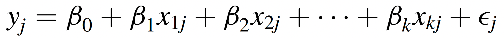
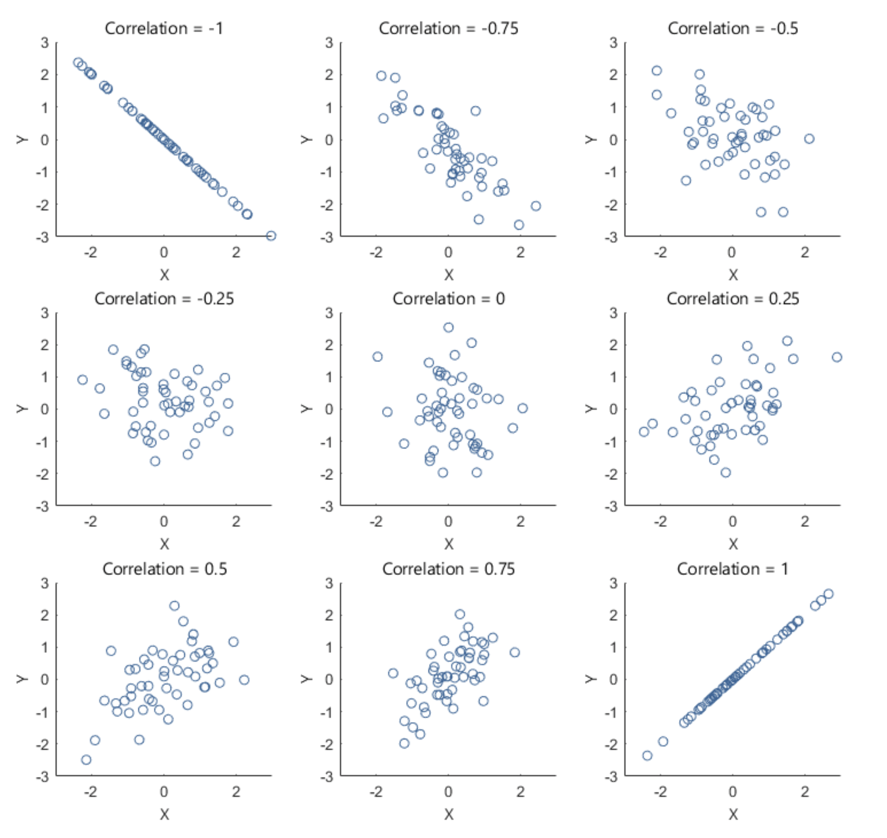
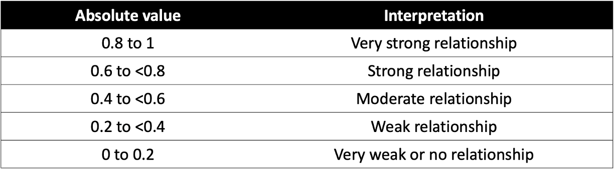
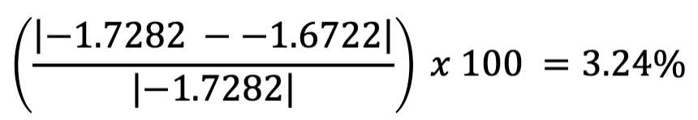
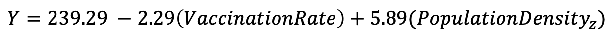

```{r setup, include=FALSE}
knitr::opts_chunk$set(echo = TRUE)
```


<br>
**Jenny Wagner, PhD, MPH**
<br>
Department of Public Health
<br>
California State University, Sacramento
<br>
<br>

# Introduction

As we have discussed in class, public health researchers often seek to understand relationships between variables. Correlation and simple linear regression are two fundamental statistical techniques used to explore and quantify these relationships. Correlation measures the strength and direction of the linear association between two continuous variables, while simple linear regression goes a step further by modeling how one variable (the dependent variable, or "outcome" of interest) changes in response to another (the independent variable, or "exposure" of interest). These methods are widely applied in public health sciences, for example, to identify risk factors for disease, to identify populations at increased risk, and ultimately to inform decision-making.

**Correlation** is used when the goal is to determine whether two continuous variables are linearly related and to quantify the strength and direction of that relationship. There are various methods for calculating what is called a *correlation coefficient*. We will use the most common method, Pearson’s correlation coefficient (denoted by *r*). This coefficient ranges from -1 to 1, where values close to -1 or 1 indicate a strong relationship and values near 0 suggest little or no linear association. Remember, of course, that correlation does not imply causation — it only describes an association between variables.

**Simple linear regression**, on the other hand, models the relationship between an independent variable (predictor) and a dependent variable (outcome). It not only tells us whether a relationship exists but also provides a mathematical equation to describe the relationship and make predictions. This method fits a regression line to the data, represented by the equation...

```{r fig.align="center", echo=FALSE, out.width = '30%'}

```

... where:

* *Y* is the dependent variable (outcome),
* *X* is the independent variable (predictor),
* *β~0~* is the y-intercept (i.e., the value of *Y* when *X*=0),
* *β~1~* is the slope (indicating how much *Y* changes for each one-unit increase in *X*), and
* *ε* represents the error term (unexplained variation).

This model can help answer questions like: What is the association between air pollution levels and hospital admission rates for respiratory diseases? or How does physical activity level influence blood pressure?

While simple linear regression examines the effect of a single predictor (*X*) variable on an outcome of interest, **multiple linear regression** extends this concept by incorporating two or more independent variables to explain variation in the dependent variable. The equation for multiple linear regression is...

```{r fig.align="center", echo=FALSE, out.width = '75%'}

```

... where each *X~i~* represents a different predictor variable, and each *β~i~* is the regression coefficient or slope associated with the corresponding predictor variable. In a multiple regression equation, the *β~i~* associated with a particular predictor variable tells us how much of a change is expected in the dependent variable with each one-unit increase in that predictor variable, *holding all other predictor variables constant*.

Multiple linear regression is particularly useful in public health research when outcomes are influenced by multiple factors. For example, instead of studying how exercise alone affects blood pressure, a multiple regression model could incorporate additional variables like diet, age, and smoking status to better explain variations in blood pressure.

As we saw in our exploration of Analysis of Variance (ANOVA) last week, linear regression too has several assumptions which must be met in order for any conclusions we draw from a linear model to be valid. Briefly, these assumptions are as follows:

1. **Linearity** – The relationship between the independent and dependent variable should be linear.
2. **Independence** – Residuals (errors) should be independent, meaning observations should not be influenced by one another.
3. **Homoscedasticity** – The variability of residuals should be constant across all levels of the independent variable.
4. **Normality** – The residuals should follow a normal distribution.
5. **Minimal multicollinearity** (for multiple regression) – This means that predictors should not be highly correlated with one another. In simple linear regression, there is only one predictor, so this assumption is not relevant, but it is relevant for multiple linear regression.

In Lab 7, we will use RStudio to compute Pearson’s correlation coefficient for several pairs of variables, fit a simple linear regression model, and assess whether assumptions are met. We will also briefly explore applications of multiple linear regression.

<br>

# Objectives

After completing Lab 7, you will be able to:

1. Calculate and interpret Pearson’s correlation coefficient to assess linear relationships.
2. Perform simple and multiple linear regression.
3. Evaluate regression assumptions using diagnostic plots and statistical checks.
4. Interpret regression results.

<br>

# Tasks

For Lab 7, we will take a brief break from the Framingham Heart Study and instead use the "measles_vaccination_data.csv" dataset. This is a simulated dataset (i.e., created for example purposes) designed for exploring the relationship between measles vaccination rates and measles incidence across different regions, taking into account various healthcare and population factors. It includes data for 100 regions, with each row representing a unique region. The specific variables include:

* `RegionID`: A unique identifier for each region.
* `VaccinationRate`: The percentage of the population vaccinated against measles in each region.
* `MeaslesIncidence`: The number of measles cases per 100,000 population in each region.
* `HealthcareAccess`: An index (ranging from 0 to 100) representing the accessibility of healthcare services in each region.
* `PopulationDensity`: The number of people per square kilometer in each region.
* `PercentChildrenUnder5`: The percentage of the region's population that is under 5 years old.
* `SES_Category`: A binary indicator of area socioeconomic status (SES), where 0=Low SES and 1=High SES. 

<br>

When you are ready to start Lab 7:

1. First create a new R Markdown file using the instructions on the Assignment Guidelines page. Save this `.Rmd` file in a folder dedicated to Lab 7 materials. 
2. Next, download the file called "measles_vaccination_data.csv" from Canvas and save it in the same folder as your Lab 7 R Markdown file.
3. Finally, proceed to read through and carry out each of the tasks detailed below. As usual, you will begin by loading R packages, setting your working directory, and importing the dataset.

<br>

## 1. Install and load R packages

In Lab 7, we will use functions from a couple of new packages. Copy and paste the following into your Console (bottom-left window), then click Return/Enter, to install the new packages: 

```
install.packages(c("lmtest", "performance"))
```

After these packages have been installed, they will need to be loaded with the `library()` function each time you start a new R session. We will use the following packages in this Lab:

```{r, results = FALSE, message = FALSE, warning = FALSE}
# load packages
library(tidyverse)
library(ggplot2)
library(ggpubr)
library(naniar)
library(stats)
library(lmtest)
library(performance) 
```

<br>

## 2. Set your working directory

Set your working directory using the `setwd()` function (see Assignment Guidelines for detailed instructions). 

```
setwd("YOUR FILE PATH HERE")
```

```{r, echo=FALSE}
# set working directory
setwd("/Volumes/GoogleDrive/My Drive/1_CSUS/2024-2025/Spring 2025/PUBH 207B/Website/PUBH-207B-S25")
```

<br>

## 3. Import the dataset into RStudio

Use the `read.csv()` function to import the "measles_vaccination_data.csv" dataset. For this to work, this file will need to be saved in the working directory you specified in the above step. 

```{r}
# import dataset
data <- read.csv("measles_vaccination_data.csv")
```

<br>

## 4. Identify and modify variable types

In previous Labs, we have used the `class()` function to check variable types one at a time. As a quicker alternative, we can use the `str()` command to check the structure of our dataset, including variable types, as follows: 

```{r}
# identify variable type for all variables in the dataset
str(data)
```

Our output contains a list of the variables in our dataset, followed by the variable type, where "num" indicates a variable is numeric and "int" indicates a variable is an integer. Most of our variables represent quantities, so they are already formatted appropriately as continuous numerical variables. The only variable that we may want to modify is `SES_Category`, since the values here represent categories (0=Low SES, 1=High SES), not quantities. We can modify this variable as follows:

```{r}
# convert SES category to unordered factor variable
data$SES_Category <- factor(data$SES_Category, 
                         levels=c("0", "1"), 
                         ordered=FALSE)
```

<br>

## 5. Exploratory data analysis

Since we are working with a new dataset in this Lab, we need to start by doing some exploratory data analysis before jumping into more in-depth analyses. We should have a good understanding of the distribution of each variable we plan to use. For this, we may want to generate both numerical summaries and descriptive plots. We can also begin to explore possible relationships between variables - for example, using scatterplots - in order to inform future analyses. 

<br>

### a. Numerical summaries

As we have done in previous Labs, we can use the `summary()` function to generate a numerical summary for each variable in our dataset, as follows:

```{r}
# generate a numerical summary of all variables
summary(data)
```

<br>

### b. Descriptive plots

#### Examine distributions of individual variables

Next, let's visualize the distribution of each individual variable using descriptive plots. For each continuous numerical variable, a histogram or boxplot is an appropriate visual. For our one categorical variable (`SES_Category`), a bar chart is most appropriate.

```{r}
# histogram of measles incidence
hist(data$MeaslesIncidence, breaks = 10)
```

```{r}
# histogram of vaccination rate
hist(data$VaccinationRate, breaks = 10)
```

```{r}
# histogram of healthcare access
hist(data$HealthcareAccess, breaks = 10)
```

```{r}
# histogram of population density
hist(data$PopulationDensity, breaks = 10)
```

```{r}
# histogram of percent children under 5
hist(data$PercentChildrenUnder5, breaks = 10)
```

```{r}
# generate a simple bar chart for SES
barplot(table(data$SES_Category), 
        main = "Barchart of SES Category", 
        xlab = "SES", 
        ylab = "Frequency", 
        col = "lightblue",
        names.arg = c("Low SES", "High SES"))
```

These plots give us a good sense of the spread of each variable. Although it is not required for linear regression that each individual variable be normally distributed, it is still helpful to check whether variables are heavily skewed or contain outliers, which can affect regression results. In the event that a variable is heavily skewed, data transformations (e.g., log transformation, square root transformation, etc.) may help to meet linear regression assumptions or improve model fit.

<br>

#### Explore relationships between variables

Next, we can use descriptive plots to visualize relationships between variables. Suppose we are most interested in understanding the relationship between measles vaccination rate and measles incidence. We can use a scatterplot, specifying the independent (vaccination rate) and dependent (measles incidence) variables as follows:

```{r}
# scatterplot of vaccination rate and measles incidence
plot(data$VaccinationRate, data$MeaslesIncidence)
```

From the scatterplot, we see a beautiful linear relationship, where increasing vaccination rate corresponds to decreasing measles incidence. In other words, there is a negative linear relationship between vaccination rate and measles incidence. 

Particularly when we get into multiple linear regression later, we may also be interested in the relationships between our other variables and the outcome of interest, as well as the relationships between predictors. If we want to examine relationships between all continuous variables at-hand, we can generate a **scatterplot matrix** using the `pairs()` function as follows:

```{r out.width = '100%'}
# scatterplot matrix for all variables, excluding SES Category and Region ID
data %>% 
  select(-c(SES_Category, RegionID)) %>% 
  pairs()
```

You may need to expand the Plots window (click and drag at the borders) to get a good view of all the plots. As you can imagine, scatterplot matrices can get pretty messy if we try to use too many variables at one time - but for a handful of variables like we have here, they can provide an efficient way to view relationships between each pair of variables in our dataset. 

Here, we've generated a scatterplot matrix using the `pairs()` function, *excluding* `SES_Category` and `RegionID`, since it doesn't make sense to visualize these particular variables with this type of plot. We may be interested, however, in viewing the distribution of our outcome of interest, measles incidence, across levels of SES. We can do this using grouped boxplots as follows:

```{r}
# Boxplot of measles incidence across SES categories
boxplot(data$MeaslesIncidence ~ data$SES_Category, 
        main = "Boxplot of Measles Incidence by SES Category", 
        xlab = "SES Category", 
        ylab = "Measles Incidence", 
        col = "lightblue", 
        names = c("Low SES", "High SES"))
```

<br>

## 6. Correlation (Pearson's r)

After exploring relationships between variables using a scatterplot matrix, the next step is to quantify the strength and direction of these relationships using **Pearson’s correlation coefficient** (*r*). While scatterplots provide a visual representation, Pearson’s *r* gives us a numerical measure of how strongly two continuous variables are linearly related, ranging from -1 (strong negative correlation) to +1 (strong positive correlation), with 0 indicating no linear relationship. For example, the following plots show what linear relationships might look like with different values of Pearson's *r*:

```{r fig.align="center", echo=FALSE, out.width = '80%'}

```

<br>

Here's a general breakdown of how to interpret values of Pearson's *r*:

```{r fig.align="center", echo=FALSE, out.width = '75%'}

```

<br>

Once again, suppose that we are most interested in investigating the relationship between vaccination rate and measles incidence. The scatterplot we generated previously suggested there is a strong negative linear relationship between these variables. We can quantify the strength and direction of this relationship by generating Pearson's *r* using the `cor()` function as follows:

```{r}
# generate Pearson's correlation coefficient (r) for vaccination rate and measles incidence
cor(data$VaccinationRate, data$MeaslesIncidence, method = "pearson")
```

As expected, the Pearson's correlation coefficient (-0.913) indicates a strong negative relationship between vaccination rate and measles incidence. 

Just as we used a scatterplot matrix to visually examine relationships between multiple pairs of variables, we can generate a **correlation matrix** to examine Pearson’s correlation coefficients for all possible pairs of continuous variables in the dataset. This helps us quickly understand the direction and magnitude of relationships between variables in our dataset and helps us identify potential multicollinearity issues (i.e., predictors that are highly correlated with one another) before proceeding with regression analysis. Let's generate a correlation matrix for all variables in our dataset (again, excluding SES category and Region ID), as follows:

```{r}
# correlation matrix
cor_matrix <- data %>% 
  select(-c(SES_Category, RegionID)) %>% 
  cor(use = "complete.obs", method = "pearson")
round(cor_matrix, 2)
```

First, a brief explanation of this code chunk:

* `data %>%`: Passes the `data` object to the next function.
* `select(-c(SES_Category, RegionID))`: Retains all variables except `SES_Category` and `RegionID` for use in the subsequent function (since we only want to generate correlation coefficients for each pair of *continuous* variables).
* `cor(use = "complete.obs", method = "pearson")`:
    * The `cor()` function computes the correlation matrix.
    * The argument `use = "complete.obs"` ensures that only rows with complete (non-missing) data are used in the calculation. This prevents missing values (NA) from affecting the results.
    * The `method = "pearson"` specifies the type of correlation coefficient to compute. The default method in `cor()` is Pearson’s correlation coefficient, but other methods like "spearman" or "kendall" can also be specified. We just won't use those in this course.
* `cor_matrix <-`: This stores the resulting correlation matrix as an object called `cor_matrix`. This is helpful because then we can easily pass the correlation matrix through our next line of code...
* `round(cor_matrix, 2)`: The `round()` function rounds all values in the correlation matrix to two decimal places, just to make it easier to read and interpret.

Once again, the correlation matrix shows the direction and strength of the linear relationships between different pairs of continuous variables in our dataset. The values range from -1 to 1, where values close to 1 indicate a strong positive correlation (both variables increase together), while values close to -1 indicate a strong negative correlation (one variable increases while the other decreases). Values near 0 suggest little or no linear relationship between the variables.

If we do a quick scan of our correlation matrix, we can see measles incidence (our outcome of interest) has strong negative correlations with vaccination rate (our main predictor of interest) and healthcare access. Measles incidence also has a weak (but approaching moderate) positive correlation with population density. The correlation between measles incidence and percent children under 5 is very weak (almost 0). Vaccination rate and healthcare access are highly correlated (we'll keep this in mind for later when building our multiple regression model).

<br>

## 7. Simple linear regression

Now that we have explored the relationships between variables using a scatterplot matrix and a correlation matrix, we can move forward with building a simple linear regression model. As discussed previously, in this scenario we are most interested in the relationship between vaccination rate (the independent variable, or primary "exposure" of interest) and measles incidence (the dependent variable, or "outcome" of interest).

<br>

### a. Build the simple linear model

From our exploratory analysis above, we have already checked the first assumption - linearity. The scatterplot of vaccination rate and measles incidence shows a strong negative linear relationship, supported by the Pearson's correlation coefficient (-0.91). We will need to check the other assumptions as well, but we first need to build the linear model in order to do this. We can build the simple linear model using the `lm()` function as follows:

```{r}
# build simple linear model and save it as an object to our Environment
model <- lm(MeaslesIncidence ~ VaccinationRate, data = data)
```

We can use the `summary()` function to view the model results as follows:

```{r}
# generate a summary of the regression model
summary(model)
```

We're not going to get too excited about our model results at this stage - we still need to check the rest of the assumptions (i.e., model diagnostics) to ensure our results are valid. For now, let's just get familiar with the most important components of the regression output:

* **Coefficients**: The coefficients table provides estimates for the intercept (β~0~) and slope (β~1~) of the simple linear regression equation, and it also indicates whether an independent variable (in this case we only have one, vaccination rate) is a statistically significant predictor of the dependent variable. Specifically, we have found:
  * **β~0~** (y-intercept): The value 241.1388 means that when the vaccination rate is 0%, the predicted measles incidence is approximately 241 cases per 100,000 population.
  * **β~1~** (regression coefficient for vaccination rate): The value -2.3086 means that for every one percentage point increase in vaccination rate, the model predicts a decrease of about 2.3 measles cases per 100,000 population. The small p-value associated with vaccination rate confirms that this variable is a statistically significant predictor of measles incidence.
* **Adjusted R-squared**: The R-squared (R^2^) value represents the proportion of variance in the dependent variable that is explained by the independent variable(s). The "adjusted" R-squared value accounts for the number of predictors in the model and is more reliable when comparing models with different numbers of predictors. 
  * In our case here, the adjusted R-squared value of 0.8322 means that vaccination rate explains about 83% of the variance in measles incidence, suggesting a strong model fit. 
* **F-statistic**: The F-statistic provides a measure of overall model significance. In this case, the extremely small p-value confirms that the model as a whole is statistically significant. 

<br>

### b. Model diagnostics

Before relying on our regression results, we need to ensure that the model meets the assumptions required for valid statistical inference. Violations of these assumptions can lead to biased or misleading results. In this next section, we will assess model diagnostics (i.e., check assumptions) by examining model **residuals**, which we can use to check for homoscedasticity, normality, and potential outliers. These checks will help confirm whether our model is appropriate or if adjustments are needed before drawing final conclusions.

Before we move on, recall that residuals represent the difference between the *observed values* and the *predicted values* from the regression model — they show how much the model’s predictions deviate from the actual data points. With this in mind, let's check each assumption of linear regression...

<br>

#### Linearity

As discussed above, we typically check the linearity assumption first and often before we have built our linear model. The linearity assumption simply suggests that, if linear regression is going to be an appropriate modeling strategy, there should be a linear relationship between the independent and dependent variables. Makes sense! As we already confirmed there is a linear relationship between vaccination rate and measles incidence using a scatterplot in our exploratory analysis, we won't run any additional diagnostics here for this assumption.

<br>

#### Homoscedasticity

To assess the assumption of homoscedasticity — which means that the variance of residuals remains constant across all levels of the independent variable — we can use both visual methods and statistical tests.

First, we will create a **residuals vs. fitted values plot**, where residuals should appear randomly scattered without a clear pattern. If we see a funnel shape (widening or narrowing spread), it suggests heteroscedasticity (non-constant variance). We can create the residuals vs. fitted values plot using the `plot()` function as follows:

```{r}
# generate residuals vs. fitted values plot
plot(model, 1) 
```

**Note:** The '1' in the code above refers to a specific plot to generate from the `plot()` command, in this case, the residuals vs. fitted values plot.

The residuals vs. fitted values plot looks pretty good here. The reference line (in red) is generally straight (this is what we want to see), and the spread of points appears generally constant as we look from left to right. 

Next, we will perform the **Breusch-Pagan test**, which formally tests whether residual variance changes systematically. Note that the null hypothesis of the Breusch-Pagan test is homoscedasticity (i.e., constant variance). If we obtain a p-value less than 0.05 from the Breusch-Pagan test, we reject the null hypothesis, which would indicate a violation of the homoscedasticity assumption. 

```{r}
# Breusch-Pagan test
bptest(model)
```

In this case, our p-value is much larger than 0.05, so we can assume homoscedasticity. Yay!

<br>

#### Normality

The normality assumption refers to the distribution of model residuals. As when we checked for homoscedasticity above, we can use both visual methods and statistical tests to check the normality assumption. 

Visually, we can use a Q-Q (Quantile-Quantile) plot to compare the distribution of residuals to a theoretical normal distribution, again using the `plot()` function as follows:

```{r}
plot(model, 2) 
```

**Note:** The '2' in the code above refers to a specific plot to generate from the `plot()` command, in this case the Q-Q plot.

The Q-Q plot here generally looks good. What we want to see is that the points generally follow the dotted reference line and that there are no major deviations. If the line is not perfectly straight or if there are minor deviations toward the tails, this is okay — but any major deviations or clear curving at the tails indicates a violation of the normality assumption.

As we did in Lab 6 when checking ANOVA assumptions, we can follow up here with the **Shapiro-Wilk test**. Note that the null hypothesis of the Shapiro-Wilk test is normality. If we obtain a p-value less than 0.05 from the Shapiro-Wilk test, we reject the null hypothesis, which would indicate a violation of the normality assumption.

```{r}
# Shapiro-Wilk test for normality of residuals
shapiro.test(residuals(model))
```

In this case, our p-value is larger than 0.05, so we can assume normality of the residuals.

<br>

#### Other assumptions

In this analysis, we are not going to formally test for **independence** of observations using statistical methods because this assumption is primarily determined by the study design rather than the data itself. Independence means that each observation is unrelated to the others — violations typically occur in time series, clustered, or repeated measures data, which require specialized models. Since our dataset is assumed to have independent observations, we will proceed without additional tests. Note that we *can* use the residuals vs. fitted values plot to give us some indication of independence — where we expect to see no discernible pattern in the residuals across levels of the independent variable.

Additionally, since we are currently using only one predictor, we do not need to check for **multicollinearity** (high correlation between independent variables). Multicollinearity becomes a concern in multiple linear regression, where strongly correlated predictors can distort coefficient estimates and reduce model interpretability. We will revisit this issue in the next section on multiple linear regression.

<br>

### c. Interpret and present regression results

Now that we have checked the assumptions of linear regression — and found that our model indeed meets all assumptions — we can interpret and use the regression equation to understand the relationship between vaccination rate and measles incidence. Let's quickly revisit the summary of our model:

```{r}
# generate a summary of the regression model
summary(model)
```

We can also generate a visual to accompany our results using `ggplot()` as follows:

```{r}
# generate a visual to accompany model results
ggplot(data=data, aes(x = VaccinationRate, y = MeaslesIncidence)) +
        geom_smooth(method="lm") +
        geom_point() +
        stat_regline_equation()
```

The key finding from our simple linear regression model is the regression coefficient for vaccination rate (-2.3086), which quantifies the relationship between vaccination coverage and measles incidence. This coefficient tells us how much measles incidence is expected to change for each one-unit increase in vaccination rate, which provides a clear, numerical estimate of the protective effect of vaccination.

In practice, findings such as these can be used to inform public health policies by demonstrating the impact of increasing vaccination coverage. For example, our model shows that higher vaccination rates significantly reduce measles incidence. Policymakers may be able to use this evidence to advocate for expanded immunization programs, targeted outreach in low-coverage areas, or resource allocation for vaccine accessibility. Additionally, these results can support public health messaging by helping communicate the importance of vaccination to communities in an evidence-based way.

<br>

## 8. Multiple linear regression

While our simple linear regression model provided valuable information about the relationship between vaccination rate and measles incidence, we know in real life that public health outcomes are often influenced by multiple factors. To build a more comprehensive model, we can extend our analysis to multiple linear regression, which allows us to include additional predictor variables — such as healthcare access, population density, socioeconomic status or demographic characteristics. This approach helps us better understand the combined effects of multiple factors, control for potential confounders, and improve the accuracy of our predictions. Here, we will briefly introduce multiple regression and examine how adding more predictors impacts our model of measles incidence.

<br>

#### a. Modeling strategies

When building a multiple linear regression model, we need to determine which predictors are most relevant to include. Our aim is to include only the most important variables — those that meaningfully contribute to explaining variation in the dependent variable. Including too many predictors can lead to *overfitting*, where the model captures random noise rather than true relationships and subsequently makes it less generalizable to new data. An overly complex model may also be harder to interpret and more difficult to use in practice. Instead, we strive for a parsimonious model — one that is as simple as possible while still capturing key relationships.

Two common variable selection approaches are **backward elimination** and **forward selection**, which help refine the model by systematically adding or removing variables based on statistical criteria. 

* If using backward elimination, we start with *all candidate predictor variables* in the model. Then, we iteratively remove the least significant predictor (based on p-values, typically using a threshold like 0.05), one at a time, until only statistically (and theoretically) meaningful variables remain. Under this modeling approach, we essentially start with a comprehensive model and remove unnecessary predictors in order to reduce complexity while maintaining explanatory power.
* In contrast, with forward selection, we start with *no predictors* and gradually add variables one by one. Then, we retain only the predictors with the strongest statistical significance at each step. This process continues until adding more variables no longer significantly improves the model. 

Both methods of variable selection help refine regression models by balancing predictive accuracy and simplicity. Again, we want to reduce the risk of overfitting the model while ensuring that key predictors are included. In practice, researchers may also use **stepwise regression**, which combines elements of both approaches for a more flexible variable selection process.

<br>

#### b. Consider possible confounders

Last semester, you were introduced to the concept of confounding — a common issue in observational research that can lead to misleading conclusions if not properly accounted for. In public health, we often want to understand the relationship between an exposure and an outcome, but relationships are rarely this simple in real life. Other variables, called confounders, can distort relationships, for example, by making them appear stronger, weaker, or even reversing the direction.

A confounder is a third variable that:

1. Is associated with the predictor of interest.
2. Is independently associated with the outcome.
3. Is not on the causal pathway between the predictor and outcome.

When confounding is present, failing to account for the confounder can lead to misleading conclusions about the effect of the predictor of interest. A common method to adjust for potential confounders is to include them in our multiple linear regression model. By doing so, we can estimate the effect of the predictor of interest *while holding the confounder constant*. This allows us to isolate the predictor’s true relationship with the outcome.

For example, suppose we suspect socioeconomic status might be a confounder in the relationship between vaccination rate and measles incidence, because:

* SES may influence vaccination rates (lower SES areas may have lower vaccine coverage).
* SES may also directly impact measles incidence (lower SES areas may have higher disease transmission due to overcrowding or healthcare barriers).

If we fail to include SES in the model, we might incorrectly estimate the effect of vaccination rate on measles incidence. 

*But how to determine whether a variable is acting as a confounder of the relationship of interest?* A common approach is to compare the regression coefficient of the predictor of interest with and without the potential confounder in the model. If adding the suspected confounder changes the coefficient of the predictor by more than 10%, the variable is likely acting as a confounder. You can calculate the percent change in the regression coefficient using the following equation:

```{r fig.align="center", echo=FALSE, out.width = '50%'}

```

... where:

* β~1~ is the regression coefficient corresponding to the predictor of interest *without* the potential confounder included in the model, and
* β~1~' is the regression coefficient corresponding to the predictor of interest in the presence of the potential confounder.

We'll take a look at an example down below.

<br>

#### c. Standardize variables if needed

In lecture and in class we have discussed the concept of transforming variables — often for the purpose of meeting model assumptions. Transformations can also be useful in other situations, such as when variables are on different *scales*. For example, in our dataset, population density is measured in people per square kilometer, while other predictors — such as vaccination rate, healthcare access, and percent children under 5 — are in percentages (ranging from 0 to 100). We can include these predictors in the model in their original units, but because population density is on a much larger scale, the regression coefficient we obtain for this variable will likely be very small and difficult to interpret for practical purposes (if left in the original units, the regression coefficient for population density will represent the change in measles incidence with a *one-person increase* in population per square kilometer). To address this issue, we can **standardize** population density (it's been a while, but we covered this concept in Week 4), meaning we can transform this variable into units of *standard deviations from the mean*, using the `scale()` function as follows: 

```{r}
# create a new variable for standardized population density
data$PopulationDensity_z <- scale(data$PopulationDensity)
```

After running the above code chunk, you should see a new variable, called `PopulationDensity_z` included in the dataset. We'll use this transformed variable when building our multiple linear regression model in the next section.

<br>

#### d. Build the multiple regression model

Suppose — based on prior research and community observations — we suspect that, in addition to vaccination rate, measles incidence also relates to an area's level of healthcare access, population density, and percentage of children under 5 years old. Suppose we also suspect, for the reasons discussed previously, that socioeconomic status may be a potential confounder of the relationship between vaccination rate and measles incidence. Since we already have a good sense of what the important factors might be, let's use backward elimination to build the multiple regression model. This means we will start with a model containing all predictors of interest, as follows:

```{r}
# start by including all predictors of interest in the model
model1 <- lm(MeaslesIncidence ~ VaccinationRate + HealthcareAccess + 
               PopulationDensity_z + PercentChildrenUnder5 + SES_Category, data = data)
summary(model1)
```

In Model 1, which contains all predictors of interest, we find that vaccination rate, healthcare access, and population density (standardized) are significant predictors of measles incidence. As indicated by the p-value, percent children under 5 and SES category are not significant predictors. In backward elimination, we remove the *least significant* predictor from the model in each stage. Since `PercentChildrenUnder5` is insignificant and has the largest p-value, we will remove it from the next iteration of the model...

```{r}
# remove least significant predictor (percent children under 5)
model2 <- lm(MeaslesIncidence ~ VaccinationRate + HealthcareAccess + 
               PopulationDensity_z + SES_Category, data = data)
summary(model2)
```

In Model 2, we find that vaccination rate, healthcare access, and population density remain significant predictors of measles incidence. SES Category, which we suspected could be a potential confounder, is the only insignificant predictor, so we will remove it from the next iteration of the model... 

```{r}
# remove least significant predictor (SES Category)
model3 <- lm(MeaslesIncidence ~ VaccinationRate + HealthcareAccess + 
               PopulationDensity_z, data = data)
summary(model3)
```

As we have now built models with and without `SES_Category`, we can apply the formula shown previously to determine whether this variable acts as a confounder of the relationship between vaccination rate and measles incidence, using the regression coefficients corresponding to vaccination rate in each model, as follows:

```{r fig.align="center", echo=FALSE, out.width = '50%'}

```

We find that the difference in the regression coefficient for vaccination rate in models with and without SES category is 3.24%, below the 10% threshold. This means SES category is likely not a confounder of the relationship between vaccination rate and measles incidence, and we can proceed with our model excluding `SES_Category`.

In Model 3, all of our predictors of interest are statistically significant. In terms of the backward elimination process, this is a good place to stop, since all of our predictors are statistically significant and theoretically meaningful — but this doesn't necessarily mean we've reached our final model. We still need to check for multicollinearity, which occurs when two or more predictor variables are highly correlated with each other. 

<br>

#### e. Identify and address multicollinearity

When predictors are strongly related, it becomes difficult to determine their individual effects on the dependent variable. This issue can lead to unstable coefficient estimates and inflated standard errors, which might make some variables appear insignificant even when they are important and reduce the reliability of our model. To address this, we will check for multicollinearity using Variance Inflation Factor (VIF) scores. VIF scores essentially quantify how much the variance of a regression coefficient is inflated due to correlation with other predictor variables, where:

* **VIF = 1**: No multicollinearity (ideal scenario).
* **VIF between 1 and 5**: Moderate correlation, generally acceptable.
* **VIF > 5**: Considerable multicollinearity, may need further investigation.
* **VIF > 10**: Severe multicollinearity, the predictor should likely be removed or adjusted.

Let's compute VIF scores for each variable in our model to identify any potential multicollinearity issues. We can do this using the `check_collinearity()` function from the `performance` pacakage:

```{r}
# generate Variance Inflation Factors for Model 2
check_collinearity(model3)
```

From our output (specifically, the two leftmost columns), we can see vaccination rate and healthcare access are listed under "High Correlation" as they have extremely high VIF values (~16.9), meaning these two variables are highly correlated. Since high VIF values suggest redundant information between predictors, our model may struggle to distinguish their individual effects — in other words, the regression coefficients associated with these predictors may be unreliable. We have a couple of options — (1) we can remove one of the highly correlated predictors, or (2) we can combine the variables into an index (i.e., a composite measure). 

For now, let's opt for the simpler of the two approaches — to remove one of the highly correlated predictors. The decision for which predictor to remove should not be made arbitrarily but rather should be based on our theoretical understanding of the issue at-hand. In this case, since vaccination is the *direct* intervention against measles, and healthcare access is more indirect in that it may influence vaccination rates, retaining vaccination rate in the model makes more sense conceptually. So, let's generate a new model excluding healthcare access, as follows:

```{r}
# remove one predictor with high VIF
model4 <- lm(MeaslesIncidence ~ VaccinationRate + PopulationDensity_z, data = data)
summary(model4)
```

From the output, we see that vaccination rate and population density remain significant predictors of measles incidence. Additionally, the adjusted R-squared remains approximately the same, at 0.9306 in Model 4, meaning we haven't really lost anything in terms of explained variation in our outcome by removing healthcare access from the model.

Let's double check the VIF values for Model 4:

```{r}
# generate Variance Inflation Factors for Model 4
check_collinearity(model4)
```

We see that, after removing healthcare access from the model, multicollinearity is no longer an issue (the VIF values are 1, meaning no multicollinearity). Yay!

<br>

#### f. Rerun model diagnostics

Finally, since we have arrived at what we *hope* is our final model, let's quickly rerun model diagnostics to ensure our multiple regression model still meets assumptions.

```{r}
# generate residuals vs. fitted values plot to assess homoscedasticity assumption
plot(model4, 1) 
```

Looks good!

```{r}
# generate Q-Q plot to assess normality assumption
plot(model4, 2) 
```

Looks fine. Hooray!

<br>

#### g. Interpret regression results

Our final regression model estimates the relationship between measles incidence, vaccination rate, and population density, given by the following equation:

```{r fig.align="center", echo=FALSE, out.width = '75%'}

```

We can interpret our regression coefficients as follows:

* **Vaccination Rate (-2.29)**: For every one percentage point increase in vaccination coverage, measles incidence is expected to decrease by 2.29 cases per 100,000 population, *holding population density constant*.
* **Population Density (standardized) (5.89)**: For every one-standard deviation increase in population density, measles incidence is expected to increase by 5.89 cases per 100,000 population, *holding vaccination rate constant*.

Our results indicate that both predictors (vaccination rate and population density) have very small p-values (< 2e-16), meaning they are highly significant contributors to the model.

Finally, the adjusted R-squared value of 0.9306 indicates that the model explains about 93% of the variability in measles incidence, an excellent fit.

<br>

#### h. Investigate interactions

So far in this Lab, we have assumed that each predictor variable in our model has an independent effect on the outcome. However, in many situations, the effect of one variable may depend on the level of another variable — this is known as an interaction effect. We might be interested in investigating interactions when we suspect (based on theory or prior research) that the relationship between an independent variable and the outcome of interest differs across levels of another variable. For example, we found earlier in this Lab that socioeconomic status does not act as a confounder of the relationship between vaccination rate and measles incidence. But suppose we suspect that the effect of vaccination rate on measles incidence *depends* on socioeconomic status. Suppose we think that, in lower SES areas, vaccination rates may need to be higher in order to achieve the same reduction in measles cases (perhaps do to overcrowding, more limited healthcare access, or other factors).

Building from Model 4, we can include an interaction term between vaccination rate and SES category by putting an asterisk (*) between these two variables, as follows:

```{r}
# add interaction term between vaccination rate and SES category
model5 <- lm(MeaslesIncidence ~ VaccinationRate*SES_Category + PopulationDensity_z, data = data)
summary(model5)
```

Note that when we include an interaction term, the *main effects* of each variable and *interaction effect* are all reported in the output. Based on the p-values, however, we see that the main effect of SES category and interaction between vaccination rate and SES category are insignificant. Womp womp. Had the interaction term been significant, recall from lecture that:

* A positive (and significant) interaction coefficient suggests the effect of one predictor variable on the outcome is increased by the presence of the other variable.
* A negative (and significant) interaction coefficient suggests the effect the effect of one predictor variable on the outcome is reduced by the presence of the other variable.

Since the interaction term was insignificant and did not improve the explanatory power of the model (based on the adjusted R^2^ value), best to continue with Model 4 as our final model.

<br>

# Summary

In Lab 7, we have explored the use of correlation and linear regression to analyze the relationship between vaccination rates, population density, and measles incidence. These statistical methods are appropriate for analyzing linear relationships when the outcome of interest is a continuous random variable. From this Lab, we can see that much of the work that goes into applying linear regression techniques is in checking assumptions, or in other words, performing model diagnostics. This is a necessary step to ensure that the results we obtain from our linear model are valid. 

In the next section of our course, we will discuss logistic regression, a modeling approach used when the outcome variable is categorical rather than continuous. This builds upon what we have learned in linear regression but is particularly useful in public health settings where outcomes are often binary — such as predicting whether a disease occurs (yes/no), whether a patient is at high risk (high/low), or whether a policy intervention succeeds or fails. 

When you are ready, please submit the following to the Lab 7 assignment page on Canvas:

1. An R Markdown document, which has a `.Rmd` extension
2. A knitted `.html` file

Please reach out to me at jenny.wagner@csus.edu if you have any questions. See you in class!