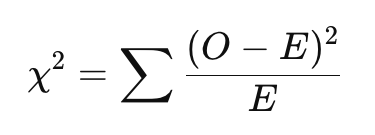
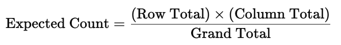
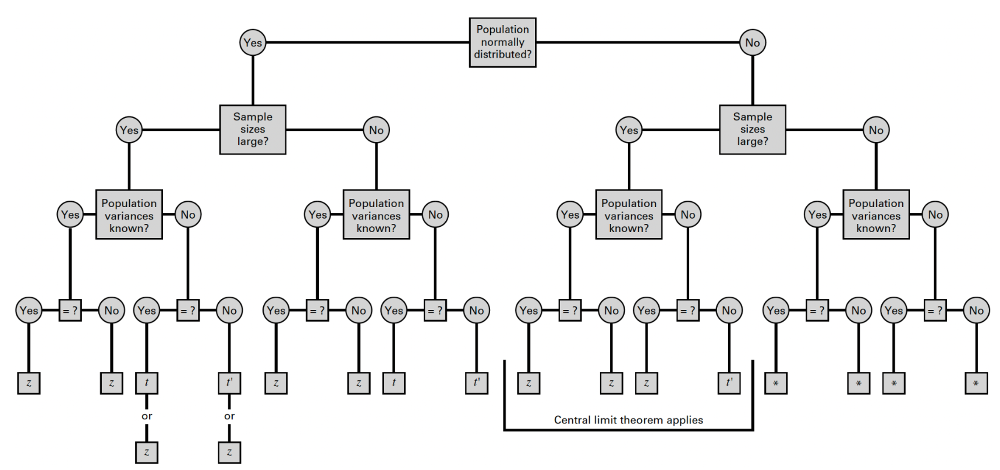

```{r setup, include=FALSE}
knitr::opts_chunk$set(echo = TRUE)
```

<br>

**Jenny Wagner, PhD, MPH**
<br>
Department of Public Health
<br>
California State University, Sacramento
<br>
<br>

# Introduction

In Lab 9, you will learn how to apply statistical tests that are useful when common assumptions of parametric tests (such as normally distributed data or large sample sizes) do not hold. The Lab is divided into two parts, each using a different dataset to highlight distinct types of analyses.

Part 1 of this Lab focuses on methods for analyzing relationships between categorical variables. Specifically, you’ll use the **Chi-square test of independence** and **Fisher’s exact test** to determine whether there is a significant association between two categorical variables in a contingency table. These tests are commonly used in public health and epidemiology to assess relationships such as exposure and disease status, stratified by demographic or behavioral characteristics. While the Chi-square test is appropriate for larger sample sizes and expected cell counts, Fisher’s exact test is better suited for smaller samples.

Part 2 of this Lab introduces non-parametric methods for comparing groups when your data do not meet the assumptions of normality or homogeneity of variance. You’ll apply the **Mann-Whitney U test** (also known as the Wilcoxon rank-sum test) to compare two independent groups, and the **Kruskal-Wallis test** to compare more than two groups. When the Kruskal-Wallis test indicates a statistically significant difference, you’ll follow up with **Dunn’s test** for post-hoc pairwise comparisons. These methods rely on ranked data rather than raw values, which makes them useful for ordinal data or skewed continuous variables.

<br>

# Objectives

After completing Lab 9, you will be able to:

1. Use the Chi-square test of independence and Fisher’s exact test to assess associations between categorical variables.
2. Apply the Mann-Whitney U test, Kruskal-Wallis test, and Dunn test to compare distributions of continuous or ordinal variables across independent groups.
3. Interpret the results of non-parametric and categorical analyses.

<br>

# Tasks

Lab 9 is divided into two distinct parts. You will use a different dataset for each part. For Part 1, you will use the file called "asthma_risk_factors.csv" and for Part 2, you will use "smoking_cessation.csv" - these are simulated datasets created for teaching purposes. The specific variables contained within each dataset will be detailed below.

When you are ready to start Lab 9:

1. First create a new R Markdown file using the instructions on the Assignment Guidelines page. Save this `.Rmd` file in a folder dedicated to Lab 9 materials. 
2. Next, download the files called "asthma_risk_factors.csv" and "smoking_cessation.csv" from Canvas and save them in the same folder as your Lab 9 R Markdown file.
3. Finally, proceed to read through and carry out each of the tasks detailed below. As usual, you will begin by loading R packages, setting your working directory, and importing the dataset.

<br>

## Install and load R packages

We will use the following packages in this Lab:

```{r, results = FALSE, message = FALSE, warning = FALSE}
# load packages
library(tidyverse)
library(stats)
library(ggplot2)
library(ggpubr)
library(rstatix)
```

<br>

## Set your working directory

Set your working directory using the `setwd()` function (see Assignment Guidelines for detailed instructions). 

```
setwd("YOUR FILE PATH HERE")
```

```{r, echo=FALSE}
# set working directory
setwd("~/Google Drive/My Drive/1_CSUS/2024-2025/Spring 2025/PUBH 207B/Website/PUBH-207B-S25")
```

<br>

# PART 1: Analysis of frequencies

Suppose you are a public health researcher exploring the impact of various environmental, housing, and behavioral factors on the occurrence of asthma. You are particularly interested in determining if indoor air quality, presence of pets, and smoking behavior are associated with asthma diagnosis.

For Part 1 of this Lab, we will be using the "asthma_risk_factors.csv" dataset, which contains the following variables:

* **Asthma**: Yes, No (whether individuals have asthma)
* **Indoor_Air_Quality**: Excellent, Good, Moderate, Poor (assessment of the indoor air quality where the individual resides)
* **Pets**: Yes, No (whether the individual has pets at home)
* **Smoking_Behavior**: Smoker, Non-Smoker (personal smoking status)

<br>

## Import the dataset

To get started with Part 1, import the dataset using the following:

```{r}
# import the dataset
data <- read.csv("asthma_risk_factors.csv")
```

<br>

## Data preparation

As usual, we should start by checking the structure of the dataset, including variable types:

```{r}
# identify variable type for all variables in the dataset
str(data)
```

We can see from the output that there are 100 observations and 4 variables. All four variables (`Asthma`, `Indoor_Air_Quality`, `Pets`, and `Smoking_Behavior`) are stored as *character* variables, shown by "chr." Character variables are simply text values — like "Yes", "No", or "Smoker". We haven’t encountered character variables yet in this course because all of the variables we’ve used so far — whether categorical or numerical — have been stored as numbers. Now that we’re working with variables represented by words instead of numbers, it’s important to tell R when those words represent distinct categories. To do this, we convert character variables to factor variables. This helps R recognize that, for example, "Smoker" and "Non-Smoker" are not just different words, but different groups. As with previous datasets, it’s good practice to convert known categorical variables to factors before doing analysis or creating visualizations.

We can convert each to a factor variable as follows:

```{r}
# convert variables to factors
data$Asthma <- as.factor(data$Asthma)
data$Indoor_Air_Quality <- as.factor(data$Indoor_Air_Quality)
data$Pets <- as.factor(data$Pets)
data$Smoking_Behavior <- as.factor(data$Smoking_Behavior)
```

<br>

## Exploratory data analysis

Suppose your goal is to determine whether there are significant associations between each potential risk factor of interest — smoking behavior, presence of pets, and indoor air quality — and the occurrence of asthma. Before we get into more detailed analyses, let's begin with some exploratory data analysis to become more familiar with the dataset.

Since we're interested in the association between each potential risk factor and asthma status, a good place to start is with contingency tables. These tables show the distribution of one variable across the levels of another and can help us identify potential patterns or relationships in the data.

We can generate contingency tables using the `table()` function. When you use the `table()` function in R to create a contingency table, be sure to pay attention to the order of the variables you include. R does not label which variable is which in the output, so you need to remember that:

* The first variable you list will appear as the rows (along the left side).
* The second variable you list will appear as the columns (across the top).

This can get especially confusing when both variables have the same category labels — like "Yes" and "No" — because it's not immediately obvious which variable those labels belong to. To avoid misinterpreting the table, always double-check the order in which you supplied the variables.

```{r}
# generate contingency table for smoking behavior and asthma
table(data$Smoking_Behavior, data$Asthma)
```

From the output, we can see that, among non-smokers, most participants do not have asthma (50 vs. 8). Among smokers, the numbers are evenly split between those with and without asthma (21 each). This suggests that asthma appears to be more common among smokers than non-smokers.

```{r}
# generate contingency table for presence of pets and asthma
table(data$Pets, data$Asthma)
```

Among those without pets, more participants do not have asthma (40 vs. 13). Among those with pets, the difference is smaller (31 without asthma vs. 16 with asthma). Asthma may be slightly more common among those with pets, but the association appears weaker than with smoking.

```{r}
# generate contingency table for indoor air quality and asthma
table(data$Indoor_Air_Quality, data$Asthma)
```

For those reporting excellent, good, or moderate indoor air quality, asthma is relatively uncommon. For those reporting poor air quality, asthma is almost as common as not having asthma (19 with asthma vs. 20 without). This suggests a potential stronger association between poor indoor air quality and asthma.

As part of our exploratory analysis, we may also want to generate descriptive plots to visualize potential associations in the data. This can sometimes make it easier to quickly ascertain potential associations between variables. As we have seen in prior Labs, bar charts are most appropriate for visualizing one or more categorical variables. We can generate bar charts for each pair of variables as follows:

```{r}
# visualize the data: asthma by smoking status
data %>% ggplot(aes(x = Smoking_Behavior, fill = Asthma)) +
  geom_bar(position = "dodge") + 
  labs(y = "Frequency",
       x = "Smoking Status",
       fill = "Asthma")
```

```{r}
# visualize the data: asthma by presence of pets
data %>% ggplot(aes(x = Pets, fill = Asthma)) +
  geom_bar(position = "dodge") + 
  labs(y = "Frequency",
       x = "Presence of Pets",
       fill = "Asthma")
```

```{r}
# visualize the data: asthma by indoor air quality
data %>% ggplot(aes(x = Indoor_Air_Quality, fill = Asthma)) +
  geom_bar(position = "dodge") + 
  labs(y = "Frequency",
       x = "Indoor Air Quality",
       fill = "Asthma")
```

<br>

## Formal analysis of categorical variables

Now that we've explored potential relationships in our dataset using contingency tables and bar charts, we can move on to formal statistical tests to assess whether the associations we observed are statistically significant - or if they are likely due to chance.

Two commonly used tests for this purpose are the **Chi-square test of independence** and **Fisher’s exact test**. Both tests evaluate whether there is a statistically significant association between two categorical variables by comparing *observed frequencies* in each cell of a contingency table to the *expected frequencies* — the counts we would expect to see if the two variables were not associated with one another (i.e., if they were independent). For both tests, the null hypothesis is that there is *no association* between the two variables (i.e., they are independent of one another). The Chi-square test statistic is given by the following equation:

```{r fig.align="center", echo=FALSE, out.width = '25%'}

```

Where:

* 𝑂 = Observed frequency in each cell
* 𝐸 = Expected frequency in each cell
* The sum is taken over all cells in the contingency table

A larger Chi-square test statistic (and therefore, a smaller p-value) suggests a bigger difference between observed and expected counts, which provides more evidence against the assumption of independence. As with other hypothesis tests we have used in this course, we can draw a conclusion about the test based on the p-value, where a p-value less than 0.05 is considered statistically significant.

In short, the Chi-square test and Fisher's exact test tell us whether the differences we see in the contingency table are likely due to chance or reflect a real association in the population. When to use each test depends on the sample size and expected cell counts:

* The Chi-square test of independence is appropriate when *all expected cell counts are sufficiently large* — typically at least 5. It is well-suited for larger samples and is often used when analyzing 2x2 or larger tables.
* The Fisher’s exact test is more accurate when sample sizes are small or *expected cell counts are low* (below 5). While it can be used with larger tables, it becomes computationally intensive and is generally reserved for smaller datasets.

In this section, we’ll use both tests — depending on the characteristics of the data — to formally test for associations between asthma status and each of the potential risk factors we explored earlier.

<br>

### Check expected cell counts

Before choosing between the Chi-square test of independence and Fisher’s exact test, we need to check the expected cell counts. The expected cell count is the number of observations we would *expect* to see in each cell of the contingency table if the two variables were completely independent — that is, if there were no relationship between them. For each cell in a contingency table, the expected count is calculated by:

```{r fig.align="center", echo=FALSE, out.width = '50%'}

```

The Chi-square test uses these expected counts to compare against the observed counts. If the differences between observed and expected counts are large, the test may indicate a significant association. But for the Chi-square test to be valid, expected counts in each cell should generally be 5 or more. If not, it’s better to use Fisher’s exact test.

We can check the expected cell counts using the following:

```{r}
# check expected cell counts
chisq.test(data$Smoking_Behavior, data$Asthma)$expected
chisq.test(data$Pets, data$Asthma)$expected
chisq.test(data$Indoor_Air_Quality, data$Asthma)$expected
```

From the output, we can observe the following:

* For smoking behavior and asthma, all expected cell counts are above 5, so it is appropriate to use the Chi-square test of independence here.
* For presence of pets and asthma, all expected cell counts are above 5, so it is appropriate to use the Chi-square test of independence here.
* For indoor air quality and asthma, most expected counts are above 5, but one cell (Asthma = Yes, Air Quality = Good) has an expected count of 4.93, which is below the threshold. Here, we even see a warning from R indicating that the Chi-square approximation may be incorrect. In this case, it is safer to use Fisher's exact test rather than the Chi-square test of independence.

<br>

### Chi-square test of independence

We can run the Chi-square test of independence for smoking behavior and asthma using the `chisq.test()` function as follows:

```{r}
# Chi-square test of independence for smoking behavior and asthma
chisq.test(data$Smoking_Behavior, data$Asthma)
```

From the output, we can see the Chi-square test statistic is 13.801, and the p-value is 0.0002, which is well below 0.05. This means there is strong evidence of a statistically significant association between smoking behavior and asthma. In other words, the observed differences in asthma rates between smokers and non-smokers are unlikely to be due to chance. This supports what we saw in the contingency table - that asthma was more common among smokers than non-smokers.

Next, we'll again use the `chisq.test()` function to test the association between presence of pets and asthma, as follows:

```{r}
# Chi-square test of independence for pets and asthma
chisq.test(data$Pets, data$Asthma)
```

Our output here suggests that there is no statistically significant association between pet ownership and asthma status in this sample, as the p-value is greater than 0.05. In other words, based on this data, there is not enough evidence to conclude that the presence of pets is related to whether or not someone has asthma.

<br>

### Fisher's exact test

Finally, let's use Fisher's exact test to examine the association between indoor air quality and asthma using the `fisher.test()` function as follows:

```{r}
# Fisher exact test for indoor air quality and asthma
fisher.test(data$Indoor_Air_Quality, data$Asthma)
```

Given the p-value is below the 0.05 threshold, our results suggest the association between indoor air quality and asthma is statistically significant. In other words, the distribution of asthma cases differs depending on the reported level of indoor air quality — this supports what we saw earlier in the contingency table, where asthma was more common among those who reported poor indoor air quality.

<br>

# PART 2: Non-parametric hypothesis tests

In Part 2 of this Lab, we’ll explore how to compare differences in outcomes across groups when your data may not meet the assumptions required for traditional parametric tests like the two-sample t-test or ANOVA. Part 2 is based on a new scenario (unrelated to Part 1 above) and uses a new dataset.

Suppose a local public health department has implemented a smoking cessation program in three different community settings: a workplace, a community center, and a high school. The program includes workshops, free counseling, and resources for quitting smoking. The effectiveness of the program is measured by the reduction in the number of cigarettes smoked per day, collected through self-reported surveys before and after the program. Your goal is to evaluate the effectiveness of the smoking cessation program across the three settings and determine if the reductions in smoking habits differ significantly among them.

For Part 2, we will be using the "smoking_cessation.csv" dataset, which contains the following two variables:

* **Reduction_in_Cigarettes**: The reduction in the number of cigarettes smoked per day.
* **Group**: Indicates the community from which the participant was drawn (workplace, community center, high school).

<br>

## Import the dataset

To get started with Part 2, import the dataset using the following:

```{r}
# import the dataset
data1 <- read.csv("smoking_cessation.csv")
```

<br>

## Data preparation

As usual, we should start by checking the structure of the dataset, including variables types:

```{r}
# identify variable type for all variables in the dataset
str(data1)
```

From the output, we can see there are a total of 30 observations and 2 variables in the dataset. We also see that `Reduction_in_Cigarettes` is a numeric variable, and `Group` is a character variable. As we did in Part 1 above, we should start by converting `Group` to a factor variable so that R knows the different words represent different categories:

```{r}
# convert variables to factors
data1$Group <- as.factor(data1$Group)
```

<br>

## Exploratory data analysis

Suppose your goal is to determine whether reduction in cigarette use differs across the settings in which the smoking cessation program was implemented. Before we get into more detailed analyses, let's begin with some exploratory data analysis to become more familiar with the dataset.

Since we're interested in differences across groups, a good place to start is with grouped boxplots to visualize the distribution of cigarette reduction across program settings.

```{r}
# Boxplot for reduction in cigarettes by group
ggboxplot(data1, x = "Group", y = "Reduction_in_Cigarettes")
```

From the output, we can see there appears to be a difference in the distribution of cigarette reduction across groups, where participants in the workplace-based program appear to have a greater reduction in cigarettes compared to the other groups. 

As usual, we will expand on this exploratory analysis with formal statistical tests to assess whether the association we observe here between reduction in cigarettes and program setting is statistically significant — or if it is likely due to chance.

<br>

## Non-parametric hypothesis tests

Earlier in the course, we learned how to use *parametric tests* — like the two-sample t-test and ANOVA — to compare means across groups. Recall that these tests assume the outcome variable is normally distributed within each population — or alternatively, that the sample sizes are large enough to apply the Central Limit Theorem. When assumptions are violated (or sample sizes are too small to assume normality of the sampling distribution), the results of parametric tests may not be valid. This is where non-parametric tests come in.

Let's take a look at the flowchart we used several weeks back to identify the appropriate reference distribution when making comparisons across two independent groups:

```{r, echo=FALSE, out.width = '100%'}

```

Once again, from the flowchart, we can see that the statistical tests we learned earlier in the course rely on the assumption that the populations are normally distributed — or, if the populations are not normally distributed, that the sample sizes are sufficiently large (30 or more in each group) to apply the Central Limit Theorem. 

In our current scenario, suppose reduction in cigarette use in the population has an unknown distribution — in other words, we just don't know if this variable follows a normal distribution in the population. Given we have small samples (30 total observations, or 10 per group), we will need to use a non-parametric test to compare distributions of cigarette use reduction across program setting. 

Non-parametric tests:

* Don’t assume normality.
* Can be used with ordinal or non-normally distributed continuous data.
* Compare ranks rather than raw values, which makes them more flexible alternatives to parametric tests.

In Part 2 of this Lab, we’ll use:

* The Mann-Whitney U test (also called the Wilcoxon rank-sum test) as a non-parametric alternative to the two-sample t-test. 
* The Kruskal-Wallis test as a non-parametric alternative to one-way ANOVA (and the Dunn test as a non-parametric post-hoc test for pairwise comparisons). 

These tests help us assess whether there are statistically significant differences in outcomes between two or more groups, even when our data don’t meet parametric assumptions. As these tests are based on ranks rather than raw values, the results suggest a difference in medians or overall distribution rather than a difference in means.

<br>

### Mann-Whitney U test

The **Mann-Whitney U test** (also called the Wilcoxon rank-sum test) is a non-parametric alternative to the two-sample t-test. You should use it when you want to compare two independent groups, but your data do not meet the assumptions required for a t-test — such as normality or equal variances. This test doesn’t compare means directly. Instead, it compares the overall distributions (or more specifically, the ranks) of the outcome variable in each group. It’s especially useful when:

* Your outcome is ordinal or skewed,
* You have small sample sizes,
* Or you just want a more robust test that doesn’t rely on strong assumptions.

In short: Use the Mann-Whitney U test when comparing two groups and you’re not confident your data are normally distributed.

In our current scenario, we have three total groups (program settings) — community center, high school, and workplace. For example purposes, let's select just two of these groups to compare using the Mann-Whitney U test. To do this, we'll start by filtering the dataset so that it contains only two groups — say, the high school and workplace settings:

```{r}
# filter data to include only workplace and high school
data1_sub <- data1 %>% filter(!Group == "Community Center")
```

We've used the `filter()` command several times in prior Labs. Here we're seeing it used in a slightly different way, where placing an exclaimation point (`!`) in front of `Group` tells R to keep all observations *except* when the group is "Community Center." This is just a more efficient way to filter a dataset when we want to exclude a single group.

Now that we have filtered the dataset to retain only the high school and workplace settings, let's use the Mann-Whitney U test to compare reduction in cigarette use across these two groups. We can do this using the `wilcox.test()` function as follows:

```{r}
# Mann-Whitney U test
wilcox.test(Reduction_in_Cigarettes ~ Group, data = data1_sub)
```

From the output, we can see the p-value is less than 0.05, indicating a statistically significant difference between the two groups. This means there is evidence that the distribution of reductions in cigarettes smoked per day differs between the high school and workplace program settings.

<br>

### Kruskal-Wallis test

The Kruskal-Wallis test is a non-parametric alternative to one-way ANOVA. You should use it when you want to compare three or more independent groups, but your data do not meet the assumptions required for ANOVA — such as normality. Like the Mann-Whitney U test, the Kruskal-Wallis test doesn’t compare means directly. Instead, it compares the ranks of the outcome variable across the groups to assess whether they come from the same distribution.

It’s especially useful when:

* Your outcome variable is ordinal or skewed,
* Your sample sizes are unequal or small,
* Or you're not confident your data meet the assumptions of ANOVA.

In short: Use the Kruskal-Wallis test when comparing three or more groups and your data are not normally distributed or violate other ANOVA assumptions.

So, suppose we now want to compare reduction in cigarette use across all three program settings (since, again, we eliminated the Community Center group just for example purposes in the previous section). We can do this using the `kruskal.test()` function as follows:

```{r}
# Kruskal-Wallis test
kruskal.test(Reduction_in_Cigarettes ~ Group, data = data1)
```

From the output, we can see the p-value is less than 0.05, indicating a statistically significant difference across the three groups. This means there is evidence that the distribution of reductions in cigarettes smoked per day differs across *at least one* of the community settings (workplace, community center, or high school). Just like when comparing means of three or more groups using ANOVA, our results here don't tell us which group (or groups) is/are different from the others. For this, we'll need to use a post-hoc test for pairwise comparisons.

<br>

#### Dunn test for pairwise comparisons

When the Kruskal-Wallis test indicates a statistically significant difference across three or more groups, it tells us that at least one group differs — but not which groups are different from each other. To explore these differences further, we'll use a post-hoc test. The Dunn test is a non-parametric method that allows us to make pairwise comparisons between groups, similar to how you might use a Tukey test after ANOVA.

Since multiple comparisons increase the risk of false positives (Type I error), the Dunn test is typically used with a p-value adjustment method (like Bonferroni or Holm) to control for this. The Holm method is generally more preferred in practice, so we'll use this method in our next example. 

We can perform the Dunn test using the `dunn_test()` function as follows:

```{r}
# Dunn test
dunn_test(data1, Reduction_in_Cigarettes ~ Group, p.adjust.method = "holm", detailed = FALSE)
```

From the output, we can see there is only one significant p-value, indicating a statistically significant difference in the distributions of cigarette use reduction between the high school and workplace settings. The other two comparisons were not statistically significant (indicated by "ns"), suggesting that the reductions in those group pairs were either relatively similar — or that any differences observed were not large enough to rule out the possibility that they occurred by chance.

<br>

# Summary

In this Lab, we explored how to formally assess differences between groups using statistical tests that are appropriate for categorical data and for non-normally distributed continuous or ordinal data. This Lab was divided into two parts:

* In Part 1, we used the Chi-square test of independence and Fisher’s exact test to examine associations between categorical variables — such as asthma status and smoking behavior, pet ownership, or indoor air quality.
  * The Chi-square test is appropriate when all expected cell counts are 5 or greater.
  * Fisher’s exact test is a better choice when sample sizes are small or expected cell counts are low (below 5).
  * These tests help us determine whether observed associations in the data are statistically significant, building on our earlier use of frequency tables and bar charts for exploratory analysis.
* In Part 2, we turned to non-parametric hypothesis tests to compare smoking reduction across groups in a public health program evaluation scenario.
  * The Mann-Whitney U test (or Wilcoxon rank-sum test) was used to compare two groups when the outcome variable was not normally distributed (and sample sizes were too small to apply Central Limit Theorem).
  * The Kruskal-Wallis test extended this to comparisons across three or more groups — serving as a non-parametric alternative to one-way ANOVA.
  * When the Kruskal-Wallis test showed a significant difference, we used Dunn’s test for pairwise comparisons.
  
These methods complement the t-tests and ANOVA we learned earlier in the course. While t-tests and ANOVA assume normality and equal variances, the methods in this Lab are useful when those assumptions don’t hold — or when working with categorical or ordinal data.

When you are ready, please submit the following to the Lab 9 assignment page on Canvas:

1. An R Markdown document, which has a `.Rmd` extension
2. A knitted `.html` file

Please reach out to me at jenny.wagner@csus.edu if you have any questions. See you in class!