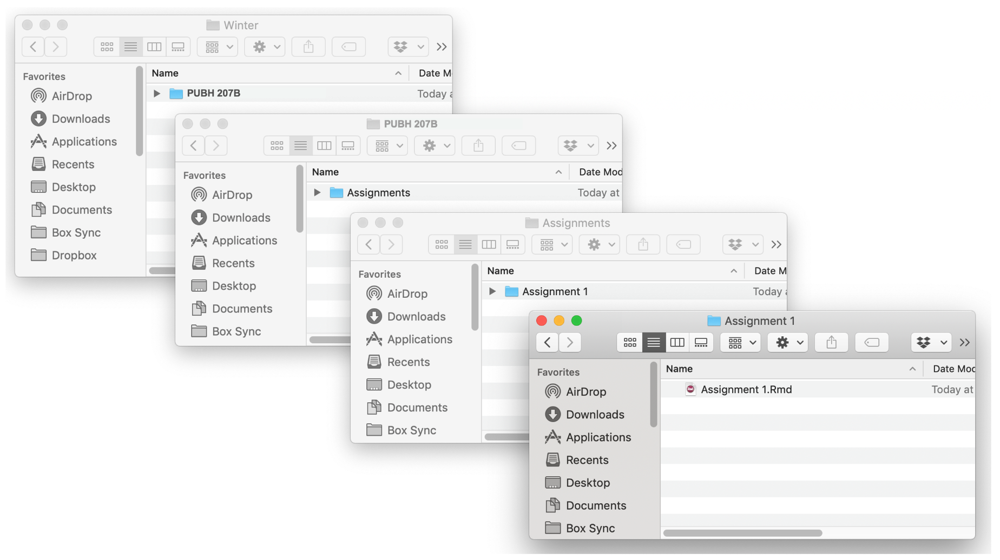
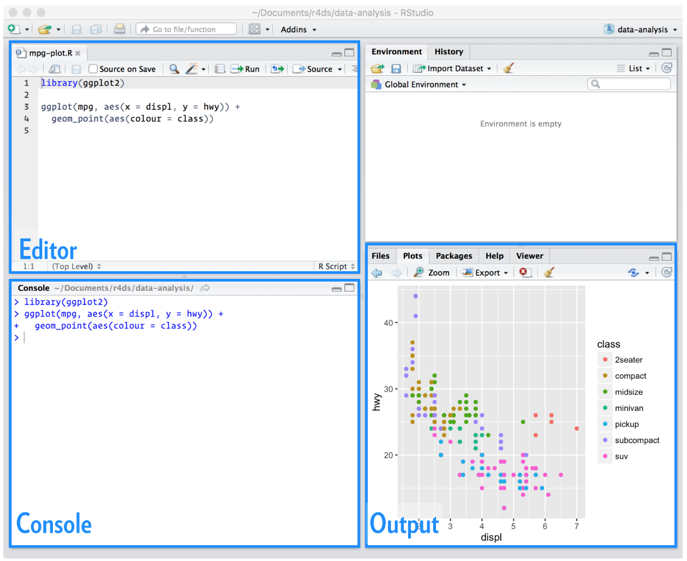
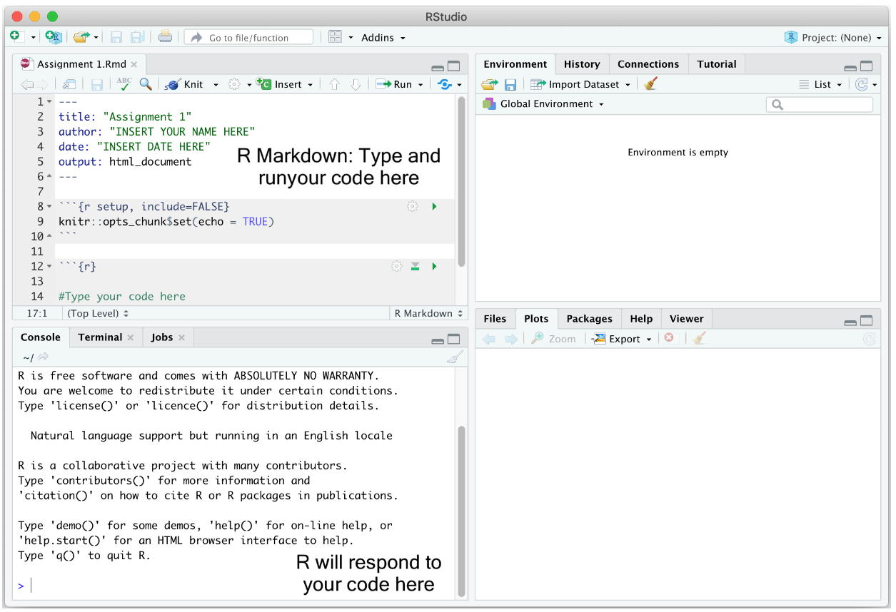
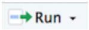
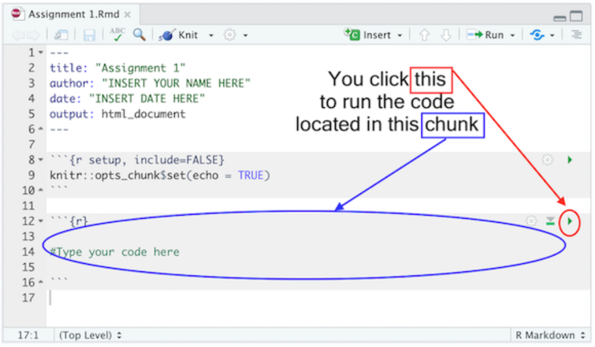
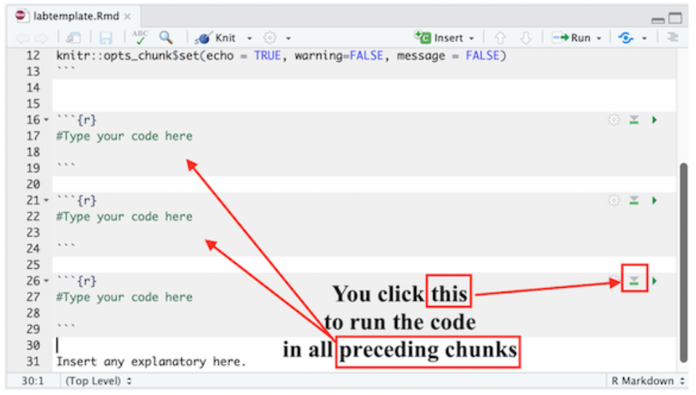
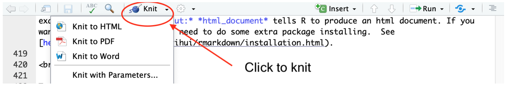
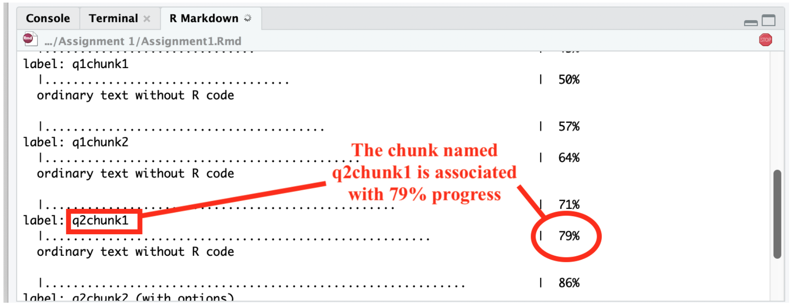
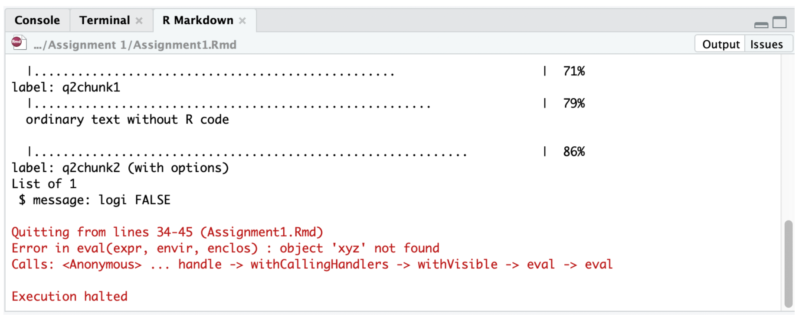
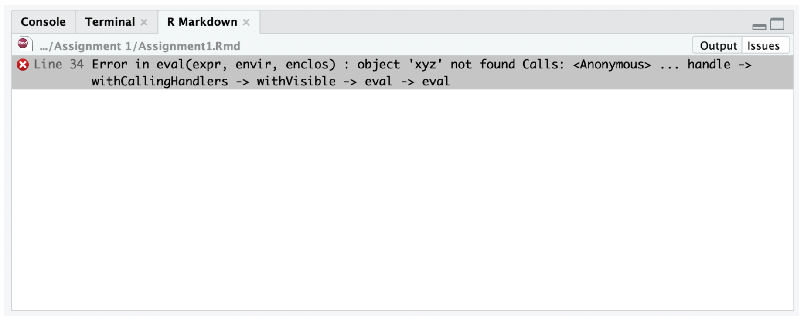

<br>

# General overview

There are a few types of assignments in this course that require the use of R/RStudio for carrying out analytic tasks: Labs, Application Challenges, and the Final Project. A few things to know for now:

* **Labs** are intended to help you learn to use software to carry out the types of analyses we are learning about in class and are graded on completion. You will be expected to read through the assigned Lab Guide according to the course schedule and complete a series of tasks using R/RStudio as you go. 
* **Application Challenges** are your opportunity to independently apply what you have learned in lecture and lab to a public health scenario. Instructions for each Application Challenge will be released on Canvas. For these assignments, you will be expected to select appropriate analytic approaches for the given scenario, execute data analysis tasks using R/RStudio, and provide written interpretations of your results. While I encourage collaboration, note that Application Challenges are individual assignments. Although there may be similarities across students due to the nature of the assignments, I expect your code and written interpretations to be your own. Students will have two attempts for each Application Challenge – after submitting an initial attempt, you will receive feedback and have the opportunity to revise and resubmit your work for an improved grade. Your initial attempt must be submitted by the deadline to be eligible for resubmission.
* For the **Final Project** you will be working in small groups. Together, you and your teammates will design, execute, and present an analysis using a selected dataset. For this project, you will need to carry out your analyses using R/RStudio. You will also be expected to share your results in a polished research paper and presentation to the class. I will provide much more detail about the Final Project on Canvas and in class.

<br>

# R code

For all assignments listed above, you will be working with *R code*. Think of R code as a set of written instructions that tells the statistical software R exactly what to do with your data. Instead of clicking through menus, you will type commands that allow you to clean data, run analyses, and create tables and figures to share your results. One major benefit of working with R code is that your analytic process is clearly documented and can be easily reproduced (by future you, your colleagues, and/or readers of your work).

Much of the code you will use is provided in the Lab Guides, which are designed to walk you through each step of the analytic process.

* Labs will primarily involve copying and pasting code directly from the course website into your own R Markdown file (a type of R file, discussed below). 
* For Application Challenges, your task will be to review the Lab Guides and *adapt existing code* — for example, by changing variable names, adjusting parameters, or extending an analysis — rather than writing code entirely from scratch. 
* For the Final Project, much of the code you will need will, again, be adaptable from the course website. However, your Final Project will likely require you to extend your R skills beyond what we have specifically done in class.

I want to emphasize that **this is not a coding course**. The primary goals of this class are to help you understand and select appropriate analytic methods and to accurately interpret and communicate results from public health research. That said, by working with R throughout the semester, you will also leave this course with practical, concrete skills that are widely used in public health research.

<br>

# R file types

As you begin working in RStudio, you’ll encounter different file types for writing and running R code. Two of the most common are:

1. **R Scripts** (with a file extension `.R`):

  * These are plain text files where you write and save your R code.
  * R scripts are great for running and saving code for standalone analyses, but they lack built-in tools for formatting or creating reports. <br>

2. **R Markdown** (with a file extension `.Rmd`):

  * R Markdown files allow you to combine code, results, and written explanations in a single, dynamic document.
  * You can generate polished reports, complete with formatted text, tables, and visualizations. These features make `.Rmd` files ideal for sharing your work in a professional and reproducible way. <br>

**In this course, we will use R Markdown files for all assignments.**

<br>

# File Management Structure

If you are using your personal computer for this course, it’s best to set up a clean and efficient file management structure. File management is key to preventing R programming frustration. Here are some tips:

* First, set up a clear and understandable hierarchical file system for this class. For example, create a class folder (PUBH 207B). Within this class folder, create the folder *Assignments* (or separate folders for Labs and Application Challenges, whatever will be clearest to you). Within the Assignments folder, you might create separate folders for each Assignment (e.g., Lab 1, Lab 2, etc.). I do **not** recommend working from your Desktop. Or from the Downloads folder. Or from some randomly named folder that you will have a hard time finding a month, week or day from now. You might end up having a system that looks something like this (on a Mac):

<br>

```{r, echo=FALSE, out.width = '100%'}

```

* Second, keep all your files that are related to an assignment or project (e.g., R Markdown file, datasets, etc.) in one folder. That is, don’t have an Application Challenge #3 folder that contains data files specific to Application Challenge #4. Keep everything in one folder, including the R Markdown and datasets for that assignment or project. **This will be necessary to properly compile your final report for each assignment.**

<br>

# RStudio interface

As discussed on the Home page, R is a programming language designed for statistical computing and graphics, while RStudio provides a user-friendly interface for working with R. You need to have both programs installed; however, we will only use the RStudio application to complete assignments in this course. You will not actually need to open the R application at any time.

When you open RStudio, you’ll see the interface is divided into four main windows (see image below):

```{r, echo=FALSE, fig.cap="The RStudio Interface", out.width = '100%'}

```

<br>

1. **Editor** (Top-Left):

* This is where you write and save your scripts or R Markdown files. Think of the Editor window as your workspace for writing and organizing your code. When you save a `.R` or `.Rmd` file, it is the content in your Editor window that is being saved for later use.
* Scripts written here can be run line-by-line or in sections, sending code to the Console for execution. <br>

2. **Console** (Bottom-Left):

* The Console is where your code gets executed. When you run commands from the Editor, this is where you’ll see results or errors (assuming you have followed the instructions for setting default options, discussed on the "Getting Started" page).
* You can write code directly into the Console. This can be useful for quick testing, but for more organized work, you’ll typically write code in the Editor. This is because any code you write directly into the Console is **not saved for later use**, unlike the code you write in the Editor window. <br>

3. **Environment** (Top-Right):

* This window displays any "R objects" you’ve created. R objects are the things R creates and keeps in memory while you are working. They can store data, results from analyses, or instructions that you want to reuse. The Environment window in RStudio shows the objects that exist in your *current R session*. For example, when you load a dataset into RStudio, you should see this dataset listed as an object in your Environment. 
** If you followed the instructions for setting default options (again, these were discussed on the "Getting Started" page), then your Environment window should be empty every time you open a new R session. Trust me, this is a good thing for avoiding issues with "knitting" (discussed later).
* The Environment is your go-to place for checking what’s currently loaded and managing your working environment. <br>

4. **Plots/Files/Help** (Bottom-Right):

* This multi-functional window displays visualizations (Plots tab) and gives access to your file directory (Files tab), packages, and documentation.
* The Help tab can be useful for looking up R functions and understanding how they work. 

<br>

# Introduction to R Markdown

As we will be using R Markdown documents (with a `.Rmd` extension) for all assignments, it is important for you to have a basic understanding of these files before we begin working with RStudio. This section provides a brief introduction to R Markdown, including how to create and save an R Markdown document within RStudio, the major components of an R Markdown document (YAML header, R code chunks, and text - each discussed below), and how to "knit" an R Markdown document (in other words, how to go from an R Markdown document to a nicely formatted report).

<br>

## Creating and saving a new R Markdown document

Once again, we will use R Markdown files for all assignments. To create a new `.Rmd` file in RStudio, select File → New File → R Markdown. A window should pop up. Type in the name of the assignment you are working on (e.g., Lab 1) next to Title and your name next to Author. Leave everything else alone and click OK. A new window in the top left of your RStudio console should pop up containing your new R Markdown file (see example below). 

<br>

```{r, echo=FALSE, out.width = '100%'}

```

<br>

You will notice that your new R Markdown file already has some "stuff" in it. R Markdown essentially provides some basic instructions for using an R Markdown file, but we don't necessarily need to include that in our assignments. **Before you get started on the assignment, you can go ahead and delete everything below the "r setup" chunk.** ("Chunks" are the sections you'll see shaded in light gray; more info below). In other words, leave the chunk that starts with "{r setup, include = FALSE}" and delete everything below it. Then, you will actually have a clean `.Rmd` file to work from.

Using the basic organizational guidelines above, save your R Markdown file into an appropriate folder by clicking on File and then Save from the RStudio menu.

To open a `.Rmd` file in RStudio, select File → Open File and navigate to the folder where you saved the assignment template and select the file. You should see the R Markdown file pop up on the top left portion of your RStudio interface (Editor window).

<br>

## Major components of an R Markdown document

R Markdown documents contain 3 major components:

1. A **YAML header** surrounded by - - -
2. **R code chunks** surrounded by ```
3. **Text** mixed with simple text formatting using the [Markdown syntax](https://www.markdownguide.org/cheat-sheet/)

<br>

### YAML header

The YAML header controls how R Markdown renders your `.Rmd` file. The YAML header is surrounded by - - - marks and is *always located at the top of your Rmd file.*

In the assignment’s YAML, add your name, assignment number, and the date. These are the only necessary items, but you can change other options, most of which are detailed [here](https://bookdown.org/yihui/rmarkdown/html-document.html). Your YAML will generally look like the following:

```
---
title: "Assignment X"
subtitle: PUBH 207B
author: Your full name here
date: Assignment due date
output: html_document
---
```

<br>

### R code chunks

When answering an assignment question, you’ll generally have the following sequence of components in your R Markdown document: question identifier (e.g., section name and number), R code used for answering the question, comments describing what the code is doing (i.e., annotations), and text to explain the results (i.e., your interpretation). For example, let’s say you have the following question in one of your assignments:

```
Question 1
1+1
1. What is the result of the operation above?  
```

Assignments will ask you to write R code to accomplish analytic tasks. You will present and execute your R code inside R code chunks (yes, they are really called "chunks"). 
R code chunks start with <code>&#96;&#96;&#96;{r}</code> and end with <code>&#96;&#96;&#96;</code>, and you insert your R code in between.
Using the example question above, to carry out the operation `1+1` as R code, it will look like the following in your R Markdown document:

`````{r, eval = FALSE}
```{r}
1 + 1
```
`````

All code inside a chunk will be executed when *knitting* the R Markdown file (more on knitting soon). This means that your R code must reside inside an R code chunk in order for it to be processed as R code. R will interpret anything outside of R code chunks (i.e., in the unshaded areas of your R Markdown document) as plain text.

On Application Challenge assignments and Final Project, you are expected to annotate your R code so that I (as well as future you and your collaborators) know what is being done in that line of code. You designate annotations or comments in R code using the `#` symbol. In programming, comments are bits of text that are not interpreted as computer instructions — they aren’t code, they’re just notes about the code. Since computer code can be opaque and difficult to understand, comments help explain the meaning and purpose of our code. While a computer is able to understand the code, comments are there to help people understand it. This is particularly important when someone else will be looking at your work — whether that person is a collaborator, or is simply a future version of you (e.g., when you need to come back and fix something and so need to remember what you were thinking when you first wrote the code).

Comments should be clear, concise, and helpful — they should provide information that is not otherwise present or “obvious” in the code itself. So, to annotate the above line of code `1+1`, you could add in your R code chunk:

`````{r, eval = FALSE}
```{r}
# this adds one plus one
1 + 1
```
`````

Annotations like this should be inside each code chunk, after a `#`. When the # symbol is in front of text *within* a code chunk, R knows that what follows is not code but rather is plain text being used to explain the code.

The first line of an R code chunk has {r}. Next to the r, we can give the chunk a name, such as:

`````{r, eval = FALSE}
```{r q1chunk1}
# this adds one plus one
1 + 1
```
`````

Here, I named the chunk "q1chunk1" which indicates this is question 1, chunk 1. You can name the chunk whatever you like. The chunk name is not required; however, it is good practice to give each chunk a unique name (we’ll see its value later when we talk about knitting).

In the R Markdown document you created and saved, you will notice the following R code chunk has automatically been included after the YAML header:

`````{r, eval = FALSE}
```{r}
knitr::opts_chunk$set(echo = TRUE)
```
`````

The above code establishes *global options* for every R code chunk in your R Markdown file. These options alter the way R results are spit out in your final formatted document. I suggest adding the following global options in every R Markdown assignment file:

`````{r, eval = FALSE}
```{r}
knitr::opts_chunk$set(echo = TRUE, warning=FALSE, message = FALSE)
```
`````

The above code hides non-error messages for every single R code chunk in your file. These non-error messages are unnecessary for the purposes of this class. Other chunk options can be found [here](https://r4ds.had.co.nz/r-markdown.html#chunk-options).

You can also set options for individual chunks. These are local options - meaning local to that chunk - and won’t be applied to other chunks in your file. For example, you can add the options `warning=TRUE` and `message=TRUE` to an individual R code chunk as follows if you want to show the messages for the R code in that particular chunk. Notice that each argument is separated by a comma:

`````{r, eval = FALSE}
```{r q1chunk1, warning = TRUE, message = TRUE}
# this code adds one plus one
1 + 1
```
`````

<br>

### Text

In addition to writing R code to carry out analytic steps, you will be expected to provide an interpretation of your results. Going back to our example question from above:

```
Question 1
1+1
1. What is the result of the operation above?  
```

You would type in your R Markdown document something like:

````{r, eval = FALSE}
Question 1

```{r}
# this code adds one plus one
1 + 1
```

My analysis yields the number 2.
````

The question identifier and your written interpretation of the results should be placed *outside of the R code chunk*, as regular text in your R Markdown file.

When you knit your R Markdown file (more on knitting shortly), R runs all of the code inside each code chunk and then combines the code, output (i.e., result), and text into a single, polished report. The output from each code chunk will appear automatically in the knitted document, even if you do not see it directly below the code while you are working (though you should see the output in the Console when running each chunk). For this reason, you should write your interpretation directly below each code chunk in plain text. When you knit the document, the code output will appear first, followed by the output and your written interpretation in the final report.

<br>

## Separating code one chunk at a time

Please do not put all of your code for an entire assignment or even a single question in one single chunk. For example, let’s say you see the following question in an assignment:

```
Question 1
(a) 1+1
(b) 2+2
Run each line of code above. What are the results? 
```

Instead of including both lines of code in one chunk like as follows...

````{r, eval = FALSE}
Question 1

```{r}
# this code adds one plus one
1 + 1

# this code adds two plus two
2 + 2
```

One plus one equals 2. Two plus two equals 4.
````

...break it up and add text after each to explain the result:

````{r, eval = FALSE}
Question 1a

```{r}
# this code adds one plus one
1 + 1
```

One plus one equals 2. 
````

````{r, eval = FALSE}
Question 1b

```{r}
# this code adds two plus two
2 + 2
```

Two plus two equals 4.
````

<br>

You may have multiple code chunks for a single item. It just depends on how complex the question is - there may be multiple steps involved. Use your best judgement to determine the most appropriate way to break up your code, keeping in mind that there are always many different ways to accomplish the same task in R. 

<br>

### Always test each chunk

After you write code in a chunk, you’ll need to test the code to make sure it is running properly. In other words, rather than writing all the code and then running it at the end of the assignment, run the chunks one at a time. To elaborate, let’s say the first question in an assignment asks you to add one plus one. In your R Markdown document, type in the following to answer this question:

````{r, eval = FALSE}
Question 1a

```{r}
# this code adds one plus one
1 + 1
```

One plus one equals 2. 
````

Run that code chunk to make sure it works (you should get 2!). Then proceed to the next question. Let me emphasize: **Do not write all of your code answering every question in the assignment and run it at the very end.** Routinely TEST, Test, and test your code to make sure it runs properly.

There are a number of ways to run code in R Markdown. First, you can click your mouse in the R code chunk you want to run and click on 
```{r, echo=FALSE, out.width = '10%'}

```
located at the top of the R Markdown window and select Run Current Chunk.

Second, you can place your mouse cursor in the R code chunk and click on 
```{r, echo=FALSE, out.width = '5%'}

```
located on the right corner of the chunk. See Figure below.

<br>

```{r, echo=FALSE, out.width = '100%'}

```

<br>

In each R code chunk, pressing the button 
```{r, echo=FALSE, out.width = '5%'}

```
will run all *previous* R chunks. See Figure below.

<br>

```{r, echo=FALSE, out.width = '100%'}

```

<br>


## Knitting an R Markdown document

*Knitting* puts an assignment’s main components - code, output, and text - in a nicely formatted document. You can create three types of knitted documents: html, Microsoft Word, or PDF. For all assignments in this course I would like you to knit to an `html` file because it is the easiest of the three options.

To Knit your document, click 
```{r, echo=FALSE, out.width = '10%'}

```
, which will be located at the top of the upper left R Markdown window. 

<br>

```{r, echo=FALSE, out.width = '100%'}

```

<br>

When you start knitting, you will notice that a new window on the bottom left will appear in place of the Console. The window will show the progress of your knitting. When you knit, R is going through each R code chunk one at a time, starting from the top and moving down. The percentages you will see are based on the proportion of your R Markdown file that R has successfully knitted. See Figure below.

<br>

```{r, echo=FALSE, out.width = '100%'}

```

<br>

If there is a problem knitting, R will stop at the chunk that contains the problem. You can determine the offending place in your R Markdown file two ways. First, in the R Markdown tab in the bottom left window, if you click on “Output” located at the top right corner of this window, you will see the R Markdown progress window, the error in red, and where R Markdown stopped. Carefully read the description of the error, which will contain the R code chunk name and sometimes the lines containing the problem in your R Markdown file. While not required, this is where naming your code chunks can come in handy. You can go to your offending chunk and see what may be the problem. For example, the figure below shows knitting was stopped because the object `xyz` was not created in the R Markdown file. You can go to the chunk named "q2chunk2" to remedy the issue.

<br>

```{r, echo=FALSE, out.width = '100%'}

```

<br>

The other way to find where R Markdown is having trouble is by clicking on “Issues” also located at the top right corner of the R Markdown window. The error will give you something similar to what you found in the Output window, but instead of a chunk, it will tell you the specific line in your R Markdown file that this error is located. Go to that line in your R Markdown file and see what is the issue. For example, the error here is located in line 34.

<br>

```{r, echo=FALSE, out.width = '100%'}

```

<br>

If everything goes smoothly and you encounter no errors, a preview of your knitted document will pop up in a new window and the `.html` file will automatically be saved in the folder where your R Markdown file resides. 

**I recommend *not* waiting until the very end of an assignment to knit.** When you finish one question, knit your document to see if everything is working properly. If it is working for that question, move on to the next question. You can knit over and over again, and each time the knitted file in your folder will be replaced by the newest version. So, don't be afraid to knit just because you aren't finished with an assignment yet. 

There are two things you’ll have to deal with: (1) making sure the R code is working correctly to get the results you need in order to answer the question; and (2) making sure the code is working correctly to knit a final document. These two issues may be related (for example, if your R code is producing an error, R Markdown will not knit), but sometimes they are not. So, check both your R code and your knitting results often. **And absolutely do not wait until the last minute to knit. Knit as often as possible.**

When you’re satisfied with the end product, submit your R Markdown document (with an `.Rmd` extension) and final knitted `.html` document to the corresponding assignment page on Canvas. Note that *both* files are required for your assignment to be graded.

<br>

# Assignment Workflow

Use the following workflow for all assignments in this course:

**1. Review the week’s materials first.**<br>
Make sure you understand the concepts before starting the assignment.
<mark>Skipping this step is the most common reason students struggle.</mark> You need a solid grasp of the content to understand what each assignment question is asking.

**2. Set up your assignment folder.**<br>
Create a folder on your computer to store assignment files. You may use one folder for all assignments or separate folders for each — what matters is that your files are organized and easy to locate.

**3. Create your R Markdown file.**<br>
Create a new R Markdown document following the instructions provided earlier on this page. Save it in the appropriate assignment folder. Remove the default text and code chunks that appear below the {r setup} chunk.

**4. Download and save the data.**<br>
Download the required data file(s) from Canvas and save them in the same folder as your `.Rmd` file.

**5. Work through the assignment questions in order.**<br>
For each question, use the following structure:

  * Question identifier (e.g., section name and item number)
  * One or more R code chunks used to answer the question
  * Written interpretation of the results (in plain text, below the code chunk)

As you work:

  * Use comments inside your code chunks to explain what the code is doing.
  * Run your code one chunk at a time to make sure it works.
  * There are many valid ways to write R code; grading is based on correctness and interpretation, not coding efficiency.
  * Unless stated otherwise, every question requires a written interpretation. This is not a programming course — clear interpretation of results is essential.

**6. Knit early and often.**<br>
After completing the first question, knit your document to an .html file and confirm that it knits without errors. Fix any issues before moving on to the next question.

**7. Repeat for all questions.**<br>
Continue working through each question, knitting periodically to ensure your document continues to knit successfully.

**8. Submit your files on Canvas.**<br>
Once all questions are complete and the document knits successfully, submit both required files by the deadline. 

For each assignment, upload two separate files to Canvas:

* Your R Markdown file (.Rmd)
* The knitted HTML file (.html)

Please do not combine these files into a zipped folder. They should be uploaded as two separate documents.

<br>

# One last thing...

If this page feels overwhelming right now, that’s okay. Much of this will make more sense once you begin working with R/RStudio, and you can return to this page as a reference throughout the semester. Remember that you are not expected to know everything at the start, and I am here to support you at every step. If you have questions at any time, please don't hesitate to reach out.

<br>

---

**Jenny Wagner, PhD, MPH**  
Assistant Professor<br>
Department of Public Health<br>
California State University, Sacramento<br>
jenny.wagner@csus.edu
