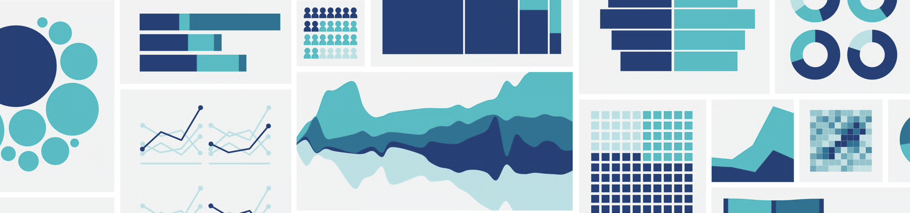

```{r, echo=FALSE, out.width = '100%'}
# 
```

<br>

### How to use this website

This website complements the course Canvas site.  

**On Canvas, you will find:**

* The course syllabus
* Lecture videos and slides
* Class meeting slides
* Assignment instructions
* Assignment submission portals
* Assignment feedback
* Grades 

**On this website, you will find:**

* Instructions for installing the course software (R/RStudio)
* General assignment guidelines & workflow
* Lab Guides

As this course is taught in a hybrid modality, you can expect to spend a substantial amount of time outside of class reading and studying the material, as well as engaging in learning activities using the course software, R/RStudio (more info below). 

The Lab Guides on this website will serve as important resources as you work on assignments for this course. Please be sure to carefully read over the Assignment Guidelines linked at the top of this page. I recommend reviewing these guidelines each time before you begin an assignment.

<br>

### What is this course about?

PUBH 207B builds on PUBH 207A by moving from public health research approaches and study design to the analysis and interpretation of public health data. The course emphasizes applying analytic methods to real datasets and linking results back to research questions and study design.

PUBH 207B is focused heavily on **biostatistics**. Biostatistics is the application of statistical methods to the study of living organisms, health, and disease. It provides the tools to collect, analyze, and interpret data to ensure public health decisions are evidence-based. Biostatistics is a cornerstone of public health research and practice — it is essential for understanding patterns of disease, identifying risk factors for disease, evaluating interventions, and informing policies to improve population health outcomes.

<br>

### Course software

Today, statistical analysis rarely happens “on paper.” Instead, public health professionals rely on software tools to manage, analyze, and visualize data effectively. A variety of statistical software tools are used to analyze public health data, including R, SAS, SPSS, Stata, Excel, and others. Each has its strengths and is widely used in specific contexts, depending on organizational preferences and the nature of the work. In this course, we’ll use R and RStudio, open-source tools that are among the most widely used in public health research and practice. R is a versatile programming language specifically designed for statistical computing and graphics, while RStudio provides a user-friendly interface for working with R. While you are not expected to become an expert in R, learning one software tool — like R — can make it much easier to adapt to other tools if required by a future job or organization.

<br>

#### Why R and RStudio? They’re:

* Capable of performing everything from simple summaries to advanced statistical modeling.
* Used by researchers, government agencies, and organizations around the world.
* Free and accessible to everyone -- ideal for building skills that you can carry forward in your career.
* Backed by a large and active global community that continuously improves the tools and shares resources.

<br>

#### Learning to work with R/RStudio is a journey, not a destination 

In this course, you are not expected to become an expert in R — but you will take important steps toward building proficiency. Using R is a continuous learning process, and even experienced users are always discovering new ways to approach challenges.

That said, developing a solid foundation in both the course material and the software will require time and dedication. R can have a steep learning curve, especially at the beginning, and it’s normal to feel overwhelmed at times. By engaging with the course content, practicing regularly, and applying what you learn to public health problems, you will gain confidence and skill over time.

To help you succeed, I encourage you to:

* Work together. Collaboration is encouraged! Discussing problems with your peers is a great way to learn.
* Utilize the provided textbooks, course website, and R-specific guides to enhance your understanding.
* Search online. The R community is large and active, and many of your coding questions will have already been answered in forums and tutorials.
* Seek support. I am here to answer questions and provide guidance as you navigate the course. If you are struggling, please come see me in office hours.

If you have any questions, please don't hesitate to reach out to me.

---

**Jenny Wagner, PhD, MPH**  
Assistant Professor<br>
Department of Public Health<br>
California State University, Sacramento<br>
jenny.wagner@csus.edu
